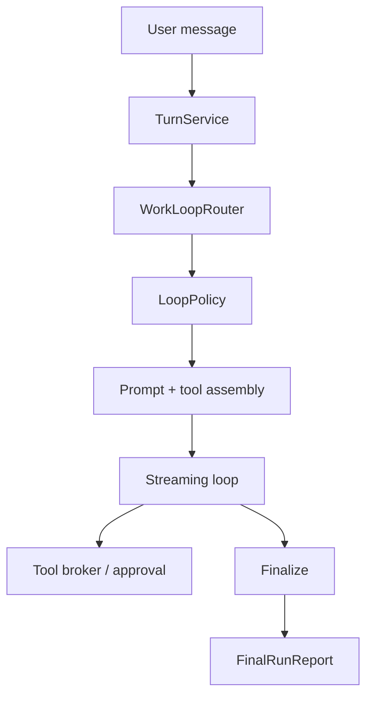

# AWL-002 WorkLoopRouter Enforcement Design

Status: draft
Owner: Staff Systems Architecture
Pack: `AWL-002`

## Problem

The first stabilization slice introduced a `WorkLoopDecision`, `SkillResolutionPlan`,
and `FinalRunReport`, but the selected loop kind is still mostly descriptive. The
streaming path continues through one general execution shape, so a simple answer can
still receive tools, a plan-first turn can still drift into mutation before approval,
and a specialized surface can fail without a loop-specific terminal contract.

The next slice turns routing into an enforceable runtime policy while keeping
`TurnService` as the only entry point.

## Target Behavior

Every user turn follows the same spine:

1. `TurnService` receives the request.
2. `WorkLoopRouter` classifies complexity, risk, and surface.
3. The selected loop kind produces a `LoopPolicy`.
4. The existing streaming implementation executes under that policy.
5. Finalization always emits a `FinalRunReport` with the selected loop kind and
   terminal outcome.

Loop policy is intentionally small:

- `DirectAnswer`: no tool definitions, no mutating approval state, final report is
  completion or provider failure.
- `DirectExecute`: tools allowed, but bounded to low-risk execution.
- `PlanThenConfirm`: read-only tools and plan generation allowed; mutating tools are
  blocked until approval.
- `AutonomousWork`: tools allowed with normal approval and budget rules.
- `SpecializedSurface`: routing metadata and final report still emitted, but the
  surface-specific handler owns execution details.

## Architecture

The router remains deterministic and cheap. It may consume
`request_intelligence_service` output, but it must not call the provider itself.
Provider-backed planning belongs inside the selected loop, not inside routing.

## Runtime Events

The following events are mandatory for every routed turn:

- `execution_mode_decision`: includes loop kind, complexity, risk, and route reason.
- `skill_resolution_snapshot`: emitted before provider/tool execution.
- `final_run_report`: emitted once for completed, failed, exhausted, or cancelled runs.

The event names are already established and should remain append-only. Any new fields
must be optional on the frontend translator.

## Enforcement Rules

`DirectAnswer`:

- Strip tool definitions from the provider request.
- Do not call `ToolExecutionBroker`.
- Report `Completed` when assistant text exists, otherwise `FailedWithPlan`.

`PlanThenConfirm`:

- Allow read-only discovery tools.
- Block mutating tools with `NeedsApproval`.
- Include the blocked tool name, risk reason, and user options in the report.

`AutonomousWork`:

- Keep existing tool loop behavior.
- Enforce attempt and retry budgets in one place.
- Convert exhaustion into `ExhaustedWithSummary`, not a hanging stream.

`SpecializedSurface`:

- Emit routing/final report events even when the surface delegates execution to a
  feature module.
- Do not introduce a parallel session or run truth source.

## UI / UX Notes

Run Inspector should make the route visible without teaching the user architecture.
Recommended labels:

- `Direct answer`: quick response
- `Plan first`: waiting for approval before changes
- `Autonomous work`: working through tools
- `Specialized`: handled by a focused surface

Failures should show a concrete next step from `FinalRunReport.user_next_step`.

## Tests

- Direct-answer turns hide tools and finish with a direct-answer report.
- Plan-then-confirm turns block mutating tool calls before approval.
- Specialized-surface routing still emits a terminal report.
- Provider failure and budget exhaustion both produce final reports.

## Rollout

Implement this as policy gates around the current streaming path. Do not extract
`AgentLoopDelegate` in this slice; that is AWL-005.
