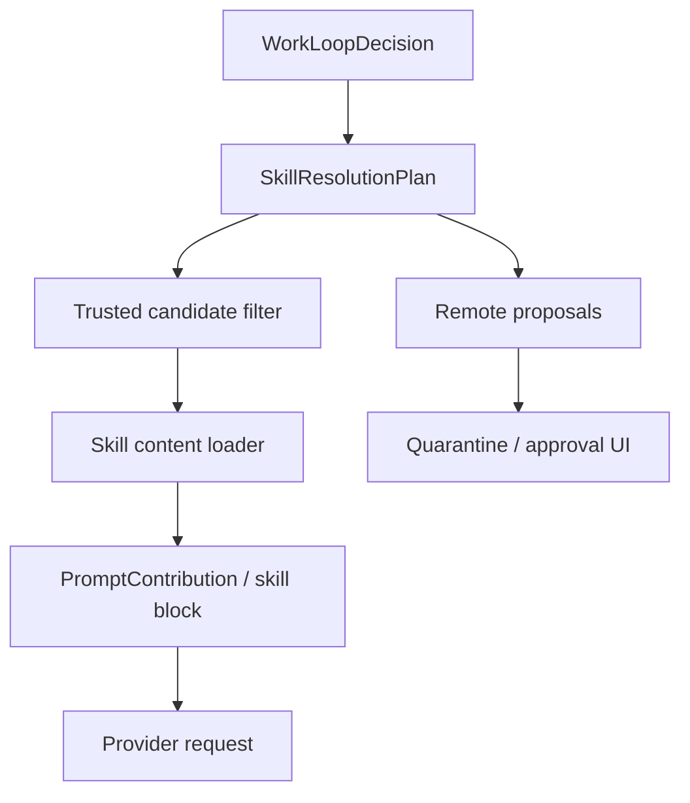

# AWL-003 Skill Auto-Load Runtime Design

Status: draft
Owner: Staff Systems Architecture
Pack: `AWL-003`

## Problem

`SkillResolutionPlan` can identify candidate skills, but the selected skills are not
yet reliably injected into the runtime context before the provider/tool loop begins.
That leaves the model aware that a skill might be relevant while still missing the
actual `SKILL.md` instructions needed to use it well.

The next slice turns skill resolution into safe context assembly.

## Safety Model

Only these skill sources may be auto-loaded:

- builtin skills shipped with the app,
- active local skills enabled by the user,
- review-passed local skills.

These sources must not be auto-loaded:

- remote/community search results,
- quarantined skills,
- unreviewed local directories,
- skills with failed scan results.

Remote discovery may propose candidates, but proposals are inert until scan,
quarantine review, and user approval pass.

## Target Flow

Skill loading must happen before provider request assembly. Tool-based skill search
remains available inside the loop, but the first request should already include the
best trusted local skills.

## SkillResolutionPlan Contract

Each candidate should expose:

- `skill_id`
- `name`
- `source`
- `reason`
- `confidence`
- `auto_load_allowed`
- `loaded`
- `blocked_reason`

`loaded` is the runtime truth for prompt inclusion. `auto_load_allowed` means the
candidate passed policy, not that loading succeeded.

## Prompt Assembly

Loaded skills should enter the prompt as a dedicated skill block, not as ad hoc user
text. The block should include:

- skill name and stable id,
- compact instruction excerpt or full `SKILL.md` content when budget allows,
- source and review status,
- any loader warning.

If token budget is tight, prefer:

1. exact matching active skills,
2. builtin skills,
3. review-passed skills with lower confidence.

Do not silently truncate a skill in a way that changes its safety instructions.

## Tool Loop Interaction

The loop may still call:

- `skill_search` for discovery,
- `skill_view` for explicit inspection,
- `skill_find` for local matching.

Those calls should append to the attempt ledger. They should not mutate active skill
state unless a separate approval path explicitly allows it.

## Runtime Events

`skill_resolution_snapshot` should be emitted twice when useful:

- pre-load snapshot: candidates and policy decisions,
- loaded snapshot: which skills actually entered context.

If only one event is emitted, it must represent the final loaded state.

## Failure Behavior

If a trusted skill cannot be loaded, continue the run with a warning and include the
failure in `FinalRunReport.evidence` or `tool_attempts`. If all likely skills are
blocked, the run should still proceed with a clear report note.

## Tests

- Local active/review-passed skill is auto-loaded and marked `loaded`.
- Remote/community candidate remains a proposal and is not loaded.
- Skill loader failure produces a warning but not a provider-loop hang.
- Final report lists loaded and blocked skills.
