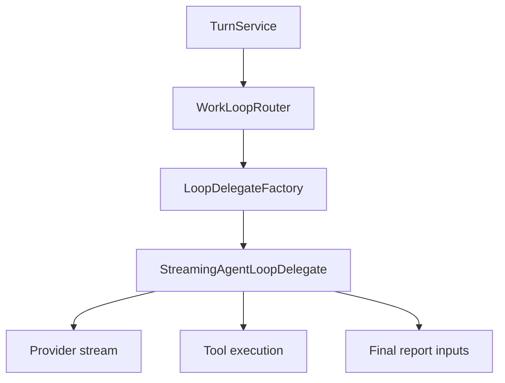

# AWL-005 LoopDelegate Extraction Design

Status: draft
Owner: Staff Systems Architecture
Pack: `AWL-005`

## Problem

The streaming path now owns routing metadata, prompt assembly, tool execution,
streaming events, finalization, and reporting. That makes every new loop behavior
hard to test without touching the same large files.

AWL-005 extracts an `AgentLoopDelegate` boundary around the existing implementation.
The first extraction should preserve behavior while making loop-specific evolution
possible.

## Target Contract

`AgentLoopDelegate` is the execution boundary for one selected loop kind. It should
receive:

- turn/session identifiers,
- `WorkLoopDecision`,
- `SkillResolutionPlan`,
- prompt/provider request inputs,
- tool policy,
- cancellation/approval handles.

It should return:

- `LoopOutcome`,
- assistant text / stream metadata,
- tool attempt summary,
- final report inputs.

Terminal outcomes:

- `Completed`
- `NeedsApproval`
- `NeedsUserInput`
- `FailedWithPlan`
- `ExhaustedWithSummary`

## Architecture

The initial implementation may have one concrete delegate:
`StreamingAgentLoopDelegate`. Specialized delegates can come later.

## Module Boundaries

Recommended files:

- `turn_service/agent_loop_delegate.rs`: trait, input/output structs, factory.
- `turn_service/stream_task.rs`: orchestration calls delegate.
- `turn_service/stream_event_loop.rs`: provider stream helper remains focused.
- `turn_service/stream_tool_execution.rs`: tool execution helper remains focused.
- `turn_service/stream_finalize.rs`: report assembly remains focused.

Do not move unrelated prompt planner, MCP, or frontend code in this slice.

## Migration Strategy

1. Introduce delegate structs and map current streaming inputs into them.
2. Move only the smallest necessary orchestration layer behind the delegate.
3. Keep existing helper functions and event names stable.
4. Add tests around outcome mapping and final-report guarantees.
5. Run existing turn-service and MCP tests to catch regressions.

## Testing

- Existing streaming success path returns `Completed`.
- Provider error maps to `FailedWithPlan`.
- Tool budget exhaustion maps to `ExhaustedWithSummary`.
- Approval block maps to `NeedsApproval`.
- Every delegate terminal state can produce a `FinalRunReport`.

## Non-Goals

- Do not introduce a second runtime supervisor.
- Do not rewrite provider clients.
- Do not implement remote MCP transports.
- Do not change frontend projection event names.
