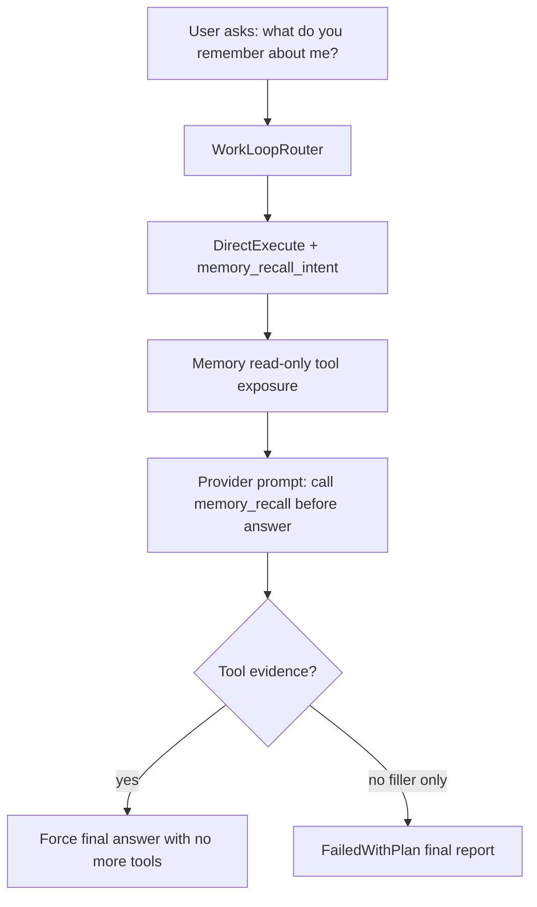

# AWL-006 Memory Recall Intent Enforcement Design

Status: draft
Owner: Staff Systems Architecture
Pack: `AWL-006`

## Problem

The latest observed turn asked "你记得关于我的什么事情". The backend classified it as
a trivial direct request, the provider emitted only "让我看看记忆中的你～🔍", and the
stream loop ended with `model_stop_no_tools` / `completed` because no tool calls
were pending.

For memory-introspection, a filler response without recall evidence is a failed
work loop, not a completed answer.

## Target Behavior

Memory-introspection requests should:

- bypass `DirectAnswer`,
- expose only read-only memory tools in the direct execution path,
- add prompt guidance requiring `memory_recall` or `memory_export` before answering,
- force a final no-tool response after the first successful memory recall,
- fail with a final report if the provider stops after a "checking memory" filler
  and no tool evidence exists.

## Architecture

## Implementation Notes

- Use a deterministic phrase detector for memory-introspection only; keep normal
  small talk in `DirectAnswer`.
- Do not add a new runtime truth source. Store the intent in `WorkLoopDecision`
  reason codes and consume that during tool exposure and finalization.
- Keep the terminal status explicit: `memory_recall_required_no_tool`.

## Tests

- Router regression for the exact Chinese symptom phrase.
- Tool exposure regression showing `read_file` / mutating tools are hidden while
  `memory_recall` and `memory_export` remain.
- Prompt contribution regression.
- Final report regression mapping no-tool filler to `FailedWithPlan`.
