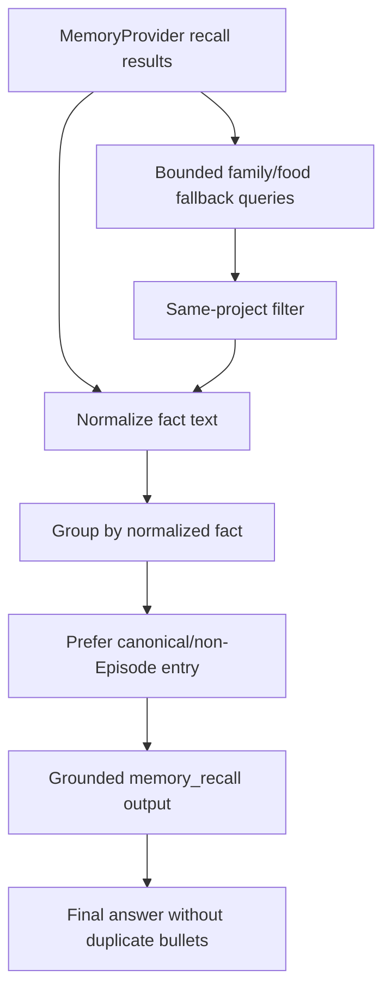

# AWL-007 Memory Recall Result Dedupe & Answer Grounding Design

Status: draft
Owner: Staff Systems Architecture
Pack: `AWL-007`

## Problem

After AWL-006, memory-introspection reliably calls memory tools and stops after
the first successful recall. The remaining issue is result quality: recall can
return both a canonical fact and an `Episode:*` wrapper for the same fact.

Example:

- `helen_husky: Ryan Liu 家有一只哈士奇叫 Helen`
- `Episode:Session:helen_husky: ...` with content `helen_husky: Ryan Liu 家有一只哈士奇叫 Helen`

These should become one evidence item before the model sees them.

During validation we also observed a related grounding miss: the Memory Browser
showed `son_fish_preference`, but the agent answered as if no such memory
existed. The immediate causes were:

- the work-loop memory intent matched broad "what do you remember about me"
  wording, but not family/food questions like "what do my son and I both like to
  eat?",
- scoped tool recall only sees the current session plus project/global entries,
  while the browser's "all" view can surface older same-project session facts.

AWL-007 keeps storage/provider semantics unchanged, but lets the `memory_recall`
tool adapter add bounded same-project fallback queries for personal family/food
questions.

## Target Behavior

`memory_recall` should emit:

- a compact evidence header with original/unique/hidden duplicate counts,
- one line per unique fact,
- normalized fact text for `Episode:*` wrappers,
- a clear no-results message when nothing matches.
- same-project fallback facts for family/food questions when the current
  session-scoped call alone misses older session memory.

The memory-introspection prompt should tell the model to ground its answer in
the deduplicated evidence and avoid repeating equivalent facts.

## Architecture

## Non-Goals

- Do not merge or delete stored memory records.
- Do not change recall ranking.
- Do not introduce semantic embeddings or LLM dedupe in this slice.
- Do not make unrelated cross-project or unbounded memory visible to the agent.
