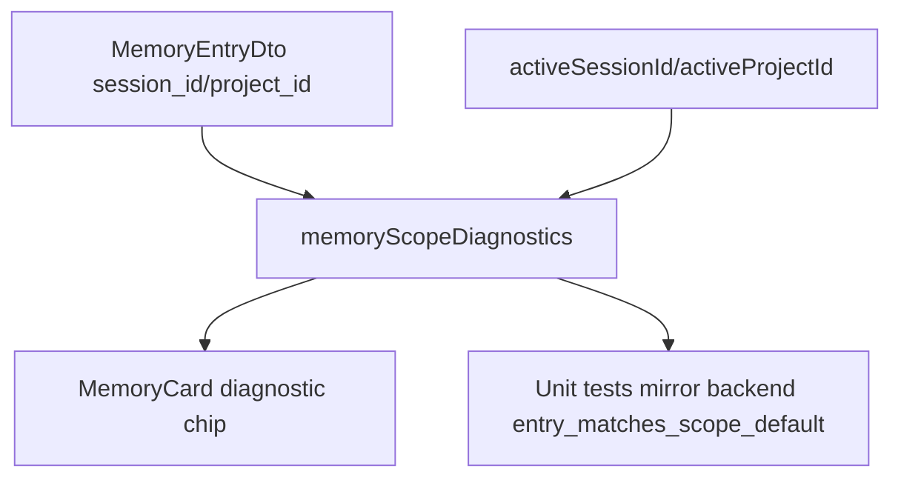

# AWL-008 Memory Scope Visibility & Recall Diagnostics Design

Status: draft
Owner: Staff Systems Architecture + Frontend UX
Pack: `AWL-008`

## Problem

The Memory Browser can show every stored entry in the `all` management view, but
the agent's recall tool uses scoped visibility: current session, current project,
and global. This confused validation of a family food question because a memory
was visible in the browser while the agent could still miss it depending on its
scope tags.

## Target Behavior

Every memory card should answer: "Will the current chat agent normally see this?"

- Global: visible to all chats.
- Project: visible in chats for the active project.
- Current session: visible in this chat.
- Same-project older session: not normal scoped recall, but may be considered by
  AWL-007's bounded fallback for personal family/food questions.
- Other project or unprojected older session: browser-only for this chat.

## UX

Add one compact chip next to the existing scope chip. Keep copy short:
`Agent可召回`, `项目可召回`, `全局可召回`, `同项目fallback`, `仅浏览器`.

When `all` is selected, show a small diagnostic line explaining that `all` is a
management view and the agent still follows scoped recall.

## Architecture

## Non-Goals

- Do not change recall ranking or storage.
- Do not make old unprojected session memory visible.
- Do not add a backend diagnostics command until a broader memory workbench
  needs it.
