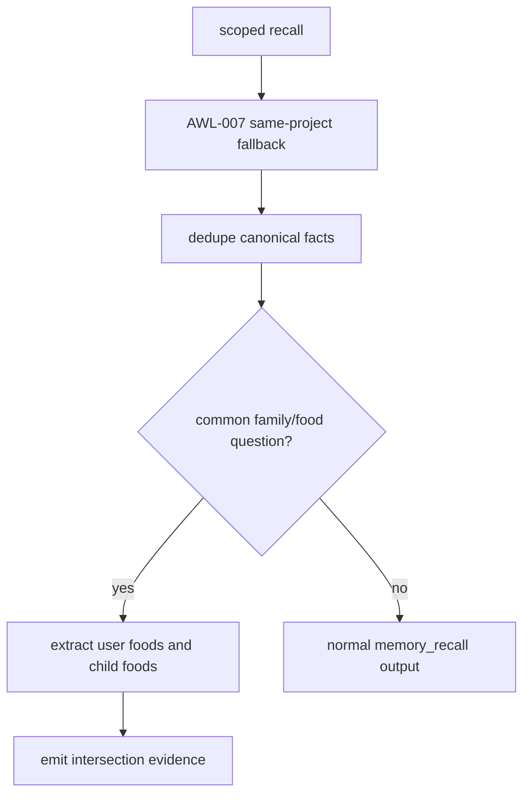

# AWL-009 Memory Recall Live Validation & Scope Repair Design

Status: draft
Owner: Staff Systems Architecture
Pack: `AWL-009`

## Problem

Live memory DB validation showed enough evidence for the question "我与我儿子共同喜欢吃什么":

- `food_preference`: Ryan Liu likes beef, lamb, and fish.
- `son_fish_preference`: Ryan's elder son Liu Shuwei likes fish.

Both records are same-project memories from older sessions. AWL-007 made those
eligible for bounded project fallback, but the model can still fail to infer the
intersection and answer "I do not know".

## Target Behavior

For family/food common-preference questions, `memory_recall` should emit:

- deduplicated source facts,
- the existing evidence counts,
- a deterministic `[memory_recall_inference] common_food_candidates=...` line
  when recalled facts support a shared food.

This is a grounding hint, not a new memory record.

## Architecture

## Non-Goals

- Do not promote or mutate memories.
- Do not search across other projects.
- Do not add new IPC.
- Do not replace semantic memory retrieval.
