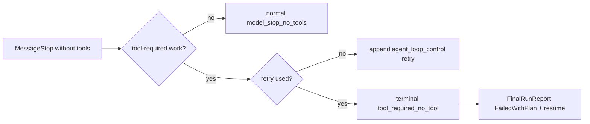

# AWL-010 Continuation Context & Tool Evidence Invariants Design

Pack: `AWL-010`

## Problem

Live logs showed a concrete artifact request:

`帮我创建一个泡泡龙网页游戏 需要有声效 界面美观大方`

The old classifier treated it as `DirectExecute / Trivial / short_direct_request`.
The work-loop router then allowed `DirectAnswer`, which hid tool definitions. The
model later emitted textual `<function_calls>` in the transcript, but no real
tool call was produced. A follow-up `继续` was classified as another short direct
request and did not inherit the unfinished game-building goal.

## Target Invariants

1. Artifact creation requests are tool-required work.
2. `DirectAnswer` never handles tool-required work.
3. `继续 / continue / resume` reads recent session context before routing.
4. Fake textual tool-call markup is never treated as execution evidence.
5. A tool-required run without mutating tool evidence retries once, then ends as
   `tool_required_no_tool` with `FailedWithPlan` and resume guidance.
6. Run Inspector shows the canonical work-loop kind, reason codes, and tool
   exposure policy from runtime projection.

## Routing Context

`WorkLoopRouteContext` is derived from existing session messages before the
current user message is appended. It is not persisted separately and does not
create a second truth source.

The context tracks:
- last user text,
- last assistant text,
- last assistant task outcome / degraded reason / resume flag,
- the most recent tool-required user goal that has no later mutating tool
  evidence.

When the current message is a continuation intent and that context indicates
unfinished tool-required work, the router emits:
- `continuation_intent`
- `tool_required_work_intent`
- `inherited_tool_required_work_intent`

The loop kind becomes `AutonomousWork` so tools remain available.

## Tool Evidence

Only canonical tool-use/tool-result messages and tool attempt updates count.
Text such as `<function_calls><invoke name="text_editor">...` remains assistant
text and is not execution evidence.

If a tool-required turn stops with no mutating tool evidence:

## Live Validation Runbook

1. Start the debug app from this checkout.
2. Open a fresh chat session whose workdir can be written.
3. Send: `帮我创建一个泡泡龙网页游戏 需要有声效 界面美观大方`.
4. If the provider stops without real tools, send: `继续`.
5. Open Run Inspector and confirm:
   - Loop shows `autonomous work`.
   - Route reasons include `tool_required_work_intent`.
   - For inherited continuation, reasons include `continuation_intent` and
     `inherited_tool_required_work_intent`.
   - Tool policy shows `definitions visible`.
6. If the provider emits fake `<function_calls>` text again, the run must either
   retry once with `tool_required_no_tool_retry` or finish failed/resumable with
   `tool_required_no_tool`; it must not show a green completed state.

## Next Pack

`PROV-001 Provider Tool Call Compatibility Diagnostics` should add provider-level
diagnostics for models like Kimi that write fake tool-call markup instead of
emitting real tool-call schema events.
