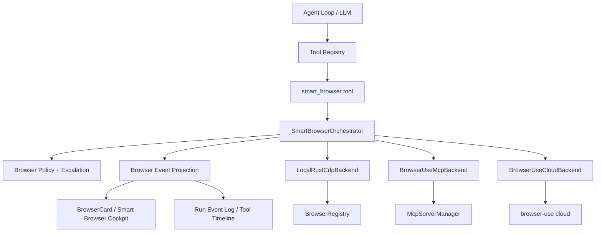

# Smart Browser Architecture

> Status: draft
> Last Updated: 2026-04-25
> Related Packs: FEAT-SB-001, FEAT-SB-002, FEAT-SB-003, FEAT-SB-004

## Problem

If2Ai already has a local AI browser: Rust/Tauri owns Chromium launch, CDP actions, profile mode, downloads, console/network ledgers, thumbnail events, BrowserCard, and human takeover. Browser-use adds a strong external agent/browser engine with MCP, CLI persistence, extraction, cloud browsers, and production stealth. The risk is creating two browser truth sources: one in `BrowserRegistry`, another inside browser-use.

Smart Browser solves this by making browser-use a backend behind If2Ai's runtime, not a replacement for the product surface.

## Current Code Truth

- Local browser tool: `src-tauri/src/modules/tools/builtin/browser_tool.rs`
- Browser runtime: `src-tauri/src/modules/browser/{session,registry,profile,events}.rs`
- UI status surface: `src/components/browser/BrowserCard.tsx`
- Viewer surface: `src/modules/browser-viewer/BrowserViewerPage.tsx`
- MCP stdio manager: `src-tauri/src/modules/runtime/mcp_stdio/manager.rs`
- Web routing prompt: `src-tauri/src/modules/runtime/prompt_tools_guide.rs`

## Browser-Use Truth

As of upstream `browser-use/browser-use` main `f3878b0` (2026-04-24), browser-use is a Python 3.11+ package with:

- `Agent`, `Browser`, and `BrowserSession` Python APIs.
- `uvx browser-use --mcp` stdio MCP server.
- Direct MCP tools such as `browser_navigate`, `browser_click`, `browser_type`, `browser_get_state`, `browser_screenshot`, `browser_extract_content`, tab/session controls, and `retry_with_browser_use_agent`.
- CLI session persistence and optional cloud browser support.

Primary references:

- `https://github.com/browser-use/browser-use/blob/main/README.md`
- `https://github.com/browser-use/browser-use/blob/main/browser_use/mcp/server.py`
- `https://github.com/browser-use/browser-use/blob/main/browser_use/skill_cli/README.md`
- `https://github.com/browser-use/browser-use/blob/main/AGENTS.md`

## Architecture

## Core Contract

Introduce `src-tauri/src/modules/smart_browser/` with a small stable contract:

- `SmartBrowserBackend`: `local_rust_cdp | browser_use_mcp | browser_use_cloud`
- `SmartBrowserSessionId`: maps to chat `session_id` unless explicitly overridden.
- `SmartBrowserCommand`: `start`, `navigate`, `state`, `screenshot`, `click`, `type_text`, `scroll`, `wait`, `extract`, `tabs`, `close`, `handoff_to_human`, `release_human`.
- `SmartBrowserObservation`: URL, title, state text, screenshot metadata, element refs, backend, action id, timing, risk flags, raw backend summary.
- `SmartBrowserEvent`: `queued`, `running`, `observed`, `completed`, `failed`, `blocked`, `takeover_started`, `takeover_released`, `escalated`.

The existing `browser` tool should become an adapter to this contract only after FEAT-SB-001 proves behavioral parity.

## Backend Policy

Default order:

1. `LocalRustCdpBackend`: default for normal browser UI, profiles, downloads, console/network diagnostics, BrowserCard, and user takeover.
2. `BrowserUseMcpBackend`: opt-in for richer DOM state, content extraction, retrying complex page interactions, and future MCP interoperability.
3. `BrowserUseCloudBackend`: escalation only for CAPTCHA, bot detection, proxy/stealth requirements, or explicit cloud profile tasks.

Policy must be fail-closed:

- Never auto-submit forms with money, auth, personal data, account mutation, or file upload.
- Never silently sync local cookies to cloud.
- Never bypass the existing "user takeover" pause semantics.
- Never let browser-use MCP own UI state without emitting If2Ai browser events.

## Runtime Projection

`browser-slice.ts` is currently a separate event path driven by `"browser-status"`. Smart Browser should add a projection bridge so browser state becomes part of the same runtime/tool timeline model used by chat execution.

Projection fields:

- `session_id`
- `smart_browser_session_id`
- `backend`
- `url`
- `title`
- `running`
- `taken_over`
- `thumbnail`
- `last_action`
- `action_log`
- `console_count`
- `network_error_count`
- `downloads_count`
- `escalation_state`

The UI may keep the lightweight store internally, but it should be hydrated from projection events instead of acting as the only truth.

## UX Direction

Upgrade `BrowserCard` into a Smart Browser Cockpit:

- Compact overlay remains for everyday use.
- Expand opens a cockpit with three panes: live preview, action timeline, diagnostics drawer.
- Backend badge labels: `本地浏览器`, `智能代理`, `云端浏览器`.
- Human controls: `接管`, `释放`, `停止`, `升级云端`.
- Diagnostics tabs: `状态`, `截图`, `DOM`, `Console`, `Network`, `Downloads`, `MCP Raw`.

Use shadcn/Tailwind/Lucide patterns already present in the app. Keep Chinese UI copy consistent with current BrowserCard language.

## Pack Sequence

1. FEAT-SB-001 Smart Browser Contract
2. FEAT-SB-002 Browser Runtime Projection
3. FEAT-SB-003 browser-use MCP Backend
4. FEAT-SB-004 Agentic Browser + Cloud Escalation

Do not start FEAT-SB-003 before FEAT-SB-001/002 exist; otherwise browser-use will create an unprojected second runtime.

## Verification Strategy

- Rust unit tests for command mapping, backend selection, and event projection.
- Existing browser tests must continue to pass.
- UI tests or TypeScript tests for projection-to-card rendering.
- Manual Tauri run for BrowserCard, viewer, user takeover, and MCP-backed navigation once FEAT-SB-003 lands.
