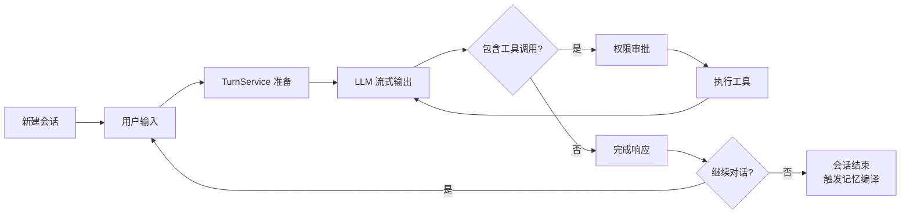
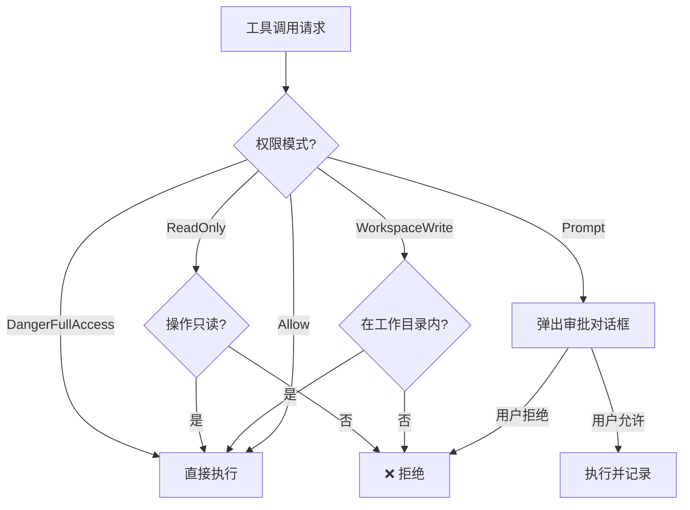

# 智能体使用指南

> 面向用户的 Agent 操作手册——对话生命周期、权限审批与流式输出

## 📍 对话生命周期

一次完整的 Agent 对话经历以下阶段：



### 新建会话

```
Tauri 命令: start_agent_stream
参数:
  - message (string): 用户首条消息
  - session_id (string, 可选): 恢复已有会话
  - project_id (string, 可选): 关联项目
  - workdir (string): 工作目录
```

### 执行流程

1. **TurnService 准备**：解析 LLM 提供商 → 记忆注入 → 提示词规划
2. **LLM 调用**：通过 ApiClient 流式请求，获取 AssistantEvent 序列
3. **工具循环**：如果 LLM 返回工具调用，审批并执行后重新提交给 LLM
4. **响应完成**：汇总所有 assistant 消息，返回 TurnSummary

## 🛡️ 权限审批流程

If2Ai 提供 5 种权限模式，控制工具的执行能力：

| 模式 | 说明 | 典型场景 |
|------|------|----------|
| **ReadOnly** | 只读文件，禁止写入和执行 | 代码审查 |
| **WorkspaceWrite** | 可读写工作目录内文件 | 日常开发（默认） |
| **DangerFullAccess** | 无限制访问 | 自动化脚本 |
| **Prompt** | 每次工具调用需用户确认 | 安全敏感环境 |
| **Allow** | 允许当前调用，后续不再提示 | 临时放行 |



### 高风险工具

以下工具需要显式的每会话上下文才能执行：

- 文件操作：`read_file` / `file_write` / `file_edit` / `glob_search` / `grep_search`
- 终端：`bash` / `REPL` / `PowerShell`
- 记忆：`memory_store` / `memory_forget` / `memory_purge`
- 调度：`cron_add` / `cron_remove` / `cron_run`
- 子代理：`agent`

> 源码参考：`src-tauri/src/modules/tools/registry.rs` — `requires_explicit_context()`

## 📡 流式输出与中止控制

### 流式事件类型

Agent 响应通过 Tauri event emit 实时推送到前端：

| 事件 | 说明 |
|------|------|
| `AssistantEvent::TextDelta` | 文本增量，逐步拼接完整响应 |
| `AssistantEvent::ToolUseStart` | 工具调用开始 |
| `AssistantEvent::ToolResult` | 工具执行结果 |
| `AssistantEvent::MessageStop` | 消息结束 |
| `AssistantEvent::Error` | 错误信息 |

### 中止控制

用户可随时中止 Agent 执行：
- 通过 `cancel_agent_stream` Tauri 命令
- ConversationRuntime 检测取消信号后停止当前迭代
- 已执行的工具调用结果保留在会话中

## 🚀 执行模式

If2Ai 支持多种执行模式，影响 LLM 选择和工具权限：

| 模式 | LLM 选择 | 工具权限 | 适用场景 |
|------|----------|----------|----------|
| **标准** | 默认提供商 | WorkspaceWrite | 日常对话 |
| **快速** | 快速模型 | ReadOnly | 简单问答 |
| **深度** | 高能力模型 | DangerFullAccess | 复杂任务 |

执行模式由 `RequestIntelligence` 自动分类，也可手动覆盖。

> 源码参考：`src-tauri/src/modules/application/request_intelligence.rs`

## 📊 用量追踪

`UsageTracker` 在每个 turn 中累计 token 用量：

- **input_tokens**：输入 token 数
- **output_tokens**：输出 token 数
- **cache_read_input_tokens**：缓存命中 token 数
- **cache_creation_input_tokens**：缓存创建 token 数

通过 `ContextBudget` 可设置单轮 token 上限，超出时触发上下文压缩。

## ⚠️ 与 cc-haha 差距分析

### If2Ai 优势

| 特性 | If2Ai | cc-haha |
|------|-------|---------|
| **类型安全** | Rust 编译时保证 | TypeScript 运行时检查 |
| **权限模型** | 5 级权限 + 高风险工具隔离 | 3 级权限 |
| **MCP 集成** | 原生支持 | 需要适配层 |
| **记忆注入** | Pinned → Compiled → Rules → Retrieved 四层注入 | 简单记忆注入 |
| **工作记忆** | 滑动窗口过滤 | 无等价机制 |

### If2Ai 劣势

| 特性 | If2Ai | cc-haha |
|------|-------|---------|
| **成本追踪** | 无 CostTracker | 有 CostTracker 实时追踪 |
| **迭代预算** | max_iterations 仅限制循环次数 | maxTurns=32 + maxBudgetUsd 双重限制 |
| **运行时复杂度** | ConversationRuntime ~11,500 行 | QueryEngine 更精简 |

## 🎯 增强计划

1. **实现 CostTracker**：在 UsageTracker 基础上添加实时成本计算，支持按模型定价和预算提醒
2. **添加 maxBudgetUsd 预算限制**：TurnService 检查累计成本，超出时中止 Agent 循环
3. **简化 Runtime 接口**：将 ConversationRuntime 的泛型参数简化为 trait object，降低使用复杂度
4. **执行模式增强**：添加"规划模式"（Plan Mode），Agent 先制定计划再逐步执行
