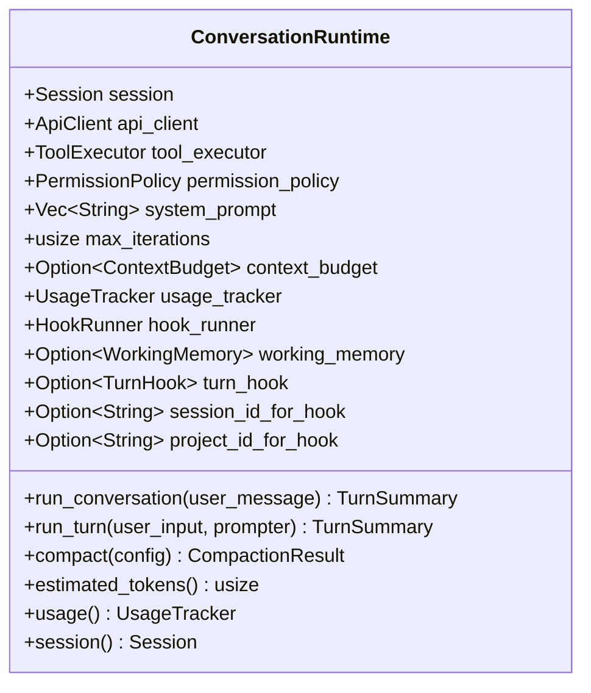
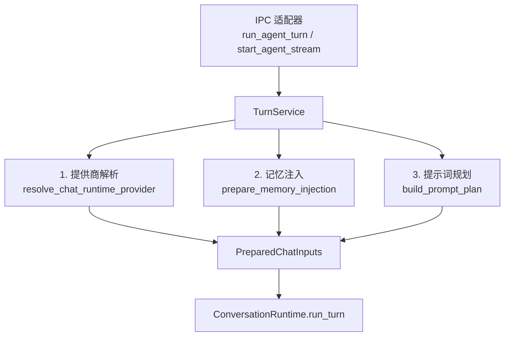
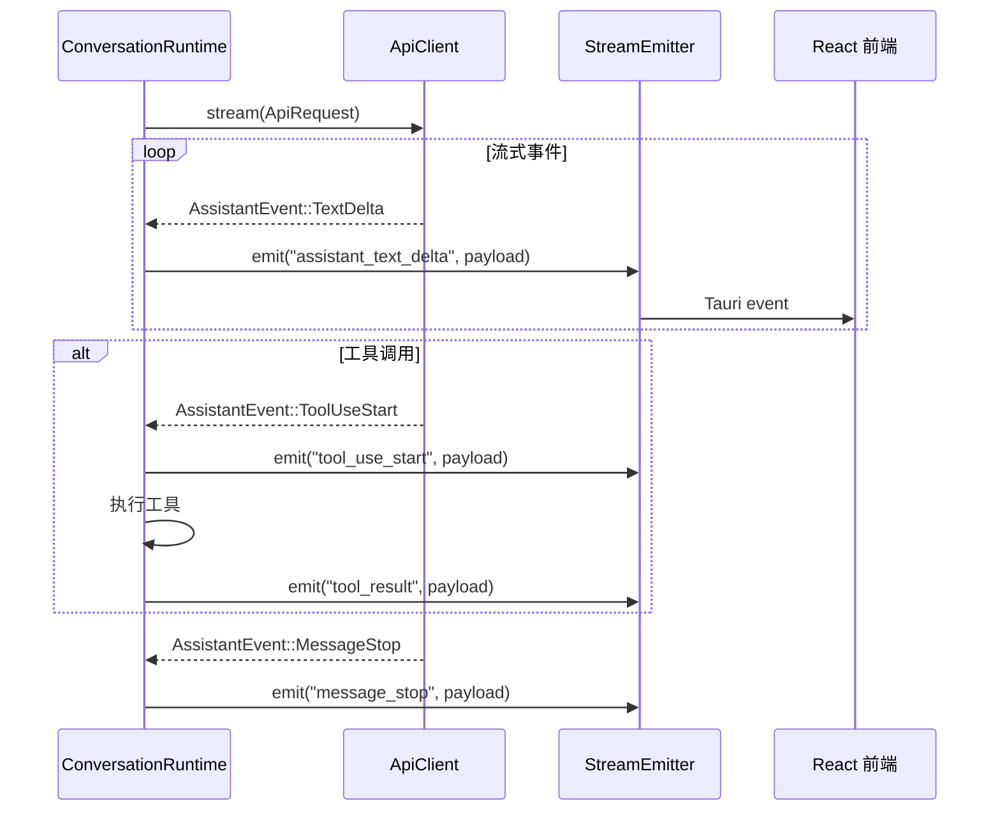
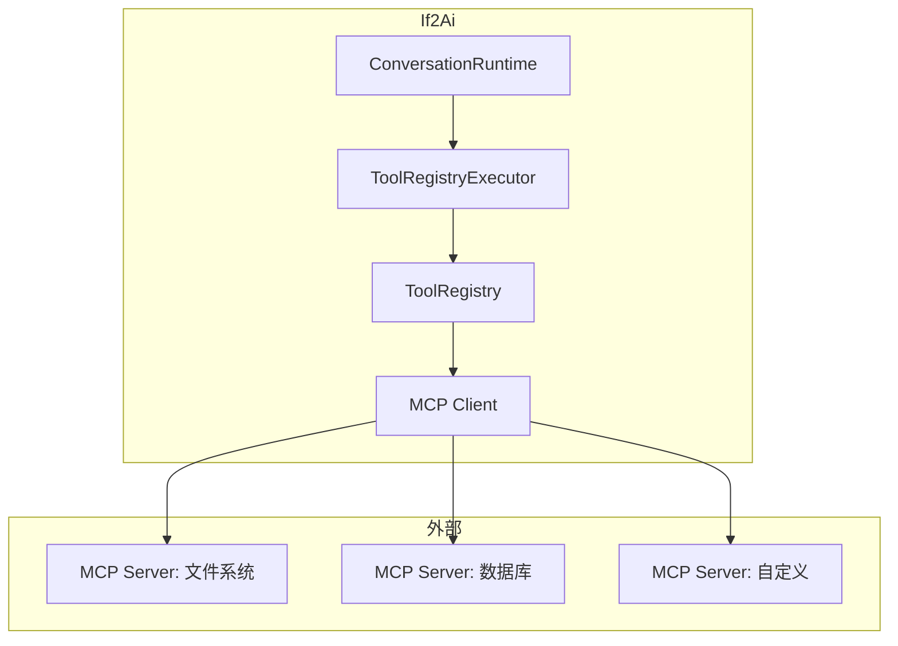
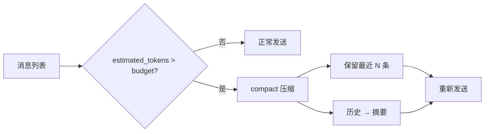
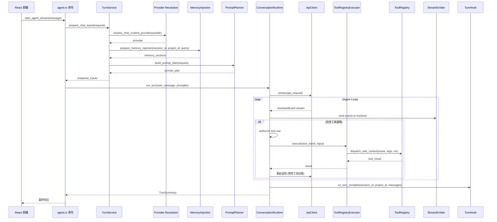

# 智能体实现原理

> 面向开发者的 Agent 架构——ConversationRuntime、TurnService、事件发射与预算控制

## 🏗️ ConversationRuntime 架构

`ConversationRuntime<C, T>` 是 Agent 循环的核心，泛型参数 `C: ApiClient` + `T: ToolExecutor`：



### 核心字段说明

| 字段 | 说明 |
|------|------|
| `session` | 会话消息列表，支持序列化/反序列化 |
| `api_client` | LLM API 客户端，支持流式和非流式 |
| `tool_executor` | 工具执行器，由 `ToolRegistryExecutor` 桥接 |
| `permission_policy` | 权限策略，控制工具执行权限 |
| `max_iterations` | 最大迭代次数，防止无限循环 |
| `context_budget` | 可选的上下文预算限制 |
| `working_memory` | 滑动窗口，限制发送给 LLM 的消息数 |
| `turn_hook` | 轮次钩子，用于触发记忆编译 |

> 源码参考：`src-tauri/src/modules/runtime/conversation.rs`

## 📍 TurnService 轮次服务

`TurnService` 是 IPC 适配器的唯一入口，组合三个关注点：



### PrepareChatInputsRequest

```rust
pub struct PrepareChatInputsRequest {
    pub workdir: PathBuf,
    pub current_date: String,       // %Y-%m-%d
    pub os_name: String,            // std::env::consts::OS
    pub os_family: String,          // std::env::consts::FAMILY
    pub session_id: Option<String>,
    pub project_id: Option<String>,
    pub workdir_str: Option<String>,
    pub user_message: String,       // 记忆检索查询
    pub caller: &'static str,       // "run_agent_turn" / "start_agent_stream"
}
```

> 源码参考：`src-tauri/src/modules/application/turn_service.rs`

## 📝 PromptPlanner 提示词规划

`build_prompt_plan()` 按固定顺序组装系统提示词块：

```
1. System        — load_system_prompt 系统提示词
2. WebToolsRoutingGuide — Web 工具路由指南（当 ≥2 个 Web 工具注册时）
3. Memory        — 记忆注入段落（Pinned → Compiled → Rules → Retrieved）
```

输出为 `PromptPlanResult { plan: PromptPlan, text: String }`。

> 源码参考：`src-tauri/src/modules/application/prompt_planner/mod.rs`

## 📡 事件发射机制

Agent 的流式输出通过 Tauri event 系统传递到前端：



### 前端运行时投影

前端通过 `src/runtime-projection/` 模块将 Tauri event 投影为响应式状态：
- 消息列表实时更新
- 工具执行状态可视化
- 流式文本逐字渲染

> 源码参考：`src-tauri/src/modules/runtime/stream_emitter.rs` / `src/runtime-projection/`

## 🔌 MCP 协议集成

If2Ai 通过 `channel` 模块原生支持 MCP（Model Context Protocol）：



MCP 工具自动注册到 ToolRegistry，与内置工具享有相同的权限控制和审计机制。

> 源码参考：`src-tauri/src/modules/channel/`

## 💰 预算控制

### Token 限制

- `ContextBudget`：限制单轮上下文 token 数
- `max_iterations`：限制 Agent 循环最大迭代次数
- `WorkingMemory`：滑动窗口，限制发送给 LLM 的消息数

### 上下文压缩

当 token 数接近预算上限时，`ConversationRuntime::compact()` 触发上下文压缩：
- 保留系统提示词和最近 N 条消息
- 将历史消息压缩为摘要
- 摘要通过 `ContextSummarizer` 生成



## 🔄 完整请求生命周期



## ⚠️ 与 cc-haha 差距分析

### If2Ai 优势

- **Rust 类型安全**：编译时保证 API 客户端和工具执行器的接口一致性
- **严格分层**：Runtime（底层循环）→ Application（编排）→ Service（业务），职责清晰
- **MCP 原生集成**：channel 模块直接对接 MCP 协议
- **TurnHook 机制**：Agent 循环与记忆系统解耦，通过钩子灵活集成

### If2Ai 劣势

- **缺少 CostTracker**：cc-haha 有实时成本追踪和预算控制，If2Ai 仅追踪 token 数
- **缺少迭代预算管理**：cc-haha 有 maxTurns=32 + maxBudgetUsd 双重限制，If2Ai 仅有 max_iterations
- **ConversationRuntime 复杂度**：~11,500 行核心代码，泛型参数 C + T 增加使用门槛
- **缺少 Plan Mode**：cc-haha 有 EnterPlanModeTool，If2Ai 无等价机制

## 🎯 增强计划

1. **实现 CostTracker**：在 `UsageTracker` 基础上添加 `CostTracker`，支持按模型定价、实时成本计算、预算提醒
2. **添加 maxBudgetUsd**：`TurnService::prepare_chat_inputs()` 检查累计成本，超出时返回错误
3. **简化 Runtime 层接口**：将 `ConversationRuntime<C, T>` 改为 `ConversationRuntime` + trait object，消除泛型传播
4. **添加 Plan Mode**：实现 `EnterPlanModeTool`，Agent 先制定执行计划再逐步执行，提高复杂任务的可靠性
5. **迭代预算可视化**：前端显示当前轮次/成本/剩余预算
