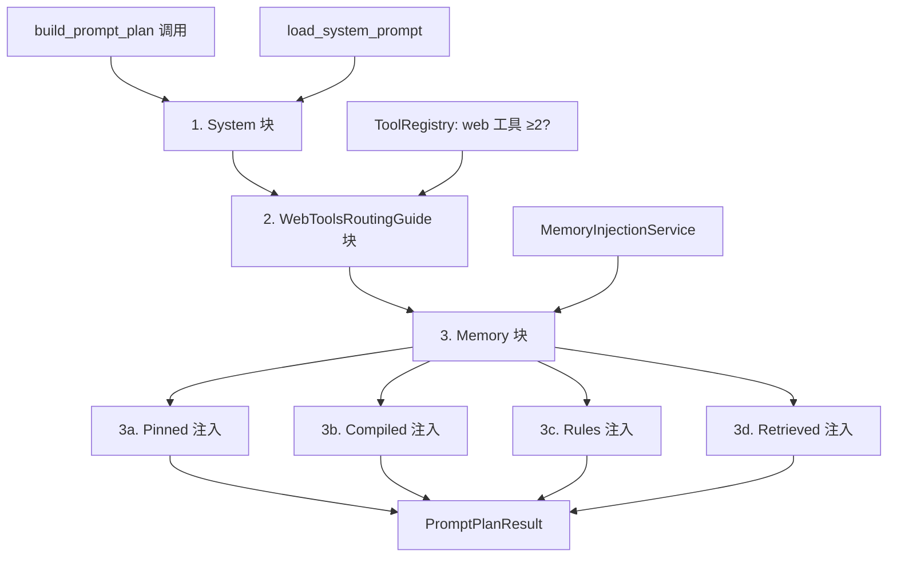
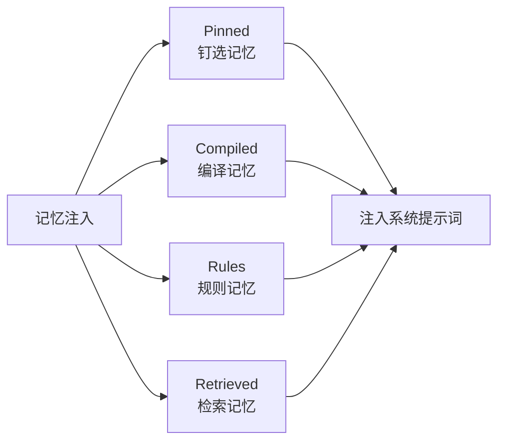
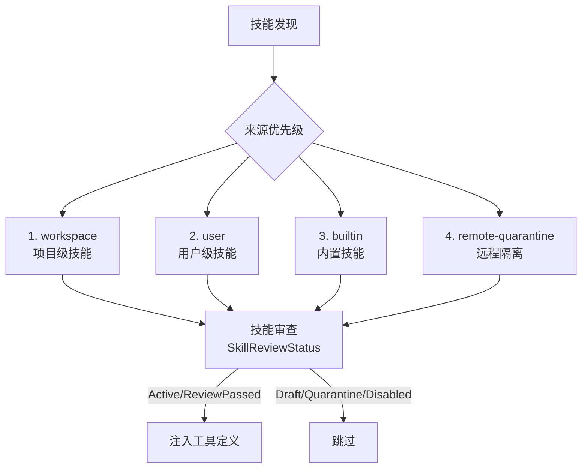
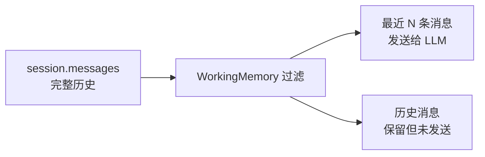
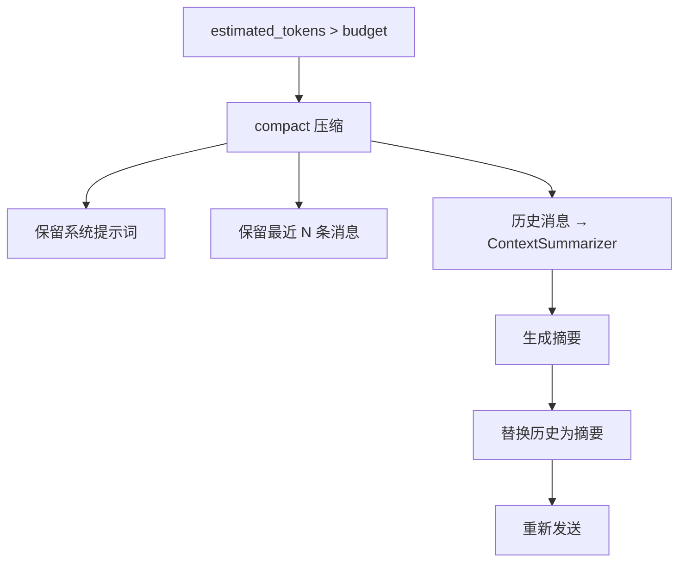

# Prompt 构建深度解析

> If2Ai 系统提示词的组装流程——记忆注入、工具描述、技能提示与上下文管理

## 📍 概述

Prompt 构建是 Agent 对话的核心环节，直接影响 LLM 的响应质量。If2Ai 的 Prompt 构建由 `PromptPlanner` 编排，通过 `build_prompt_plan()` 将多个提示词块按固定顺序组装为完整的系统提示词。

## 🏗️ 系统提示词构建流程



### 块顺序

| 顺序 | 块类型 | 来源 | 说明 |
|------|--------|------|------|
| 1 | `System` | `load_system_prompt()` | 基础系统提示词 |
| 2 | `WebToolsRoutingGuide` | `ToolRegistry` | Web 工具路由指南 |
| 3 | `Memory` | `MemoryInjectionService` | 记忆注入（4 个子块） |

> 源码参考：`src-tauri/src/modules/application/prompt_planner/mod.rs` — `build_prompt_plan()`

## 📝 记忆注入策略

记忆注入由 `MemoryInjectionService` 负责，按以下固定顺序注入 4 个子块：



### Pinned 注入（钉选记忆）

- **来源**：`PinnedStore::list_all_for_prompt()`
- **内容**：用户钉选的关键记忆条目
- **特点**：始终注入，不受轮次或查询影响
- **限制**：每个作用域最多 `MAX_PINS_PER_SCOPE` 条

### Compiled 注入（编译记忆）

- **来源**：`CompilePaths::memory_md` 文件
- **内容**：`assemble()` 生成的 `memory.md`
- **特点**：包含 today/week/longterm/facts 的聚合摘要
- **时效**：由 MemoryTicker 维护，每日更新

### Rules 注入（规则记忆）

- **来源**：项目 `.if2ai/rules/` 目录
- **内容**：项目级编码规范、约束规则
- **特点**：仅当项目目录下存在规则文件时注入

### Retrieved 注入（检索记忆）

- **来源**：`VectorMemoryProvider::recall()`
- **内容**：与用户查询语义相关的记忆条目
- **特点**：每轮动态检索，基于向量搜索
- **流程**：
  1. 使用用户消息作为查询
  2. FastEmbed 生成 384 维嵌入向量
  3. LanceDB ANN 搜索 Top-K 结果
  4. RRF 融合向量搜索和文本搜索结果

> 源码参考：`src-tauri/src/modules/application/memory_injection_service.rs`

## 🔧 工具描述注入

工具定义通过 `ToolRegistry::get_definitions()` 获取，以 OpenAI function calling 格式注入 API 请求：

```json
{
  "type": "function",
  "function": {
    "name": "bash",
    "description": "Execute a bash command",
    "parameters": {
      "type": "object",
      "properties": {
        "command": { "type": "string" }
      },
      "required": ["command"]
    }
  }
}
```

### 工具集过滤

工具定义可按 toolset 过滤，控制暴露给 LLM 的工具范围：

| Toolset | 包含工具 |
|---------|----------|
| `files` | read_file, file_write, file_edit, glob_search, content_search |
| `terminal` | bash |
| `web` | web_fetch, web_search, http_request |
| `memory` | memory_store, memory_recall, memory_forget, memory_purge, memory_export |
| `scheduler` | cron_add, cron_list, cron_remove, cron_run, cron_runs |

> 源码参考：`src-tauri/src/modules/tools/toolset.rs` — `TOOLSETS`

## ⚡ 技能提示词注入

技能（Skills）通过 `SkillsControlPlane` 管理和注入：



- **审查状态**：Draft → Quarantine → ReviewPassed → Active / Disabled
- **优先级**：workspace > user > builtin > remote-quarantine
- **注入方式**：作为工具定义注册到 ToolRegistry，LLM 通过 function calling 调用

> 源码参考：`src-tauri/src/modules/tools/registry.rs` — `SKILL_SOURCE_PRECEDENCE` / `SkillReviewStatus`

## 📐 上下文窗口管理

### WorkingMemory 滑动窗口

`WorkingMemory` 限制发送给 LLM 的消息数量，保留完整历史在 `session.messages` 中：



### ContextBudget 预算

当启用 `ContextBudget` 时：
1. 每次调用 LLM 前检查 `estimated_tokens()`
2. 超出预算时触发 `compact()` 压缩
3. 压缩后重新估算，确保在预算内

### 上下文压缩流程



> 源码参考：`src-tauri/src/modules/memory/working_memory.rs` / `src-tauri/src/modules/runtime/conversation.rs` — `compact()`

## ⚠️ 与 cc-haha 差距分析

### If2Ai 优势

| 特性 | If2Ai | cc-haha |
|------|-------|---------|
| **记忆注入层次** | 4 层 (Pinned/Compiled/Rules/Retrieved) | 2 层 (短期/长期) |
| **编译记忆** | 完整管线产出结构化 `memory.md` | 无等价机制 |
| **技能审查** | 5 级审查状态 + 4 级优先级 | 简单启用/禁用 |
| **工具集过滤** | 按类别控制工具暴露 | 全量暴露 |
| **工作记忆** | 滑动窗口过滤 | 无等价机制 |

### If2Ai 劣势

| 特性 | If2Ai | cc-haha |
|------|-------|---------|
| **提示词模板系统** | 硬编码块顺序 | 可配置模板引擎 |
| **动态提示词** | 无条件注入逻辑 | 基于上下文动态调整 |
| **提示词版本管理** | 无 | 提示词版本追踪 |

## 🎯 增强计划

1. **提示词模板引擎**：引入 Jinja-like 模板语法，支持条件注入和变量替换
2. **动态提示词调整**：根据对话阶段（探索/执行/总结）动态调整注入内容
3. **提示词版本管理**：记录每次构建的提示词快照，支持 A/B 测试
4. **记忆注入优先级**：当 token 预算紧张时，按 Pinned > Rules > Compiled > Retrieved 优先级裁剪
5. **工具描述压缩**：当工具数量过多时，自动压缩工具描述以节省 token
