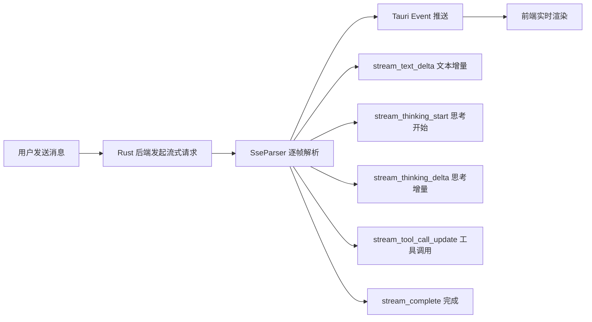

# API 使用指南

> 面向用户：LLM 提供商配置、模型选择与流式输出使用说明

## 📍 支持的提供商

If2Ai 当前支持 **2 类 LLM 提供商**：

### 1. Anthropic Claude（主提供商）

| 配置项 | 值 |
|--------|-----|
| 提供商类型 | `ProviderKind::ClawApi` |
| 默认 Base URL | `https://api.anthropic.com` |
| API 版本 | `2023-06-01` |
| 环境变量 | `ANTHROPIC_API_KEY` / `ANTHROPIC_AUTH_TOKEN` |

**支持的模型别名**：

| 别名 | 模型 | 说明 |
|------|------|------|
| `opus` | claude-opus-4 | 最强推理能力 |
| `sonnet` | claude-sonnet-4 | 平衡性能与成本 |
| `haiku` | claude-haiku-3 | 最快响应速度 |

### 2. OpenAI 兼容提供商

| 配置项 | OpenAI | xAI |
|--------|--------|-----|
| 提供商类型 | `ProviderKind::OpenAi` | `ProviderKind::Xai` |
| 默认 Base URL | `https://api.openai.com/v1` | `https://api.x.ai/v1` |
| 环境变量 | `OPENAI_API_KEY` | `XAI_API_KEY` |

> 源码参考：`src-tauri/src/modules/api/providers/mod.rs` 中 `MODEL_REGISTRY`

## 🔑 API Key 配置方式

### 方式一：环境变量（推荐开发环境）

```bash
# Anthropic
export ANTHROPIC_API_KEY="sk-ant-..."
export ANTHROPIC_AUTH_TOKEN="..."  # OAuth Bearer Token

# OpenAI
export OPENAI_API_KEY="sk-..."

# xAI
export XAI_API_KEY="xai-..."
```

### 方式二：设置界面（推荐普通用户）

1. 打开设置窗口（`Cmd+,`）
2. 进入"提供商"配置
3. 填入 API Key
4. 点击"测试连接"验证

相关 IPC 命令：

| 命令 | 说明 |
|------|------|
| `provider_configure` | 配置提供商 |
| `provider_configure_with_models` | 配置提供商并指定模型 |
| `provider_test` | 测试提供商连接 |
| `provider_list` | 列出可用提供商 |
| `provider_list_configured` | 列出已配置的提供商 |

### 方式三：Claude Desktop 设置回退

If2Ai 会尝试读取 Claude Desktop 应用的已保存 API Key（可禁用）：

```bash
# 禁用回退
export CLAW_DISABLE_CLAUDE_SETTINGS_FALLBACK=1

# 自定义路径
export CLAW_CLAUDE_SETTINGS_PATH="/path/to/claude/settings.json"
```

## 🤖 模型选择与切换

### IPC 命令

| 命令 | 说明 |
|------|------|
| `model_list_available` | 列出可用模型 |
| `model_get_active` | 获取当前活跃模型 |
| `model_select` | 选择模型 |
| `model_set_active` | 设置活跃模型 |
| `model_test` | 测试模型连接 |
| `model_get_role_config` | 获取角色配置 |
| `model_set_role_config` | 设置角色配置 |

### 模型别名解析

系统内置模型别名映射，可通过 `provider_get_configured_models` 查看完整列表：

```
"opus"   → claude-opus-4-20250514
"sonnet" → claude-sonnet-4-20250514
"haiku"  → claude-haiku-3-20250514
```

## 🔄 流式输出说明

If2Ai 所有 LLM 对话均采用 **SSE（Server-Sent Events）流式输出**：



### 流式事件类型

| 事件 | 说明 |
|------|------|
| `message_start` | 消息开始（含模型信息） |
| `content_block_start` | 内容块开始 |
| `content_block_delta` | 内容增量（文本/思考） |
| `content_block_stop` | 内容块结束 |
| `message_delta` | 消息级增量（stop reason） |
| `message_stop` | 消息结束 |

## 📊 Token 计数与用量查看

每次对话完成后，`stream_complete` 事件携带 `Usage` 信息：

```rust
pub struct Usage {
    pub input_tokens: u32,
    pub output_tokens: u32,
    pub cache_creation_input_tokens: Option<u32>,
    pub cache_read_input_tokens: Option<u32>,
}
```

前端可在对话信息面板中查看 Token 用量。

> **注意**：当前 If2Ai 缺少成本追踪（CostTracker），仅显示 Token 数量，不显示美元成本。

## 🔗 相关资源

- [实现深度解析](./02-implementation.md)
- [前端运行时投影](../frontend/03-runtime-projection.md) — 流式事件如何到达前端
- [桌面架构](../desktop/02-architecture.md)
