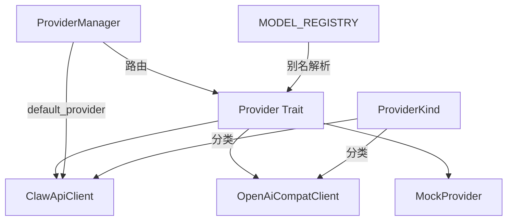
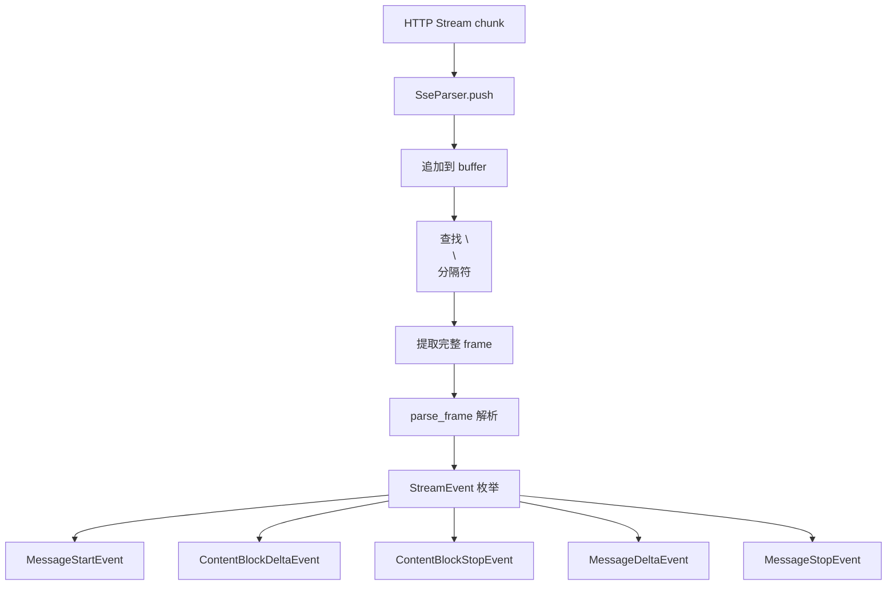

# API 实现详解

> 面向开发者：LLM 提供商抽象层架构、SSE 流式解析与认证机制

## 🏗️ 提供商抽象层架构



### Provider Trait

```rust
// providers/mod.rs
pub trait Provider: Send + Sync {
    type Stream;
    fn send_message<'a>(&'a self, request: &'a MessageRequest)
        -> ProviderFuture<'a, MessageResponse>;
    fn stream_message<'a>(&'a self, request: &'a MessageRequest)
        -> ProviderFuture<'a, Self::Stream>;
}
```

**设计要点**：
- `Send + Sync` 约束确保可跨线程共享（`Arc<ProviderManager>` 可在 `AppState` 中使用）
- `ProviderFuture` 是 `Pin<Box<dyn Future>>` 类型别名，支持异步流式返回
- `Stream` 类型由各实现自行定义

### ProviderKind 枚举

```rust
pub enum ProviderKind {
    ClawApi,   // Anthropic Claude
    Xai,       // xAI Grok
    OpenAi,    // OpenAI GPT
}
```

### 模型注册表

```rust
const MODEL_REGISTRY: &[(&str, ProviderMetadata)] = &[
    ("opus",   ProviderMetadata { provider: ClawApi, ... }),
    ("sonnet", ProviderMetadata { provider: ClawApi, ... }),
    ("haiku",  ProviderMetadata { provider: ClawApi, ... }),
    // ... 更多模型
];
```

> 源码参考：`src-tauri/src/modules/api/providers/mod.rs` 行 47-80

## 📝 ClawApiClient（Anthropic）

**1,224 行**，是 If2Ai 的主 LLM 客户端实现。

### 认证方式

```rust
pub enum AuthSource {
    None,
    ApiKey(String),                          // ANTHROPIC_API_KEY
    BearerToken(String),                     // ANTHROPIC_AUTH_TOKEN
    ApiKeyAndBearer { api_key, bearer_token }, // 两者兼有
}
```

### 请求配置

| 参数 | 默认值 | 说明 |
|------|--------|------|
| `connect_timeout` | 5s | TCP 连接超时 |
| `stream_read_timeout` | 30s | 流式读取超时 |
| `initial_backoff` | 200ms | 重试退避初始值 |
| `max_backoff` | 2s | 重试退避上限 |
| `max_retries` | 2 | 最大重试次数 |

### Claude Desktop 设置回退

ClawApiClient 会尝试从 Claude Desktop 应用的设置中读取 API Key：

```
~/Library/Application Support/Claude/claude_settings.json
```

可通过环境变量禁用或自定义路径：
- `CLAW_DISABLE_CLAUDE_SETTINGS_FALLBACK=1` — 禁用
- `CLAW_CLAUDE_SETTINGS_PATH=...` — 自定义路径

> 源码参考：`src-tauri/src/modules/api/providers/claw_provider.rs`

## 📝 OpenAiCompatClient

**1,072 行**，兼容 OpenAI API 格式的提供商客户端。

### 配置枚举

```rust
pub struct OpenAiCompatConfig {
    pub provider_name: &'static str,   // "OpenAI" / "xAI"
    pub api_key_env: &'static str,     // "OPENAI_API_KEY" / "XAI_API_KEY"
    pub base_url_env: &'static str,    // "OPENAI_BASE_URL" / "XAI_BASE_URL"
    pub default_base_url: &'static str, // 默认 API 端点
}
```

### OpenAI → Claude 类型映射

OpenAiCompatClient 将 OpenAI 格式的响应转换为 Claude 统一类型：

| OpenAI 类型 | Claude 类型 |
|-------------|-------------|
| `ChatCompletion` | `MessageResponse` |
| `delta.content` | `ContentBlockDelta` |
| `tool_calls` | `OutputContentBlock::ToolUse` |
| `finish_reason` | `MessageDeltaEvent` |

> 源码参考：`src-tauri/src/modules/api/providers/openai_compat.rs`

## 🔄 SSE 流式解析器

SseParser 是 If2Ai 流式通信的核心组件：

```rust
// sse.rs
pub struct SseParser {
    buffer: Vec<u8>,
}

impl SseParser {
    pub fn push(&mut self, chunk: &[u8]) -> Result<Vec<StreamEvent>, ApiError>;
    pub fn finish(&mut self) -> Result<Vec<StreamEvent>, ApiError>;
}
```

### 解析流程



### 关键设计

- **增量解析**：`push()` 可多次调用，自动处理不完整帧
- **双换行分隔**：支持 `\n\n` 和 `\r\n\r\n` 两种分隔符
- **类型安全**：解析结果为 `StreamEvent` 枚举，编译期保证完整性

> 源码参考：`src-tauri/src/modules/api/sse.rs`（282 行）

## 📊 Token 计数

```rust
// types.rs
pub struct Usage {
    pub input_tokens: u32,
    pub output_tokens: u32,
    pub cache_creation_input_tokens: Option<u32>,
    pub cache_read_input_tokens: Option<u32>,
}
```

Token 计数来自 API 响应的 `usage` 字段，直接反映提供商计费。

### 模型 Token 上限

```rust
pub fn max_tokens_for_model(model: &str) -> usize {
    match model {
        "opus" | "claude-opus-4*" => 32768,
        "sonnet" | "claude-sonnet-4*" => 16384,
        "haiku" | "claude-haiku-3*" => 8192,
        _ => 4096,
    }
}
```

## 🔐 认证方式

### 1. API Key 认证

```rust
// Anthropic: x-api-key header
headers.insert("x-api-key", api_key);

// OpenAI: Authorization Bearer header
headers.insert("Authorization", format!("Bearer {}", api_key));
```

### 2. Bearer Token 认证

```rust
// Anthropic OAuth
headers.insert("Authorization", format!("Bearer {}", bearer_token));
```

### 3. OAuth 流程

```rust
// OAuth token 生命周期
OAuthTokenExchangeRequest → OAuthTokenSet { access_token, refresh_token }
→ oauth_token_is_expired() → OAuthRefreshRequest → 新 Token
```

OAuth 凭证持久化于 `~/.if2ai/.credentials/`。

## 🔄 请求重试与降级策略

### 重试配置

```rust
const DEFAULT_INITIAL_BACKOFF: Duration = Duration::from_millis(200);
const DEFAULT_MAX_BACKOFF: Duration = Duration::from_secs(2);
const DEFAULT_MAX_RETRIES: u32 = 2;
```

### 重试逻辑

```
请求失败 → 200ms 退避 → 重试1 → 400ms 退避 → 重试2 → 返回错误
```

仅对可重试错误（5xx、网络超时）执行重试，4xx 错误直接返回。

## ⚠️ 与 cc-haha 差距分析

### 优势 ✅

| 维度 | If2Ai | 说明 |
|------|-------|------|
| Rust 异步流式 | ✅ | 零拷贝 SSE 解析，性能优 |
| 统一 Provider trait | ✅ | 新提供商只需实现 trait |
| OAuth 支持 | ✅ | 原生 OAuth token 管理 |
| Claude Desktop 回退 | ✅ | 无缝复用已有 Key |

### 劣势 ❌

| 维度 | If2Ai | cc-haha | 影响 |
|------|-------|---------|------|
| 提供商数量 | 2 类（Anthropic + OpenAI 兼容） | 6+ 类 | 缺少 Bedrock/Ollama/LiteLLM |
| 成本追踪 | ❌ 无 CostTracker | ✅ Token + 美元成本 + 预算限制 | 无法监控和控制 API 花费 |
| 模型降级链 | ❌ 无 | ✅ 自动降级到备用模型 | 主模型不可用时无备选 |
| 多模态 | ⚠️ 基础 | ✅ 完整图片/文件支持 | 视觉理解受限 |

### cc-haha 支持的提供商

| 提供商 | If2Ai | cc-haha |
|--------|-------|---------|
| Anthropic Claude | ✅ | ✅ |
| OpenAI | ✅ | ✅ |
| xAI Grok | ✅ | ❌ |
| MiniMax | ❌ | ✅ |
| OpenRouter | ❌ | ✅ |
| AWS Bedrock | ❌ | ✅ |
| LiteLLM | ❌ | ✅ |
| Ollama | ❌ | ✅ |

## 🎯 增强计划

### P0：添加 Bedrock 提供商

AWS Bedrock 是企业用户的核心需求：

```rust
struct BedrockProvider {
    region: String,
    access_key_id: String,
    secret_access_key: String,
    // SigV4 签名认证
}
```

### P0：添加 Ollama 提供商

本地模型支持，零成本离线运行：

```rust
struct OllamaProvider {
    base_url: String,  // 默认 http://localhost:11434
}
```

### P1：实现 CostTracker

```rust
struct CostTracker {
    token_prices: HashMap<String, ModelPricing>,  // 模型 → 单价
    daily_budget: Decimal,                         // 日预算
    monthly_budget: Decimal,                       // 月预算
    usage_records: Vec<UsageRecord>,               // 用量记录
}

struct ModelPricing {
    input_per_million: Decimal,   // 输入每百万 Token 价格
    output_per_million: Decimal,  // 输出每百万 Token 价格
}
```

### P1：实现模型降级链

```rust
struct FallbackChain {
    providers: Vec<FallbackEntry>,  // 按优先级排序
}

struct FallbackEntry {
    provider: ProviderKind,
    model: String,
    condition: FallbackCondition,  // 何时降级
}
```

### P2：添加 LiteLLM 提供商

LiteLLM 作为统一代理，一次集成支持 100+ 模型。

## 🔗 相关资源

- [使用指南](./01-usage-guide.md)
- [前端运行时投影](../frontend/03-runtime-projection.md)
- [学习系统](../learning/02-implementation.md)
