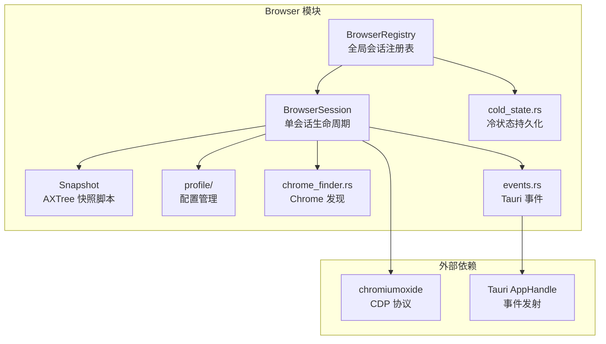
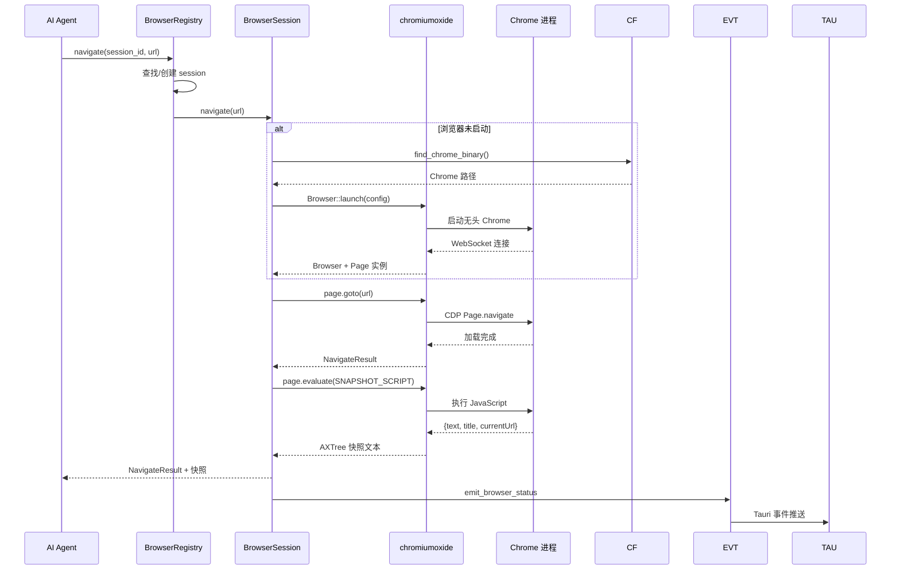

# 🏗️ Browser 实现文档

> 开发者视角 —— Chrome CDP 协议集成、页面交互 API、DOM 快照、会话隔离与生命周期管理。

## 📍 架构总览



## 🔄 CDP 通信流程



## 🏗️ chromiumoxide CDP 集成

### 浏览器配置

```rust
// src-tauri/src/modules/browser/session.rs
use chromiumoxide::browser::{Browser, BrowserConfig};

// 浏览器启动配置
BrowserConfig::builder()
    .chrome_executable(chrome_path)
    .arg("--headless=new")          // 新版无头模式
    .arg("--no-sandbox")
    .arg("--disable-gpu")
    .window_size(1280, 720)         // 默认窗口大小
    .profile_dir(profile_path)      // 用户数据目录
    .build()
```

### CDP 协议使用

`session.rs` 通过 chromiumoxide 封装 CDP 调用：

| CDP 域 | 用途 | 关键类型 |
|--------|------|----------|
| Page | 导航、截屏 | `Page.navigate`, `Page.captureScreenshot` |
| Input | 鼠标/键盘事件 | `DispatchKeyEventParams`, `DispatchMouseEventParams` |
| DOM | DOM 操作 | `DOM.getDocument`, `DOM.querySelector` |
| Network | 网络监控 | `Network.enable`, `EventRequestWillBeSent` |
| Log | 控制台日志 | `Log.enable`, `EventEntryAdded` |
| Browser | 下载管理 | `SetDownloadBehaviorParams` |

### 键盘输入

```rust
// src-tauri/src/modules/browser/session.rs
use chromiumoxide::cdp::browser_protocol::input::{
    DispatchKeyEventParams, DispatchKeyEventType, InsertTextParams,
};

// 文本输入流程：
// 1. focus 元素 (click)
// 2. DispatchKeyEvent (keyDown)
// 3. InsertText (输入字符)
// 4. DispatchKeyEvent (keyUp)
```

## 🏗️ 页面交互 API 封装

### BrowserSession 核心方法

```rust
// src-tauri/src/modules/browser/session.rs
pub struct BrowserSession {
    // 内部字段：
    // - browser: Option<Browser>
    // - page: Option<Page>
    // - action_log: VecDeque<ActionLogEntry>
    // - current_url: Option<String>
}

impl BrowserSession {
    // 生命周期
    pub async fn new(...) -> Result<Self, BrowserError>;
    pub async fn launch(&mut self) -> Result<(), BrowserError>;
    pub async fn shutdown(&mut self) -> Result<(), BrowserError>;

    // 导航
    pub async fn navigate(&mut self, url: &str) -> Result<NavigateResult, BrowserError>;
    pub async fn go_back(&mut self) -> Result<NavigateResult, BrowserError>;
    pub async fn go_forward(&mut self) -> Result<NavigateResult, BrowserError>;

    // 交互
    pub async fn click(&mut self, r#ref: usize) -> Result<String, BrowserError>;
    pub async fn r#type(&mut self, r#ref: usize, text: &str) -> Result<String, BrowserError>;
    pub async fn scroll(&mut self, dir: ScrollDir) -> Result<String, BrowserError>;
    pub async fn screenshot(&mut self) -> Result<Vec<u8>, BrowserError>;

    // 快照
    pub async fn snapshot(&mut self) -> Result<SnapshotResult, BrowserError>;

    // 标签页
    pub async fn list_tabs(&mut self) -> Result<Vec<TabInfo>, BrowserError>;
    pub async fn switch_tab(&mut self, idx: usize) -> Result<(), BrowserError>;
    pub async fn close_tab(&mut self, idx: usize) -> Result<(), BrowserError>;
}
```

### 操作日志

每个操作自动记录到 `ActionLogEntry`，供 AI 错误恢复：

```rust
pub struct ActionLogEntry {
    pub timestamp: DateTime<Utc>,
    pub action: String,     // "navigate", "click", "type" 等
    pub target: String,     // 目标描述
    pub result: String,     // "ok" 或错误信息
}
```

## 🏗️ DOM 快照采集与序列化

### 快照脚本架构

`SNAPSHOT_SCRIPT` 是一个自执行 JavaScript 函数，注入到页面后：

1. **清除旧引用**：移除所有 `data-if2ai-ref` 属性
2. **遍历 DOM**：深度优先，跳过不可见/非视觉元素
3. **标注交互元素**：为可交互元素添加 `data-if2ai-ref="N"` 属性
4. **生成文本**：格式为 `[N] role "label"` 的无障碍树

### 可见性检测

```javascript
// src-tauri/src/modules/browser/snapshot.rs
function isVisible(el) {
    if (!el.offsetParent && el.tagName !== 'BODY' && el.tagName !== 'HTML') return false;
    var s = window.getComputedStyle(el);
    return s.display !== 'none' && s.visibility !== 'hidden';
}
```

### 交互元素识别

```javascript
function isInteractive(el) {
    var t = el.tagName;
    // 标签名检测
    if (['A','BUTTON','INPUT','TEXTAREA','SELECT','DETAILS','SUMMARY'].indexOf(t) !== -1) return true;
    // ARIA role 检测
    var r = el.getAttribute('role');
    if (r && ['button','link','menuitem','tab',...].indexOf(r) !== -1) return true;
    // 事件检测
    if (el.onclick || el.hasAttribute('onclick')) return true;
    if (el.contentEditable === 'true') return true;
    if (el.tabIndex > 0) return true;
    // 光标检测
    if (window.getComputedStyle(el).cursor === 'pointer') return true;
    return false;
}
```

### 同构兄弟压缩

为避免长列表膨胀快照，使用结构签名（signature）检测同构兄弟：

```javascript
function sig(el) {
    var s = el.tagName;
    for (var i = 0; i < el.children.length; i++) {
        s += ',' + el.children[i].tagName;
    }
    return s;
}
// 相同 signature 的兄弟元素压缩为一行
```

## 🏗️ 会话隔离与生命周期管理

### BrowserRegistry 全局注册表

```rust
// src-tauri/src/modules/browser/registry.rs
pub struct BrowserRegistry {
    sessions: DashMap<String, Arc<Mutex<BrowserSession>>>,
    cold_state: Mutex<ColdState>,
    cold_state_path: PathBuf,
    app_handle: OnceLock<tauri::AppHandle>,
    profile_mode: BrowserProfileMode,
    if2ai_home: PathBuf,
    takeover_flags: DashMap<String, bool>,
    last_known_urls: DashMap<String, String>,
}
```

### 并发安全设计

- **DashMap**：分片锁，`get` 后立即释放，不跨 `.await` 持有
- **`Arc<Mutex<BrowserSession>>`**：每个会话独立锁，不同会话不互斥
- **`tokio::sync::Mutex`**：async 感知，安全跨 `.await` 持有

### ColdState 冷状态

```rust
// src-tauri/src/modules/browser/cold_state.rs
// 持久化 session_id → last_url 映射
// 应用重启后恢复上次浏览位置
```

### Profile 配置管理

```rust
// src-tauri/src/modules/browser/profile.rs
pub enum BrowserProfileMode {
    Ephemeral,   // 临时配置（应用退出即清除）
    Persistent,  // 持久化配置（~/.if2ai/browser-profiles/）
}

pub struct ProfileEntry {
    pub name: String,
    pub path: PathBuf,
    pub created_at: DateTime<Utc>,
    pub last_used: DateTime<Utc>,
}
```

### 与前端 BrowserViewerPage 通信

```rust
// src-tauri/src/modules/browser/events.rs
pub async fn emit_browser_status(
    handle: &tauri::AppHandle,
    entry: &BrowserStatusEntry,
) {
    handle.emit("browser-status", entry);
}
```

前端监听 `"browser-status"` 事件，实时更新浏览器状态卡片。

## 📝 核心概念速查表

| 组件 | 文件 | 职责 |
|------|------|------|
| BrowserRegistry | `registry.rs` | 全局会话注册表 + 冷状态 |
| BrowserSession | `session.rs` | 单会话生命周期 + CDP 操作 |
| SNAPSHOT_SCRIPT | `snapshot.rs` | DOM AXTree 快照注入脚本 |
| BrowserConfig | `profile.rs` | 配置模式管理 |
| ColdState | `cold_state.rs` | URL 跨重启持久化 |
| ChromeStatus | `chrome_finder.rs` | Chrome 二进制发现 |
| BrowserStatusEvent | `events.rs` | Tauri 事件载荷 |

## ⚠️ 与 cc-haha 差距分析

### ✅ 优势

| 方面 | If2Ai | cc-haha |
|------|-------|---------|
| CDP 集成 | 原生 Rust（chromiumoxide），类型安全 | Python Selenium/Playwright |
| 性能 | 无 Python 解释器开销 | Python 运行时开销 |
| 会话隔离 | DashMap + tokio Mutex，细粒度锁 | 单进程共享 |
| 快照质量 | AXTree 引用标注，LLM 友好 | 类似但不标注引用编号 |
| 接管模式 | 原子标志位，零延迟切换 | 无明确接管机制 |
| 冷状态 | 跨重启 URL 持久化 | 无 |

### ❌ 劣势

| 方面 | cc-haha 有 | If2Ai 缺 |
|------|-----------|----------|
| Computer Use | Python 桌面全控制（鼠标/键盘/截屏/应用授权） | 仅限浏览器 CDP |
| 系统级控制 | 鼠标移动/点击、键盘输入、窗口管理 | 仅浏览器内操作 |
| 应用授权 | 操作系统级应用权限授权 | 无 |
| 全屏截屏 | 系统级截屏（含非浏览器窗口） | 仅浏览器页面截屏 |
| 文件拖放 | 系统级文件拖放操作 | 无 |

### 📊 对比矩阵

| 特性 | If2Ai | cc-haha | 差距 |
|------|-------|---------|------|
| 浏览器 CDP | ⭐⭐⭐⭐⭐ | ⭐⭐⭐⭐ | If2Ai 原生 Rust 更优 |
| 系统桌面控制 | ⭐ | ⭐⭐⭐⭐⭐ | cc-haha 远超 |
| 截屏范围 | ⭐⭐ | ⭐⭐⭐⭐⭐ | cc-haha 全系统截屏 |
| 会话管理 | ⭐⭐⭐⭐⭐ | ⭐⭐⭐ | If2Ai 更优 |
| 性能 | ⭐⭐⭐⭐⭐ | ⭐⭐⭐ | If2Ai 原生更快 |

## 🎯 增强计划

### 1. Computer Use 等价桌面控制

```
目标：实现 cc-haha Computer Use 等价的桌面控制能力

Phase 1: 系统截屏
  - macOS: CGWindowListCreateImage
  - 跨平台: scrot / xdotool (Linux)

Phase 2: 鼠标控制
  - 移动到坐标 (x, y)
  - 点击/双击/右键
  - 拖拽

Phase 3: 键盘控制
  - 按键输入
  - 组合键 (Cmd+C 等)
  - 快捷键

Phase 4: 窗口管理
  - 列出窗口
  - 切换/最小化/关闭窗口
  - 窗口截图
```

### 2. 应用级权限授权

```
目标：实现操作系统级应用权限授权

- 授权特定应用的操作权限
- 敏感操作需用户确认
- 权限分级（读取/控制/管理）
- 权限审计日志
```

### 3. 增强截屏能力

```
目标：支持全系统截屏和 OCR

- 全屏截屏（含非浏览器窗口）
- 区域截屏
- OCR 文字识别
- 截屏标注（供 LLM 理解）
```

## 🔗 相关资源

- [Browser 使用指南](./01-usage-guide.md) — 用户操作手册
- [BrowserSession 源码](../../../src-tauri/src/modules/browser/session.rs)
- [Registry 源码](../../../src-tauri/src/modules/browser/registry.rs)
- [Snapshot 脚本源码](../../../src-tauri/src/modules/browser/snapshot.rs)
