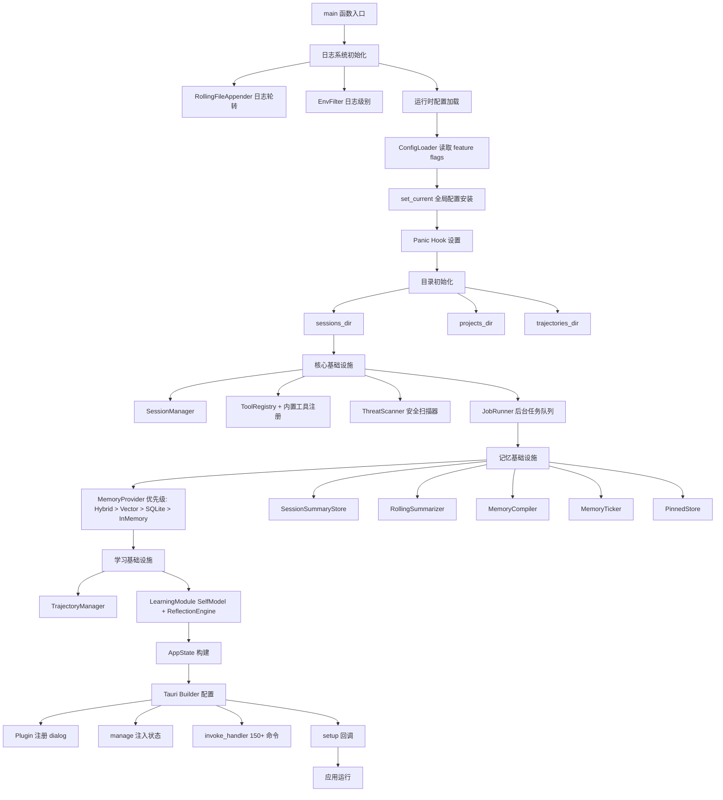
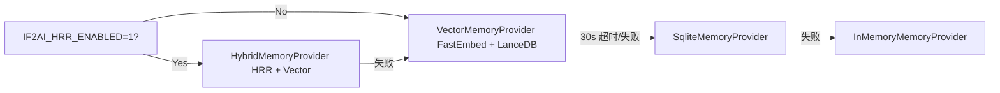
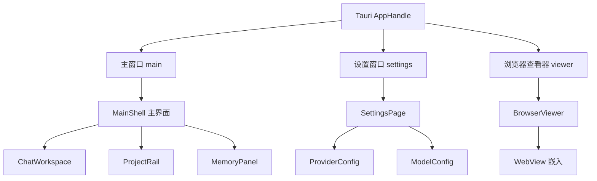

# 桌面应用架构

> If2Ai 桌面应用的 Tauri 2 架构深度解析：从 main.rs 启动到 IPC 通信的全链路

## 🏗️ Tauri 2 架构概述

If2Ai 基于 **Tauri 2** 构建，采用 Rust 后端 + React 前端的分层架构：

```
┌──────────────────────────────────────────┐
│            React + TypeScript            │
│  (Vite 构建 · localhost:9527)            │
│  src/ · components/ · stores/            │
├────────────── IPC 层 ────────────────────┤
│  invoke() ←→ Tauri Commands              │
│  listen()  ←→ Tauri Events               │
├──────────────────────────────────────────┤
│            Rust 后端 (Tauri 2)            │
│  main.rs → AppState → Modules            │
│  src-tauri/src/                          │
└──────────────────────────────────────────┘
```

**核心优势**：Rust 原生性能 + Web 前端灵活性的最佳平衡。

## 🔄 main.rs 启动流程

`main.rs`（1,217 行）是整个应用的启动编排器，按以下顺序初始化：



### 启动阶段详解

#### 1. 日志初始化（行 406-427）

```rust
// 日志轮转：按日分割，存储于 ~/.if2ai/log/backend.log
let file_appender = RollingFileAppender::new(Rotation::DAILY, &log_dir, "backend.log");
tracing_subscriber::registry()
    .with(fmt::layer().with_writer(non_blocking).with_ansi(false))
    .with(EnvFilter::from_default_env().add_directive(tracing::Level::INFO.into()))
    .init();
```

#### 2. 记忆 Provider 优先级链（行 250-404）



#### 3. 工具注册（行 669-675）

```rust
modules::tools::register_builtin_tools(
    &tool_registry,
    memory_provider.clone(),
    scheduler_provider,
    browser_registry.clone(),
    pinned_store.clone(),
);
```

## 📍 AppState 全局状态容器

`AppState` 是所有管理器的中心注入点，通过 `tauri::Builder::manage()` 注入：

| 字段 | 类型 | 职责 |
|------|------|------|
| `session_manager` | SessionManager | 会话 CRUD |
| `tool_registry` | ToolRegistry | 工具注册与调度 |
| `project_manager` | ProjectManager | 项目管理 |
| `memory_provider` | SharedMemoryProvider | 记忆存取 |
| `context_budget` | BudgetConfig | 上下文预算 |
| `trajectory_manager` | Option<Arc<TrajectoryManager>> | 轨迹记录 |
| `learning_module` | Option<Arc<Mutex<LearningModule>>> | 学习引擎 |
| `threat_scanner` | Arc<ThreatScanner> | 安全扫描 |
| `job_runner` | Arc<JobRunner> | 后台任务 |
| `utility_llm` | Arc<dyn UtilityLlm> | 辅助 LLM |
| `summary_store` | Arc<dyn SessionSummaryStore> | 摘要持久化 |
| `rolling_summarizer` | Arc<RollingSummarizer> | 滚动摘要 |
| `pinned_store` | Arc<dyn PinnedStore> | 置顶存储 |
| `memory_compiler` | Arc<MemoryCompiler> | 记忆编译 |
| `memory_ticker` | Arc<MemoryTicker> | 记忆定时器 |

## 📝 150+ Tauri 命令注册

`invoke_handler` 注册了 150+ 个前端可调用的命令，按模块分组：

| 模块 | 命令数 | 示例命令 |
|------|--------|----------|
| Agent | 5 | `run_agent_turn`, `start_agent_stream`, `stop_agent_stream` |
| Browser | 10 | `get_browser_sessions`, `request_browser_takeover` |
| Session | 8 | `create_session`, `list_sessions`, `delete_session` |
| Project | 7 | `create_project`, `list_projects`, `rename_project` |
| Memory | 12 | `memory_recall`, `memory_promote`, `memory_compile_now` |
| Learning | 15 | `learning_reflect_session_and_register`, `learning_evaluate_candidate` |
| Provider | 8 | `provider_configure`, `provider_test`, `provider_list_models` |
| Model | 6 | `model_select`, `model_set_active`, `model_test` |
| Config | 4 | `config_load`, `config_save`, `config_validate` |
| TTS | 15 | `tts_synthesize`, `tts_stream_start`, `tts_preview_voice` |
| STT | 5 | `stt_transcribe`, `stt_model_status` |
| Harness | 12 | `harness_begin_run`, `harness_evaluate_suite` |
| Hub | 14 | `hub_install`, `hub_publish`, `hub_search` |
| Onboarding | 4 | `onboarding_complete`, `onboarding_get_state` |
| Activation | 5 | `activation_start`, `activation_validate` |

> 源码参考：`src-tauri/src/main.rs` 行 869-1111

## 🔗 前后端 IPC 通信

### invoke（前端 → 后端）

```typescript
// 前端调用后端命令
import { invoke } from '@tauri-apps/api/core'

const result = await invoke('run_agent_turn', {
  sessionId: 'xxx',
  message: 'Hello',
})
```

### listen（后端 → 前端推送）

```typescript
// 前端监听后端事件
import { listen } from '@tauri-apps/api/event'

const unlisten = await listen('agent-token', (event) => {
  // 处理流式 token
})
```

### 关键事件通道

| 事件名 | 方向 | 用途 |
|--------|------|------|
| `agent-token` | 后端→前端 | 流式 token 推送 |
| `permission-request` | 后端→前端 | 权限审批请求 |
| `memory_event` | 后端→前端 | 记忆生命周期事件 |
| `browser-status` | 后端→前端 | 浏览器状态变更 |
| `tts-stream` | 后端→前端 | TTS 音频流 |
| `harness-event` | 后端→前端 | 测试 Harness 事件 |
| `model-download-progress` | 后端→前端 | 模型下载进度 |
| `activation-status-changed` | 后端→前端 | 激活状态变更 |

## 🏗️ 多窗口架构



### 窗口管理命令

| 命令 | 说明 |
|------|------|
| `open_settings_window` | 打开设置窗口 |
| `close_settings_window` | 关闭设置窗口 |
| `open_browser_viewer_window` | 打开浏览器查看器 |
| `navigate_viewer_window` | 查看器导航 |
| `focus_main_window_and_prefill_prompt` | 聚焦主窗口并预填提示 |

> 主窗口配置：1280×800，最小 960×620，Overlay 标题栏风格

## 🔗 相关资源

- [Tauri 2 IPC 文档](https://v2.tauri.app/develop/calling-rust/)
- [快速开始](./01-quick-start.md)
- [功能概览](./03-features.md)
