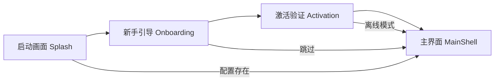
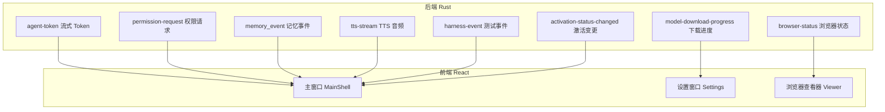

# 桌面应用功能

> If2Ai 桌面应用完整功能清单、设计系统与差距分析

## 📍 导航结构

If2Ai 主界面采用四区段导航布局：

| 区段 | 图标 | 功能 | 组件 |
|------|------|------|------|
| 💬 聊天 | ChatBubble | AI 对话、流式响应、工具调用 | `ChatWorkspace`, `ChatMessage` |
| ⚡ 技能 | Zap | 斜杠命令、技能市场、Hub 管理 | `SkillPanel`, `CommandPalette` |
| 🤖 自动化 | Bot | Agent 循环、权限审批、浏览器控制 | `PermissionCard`, `BrowserCard` |
| 🧠 记忆 | Brain | 记忆管理、置顶、编译、摘要 | `MemoryPanel`, `MemoryChip` |

## 🔄 4 状态引导流程

用户首次启动体验遵循 4 阶段引导：



### 1. 启动画面（Splash）

- 应用 Logo + 版本号水印
- 检查已保存配置
- 有配置 → 直达主界面

### 2. 新手引导（Onboarding）

| 命令 | 说明 |
|------|------|
| `onboarding_get_state` | 获取当前引导状态 |
| `onboarding_next_step` | 下一步 |
| `onboarding_prev_step` | 上一步 |
| `onboarding_complete` | 完成引导 |

引导步骤：API Key 配置 → 模型选择 → 工作目录 → 完成

### 3. 激活验证（Activation）

| 命令 | 说明 |
|------|------|
| `activation_start` | 启动激活流程 |
| `activation_validate` | 验证激活码 |
| `activation_complete` | 完成激活 |
| `activation_get_status` | 查询激活状态 |
| `activation_test_message` | 测试消息发送 |

支持状态：`checking_local` → `needs_activation` → `requesting_activation` → `activated` / `offline_grace`

### 4. 主界面（MainShell）

完整功能界面，包含项目导航、聊天区域、记忆面板。

## 🔗 跨窗口事件同步

8 个 Tauri 事件通道实现跨窗口同步：



## 🎨 Paico 设计系统

If2Ai 采用 **Paico** 设计系统，以翡翠薄雾色调为视觉基调。

### 色彩体系

| 层级 | 色调 | 用途 |
|------|------|------|
| 主色 | 翡翠薄雾 Green | 品牌标识、主按钮 |
| 中性色 | 灰阶系 | 背景、文字、边框 |
| 语义色 | 红/橙/蓝 | 错误/警告/信息 |
| 表面色 | 半透明雾感 | 卡片、面板、弹窗 |

### CSS 令牌

80+ CSS 自定义属性（Custom Properties）定义于 `src/styles/globals.css`：

```css
:root {
  --paico-green-50: ...;
  --paico-green-500: ...;
  --paico-surface: ...;
  /* ... 80+ tokens */
}
```

### 组件库

基于 **ShadCN + Radix UI** 构建 23 个基础组件：

`src/components/ui/` 包含：
- 布局：`card`, `separator`, `scroll-area`, `collapsible`
- 表单：`button`, `input`, `textarea`, `select`, `switch`, `label`
- 反馈：`dialog`, `dropdown-menu`, `tooltip`, `badge`, `sonner`
- 导航：`tabs`, `command`, `avatar`
- 业务：`chat-ui`, `ArtifactEditor`, `TodoPanel`, `ProjectPreviewPanel`

## ⚠️ 与 cc-haha 差距分析

### 优势 ✅

| 维度 | If2Ai | 说明 |
|------|-------|------|
| Rust 原生后端 | ✅ | 比 Electron/Node.js 后端性能优、内存小 |
| 深度模块化 | ✅ | 22 个独立模块，bounded context 清晰 |
| 语音原生集成 | ✅ | TTS/STT 深度集成，cc-haha 无此能力 |
| 浏览器原生集成 | ✅ | CDP 协议直接控制，cc-haha 依赖外部 |
| 学习系统 | ✅ | SelfModel + ReflectionEngine，cc-haha 无 |
| 运行时投影 | ✅ | 纯函数 Reducer 架构，比 Zustand 更规范 |

### 劣势 ❌

| 维度 | If2Ai | cc-haha | 影响 |
|------|-------|---------|------|
| 自动更新 | ❌ 无 updater | ✅ tauri-plugin-updater | 用户需手动下载新版本 |
| 多平台构建 | ❌ 仅 macOS 脚本 | ✅ 5 平台 GitHub Actions | 无法触达 Windows/Linux 用户 |
| Sidecar 机制 | ❌ 无 | ✅ 外部进程管理 | 无法运行后台服务 |
| CI/CD | ❌ 无 | ✅ 完整流水线 | 发布流程全手动 |
| 系统托盘 | ⚠️ 基础实现 | ✅ 丰富菜单 | 托盘功能有限 |

## 🎯 增强计划

### P0：自动更新

集成 `tauri-plugin-updater`：

```toml
# Cargo.toml
[dependencies]
tauri-plugin-updater = "2"
```

```rust
// main.rs setup
.plugin(tauri_plugin_updater::Builder::new().build())
```

需要：JSON 更新清单服务器 + 签名验证。

### P1：多平台 GitHub Actions

创建 `.github/workflows/release.yml`：

```yaml
strategy:
  matrix:
    include:
      - platform: macos-latest
      - platform: windows-latest
      - platform: ubuntu-22.04
```

5 平台覆盖：macOS (Intel + ARM) / Windows / Linux (deb + AppImage)。

### P2：Sidecar 后台服务

```jsonc
// tauri.conf.json
{
  "bundle": {
    "externalBin": ["bin/if2ai-backend"]
  }
}
```

支持长期运行的后台服务进程管理。

### P3：CI/CD 流水线

- PR 自动 lint + test
- main 分支自动构建 nightly
- Tag 触发正式发布

## 🔗 相关资源

- [快速开始](./01-quick-start.md)
- [架构深度解析](./02-architecture.md)
- [Paico 设计系统规范](../../references/if_2_ai_动态视觉系统规范.md)
- [前端模块文档](../frontend/)
