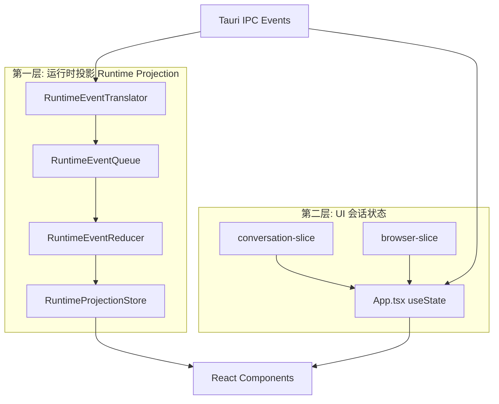
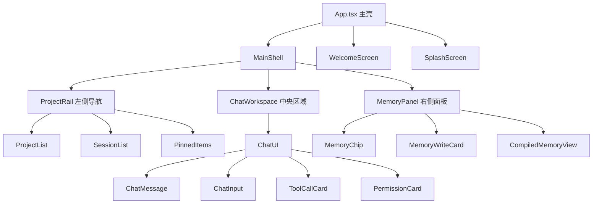

# 前端实现详解

> 面向开发者：If2Ai 前端双层状态架构、组件层次与样式体系

## 🏗️ 双层状态架构概述

If2Ai 前端采用**双层状态架构**：



**第一层**（运行时投影）：纯函数、不可变、后端事件驱动
**第二层**（UI 会话状态）：用户交互驱动、可变

## 📍 传输层

### contracts.ts（539 行事件 DTO）

`src/transport/contracts.ts`（18KB）定义了前后端通信的所有数据传输对象：

| 类别 | 示例类型 | 说明 |
|------|----------|------|
| 流式事件 | `AgentTokenPayload` | 流式 Token 数据 |
| 权限事件 | `PermissionRequestPayload` | 权限请求 |
| 记忆事件 | `MemoryEventPayload` | 记忆生命周期 |
| 激活状态 | `ActivationStatusPayload` | 激活信息 |
| 执行模式 | `ExecutionModeDecisionPayload` | 执行模式决策 |
| 上下文预算 | `ContextBudgetUsage` | 预算使用量 |

### tauri.ts IPC 桥接

`src/lib/tauri.ts` 封装了所有 Tauri IPC 调用：

```typescript
// 命令调用
export async function runAgentTurn(...): Promise<...>
export async function startAgentStream(...): Promise<...>

// 事件监听
export async function listenToAgentTokenStream(...): Promise<...>
export async function listenToPermissionRequests(...): Promise<...>
export async function listenMemoryEvent(...): Promise<...>
```

## 🏗️ 组件层次结构



### 关键组件

| 组件 | 路径 | 职责 |
|------|------|------|
| App.tsx | `src/App.tsx` | 主壳，状态编排（~2500 行） |
| ProjectRail | `src/components/ProjectRail.tsx` | 左侧导航面板（37KB） |
| ChatUI | `src/components/ui/chat-ui.tsx` | 聊天主界面（176KB） |
| WelcomeScreen | `src/components/WelcomeScreen.tsx` | 欢迎/空状态 |
| AgentOrb | `src/components/AgentOrb.tsx` | Agent 状态指示器 |
| GlobalSearch | `src/components/GlobalSearch.tsx` | 全局搜索 |
| CreateProjectDialog | `src/components/CreateProjectDialog.tsx` | 创建项目对话框 |

### 组件目录

```
src/components/
├── ui/              (23 文件) ShadCN + Radix 基础组件
├── chat/            (7 文件)  聊天相关组件
├── browser/         (1 文件)  浏览器控制组件
├── ds/              (10 文件) Paico 设计系统组件
├── memory/          (9 文件)  记忆面板组件
├── settings/        (2 文件)  设置页面组件
├── theme/           (1 文件)  主题切换组件
├── loading/         (2 文件)  加载状态组件
├── AgentOrb.tsx
├── ProjectRail.tsx
├── WelcomeScreen.tsx
├── GlobalSearch.tsx
└── ...
```

## 🔗 跨窗口同步

8 个 Tauri 事件通道实现跨窗口状态同步：

| 通道 | 监听窗口 | 数据流 |
|------|----------|--------|
| `agent-token` | 主窗口 | 流式 Token → 聊天渲染 |
| `permission-request` | 主窗口 | 权限审批 → PermissionCard |
| `memory_event` | 主窗口 | 记忆事件 → MemoryChip |
| `memory_after_turn` | 主窗口 | 批量写决策 → MemoryWriteCard |
| `browser-status` | 查看器窗口 | 浏览器状态 → BrowserCard |
| `tts-stream` | 主窗口 | 音频流 → 播放器 |
| `model-download-progress` | 设置窗口 | 下载进度 → 进度条 |
| `activation-status-changed` | 主窗口 | 激活状态 → 状态栏 |

## 🎨 样式体系

### Tailwind CSS v4

If2Ai 使用 **Tailwind CSS v4** + `@tailwindcss/vite` 插件：

```typescript
// vite.config.ts
import tailwindcss from '@tailwindcss/vite'

export default defineConfig({
  plugins: [react(), tailwindcss()],
})
```

### Geist Variable 字体

```typescript
// 使用 @fontsource-variable/geist
import '@fontsource-variable/geist'
```

### cn() 工具函数

组件类名合并工具：

```typescript
import { cn } from '@/lib/utils'

// 条件类名
<div className={cn('base-class', condition && 'conditional-class')} />
```

### globals.css（26.9KB）

包含：
- CSS 令牌定义（80+ 变量）
- 深色模式适配
- Tailwind 基础层
- Paico 自定义样式
- 动画定义

## ⚠️ 与 cc-haha 差距分析

### 优势 ✅

| 维度 | If2Ai | cc-haha |
|------|-------|---------|
| 运行时投影 | ✅ 纯函数 Reducer + 不可变快照 | ❌ Zustand 可变状态 |
| 设计系统 | ✅ Paico 80+ CSS 令牌 | ⚠️ 基础主题 |
| 组件库 | ✅ ShadCN + Radix 23 组件 | ⚠️ 自建组件 |

### 劣势 ❌

| 维度 | If2Ai | cc-haha | 影响 |
|------|-------|---------|------|
| i18n | ❌ 无 | ✅ 完整中英文 | 无法国际化 |
| 前端测试 | ❌ 0 个文件 | ✅ 26 个测试文件 | 无回归保护 |
| TypeScript strict | ❌ 未启用 | ✅ 全启用 | 类型安全不足 |
| 上帝组件 | ⚠️ App.tsx ~2500 行 / chat-ui.tsx 176KB | ✅ 组件拆分良好 | 可维护性差 |

## 🎯 增强计划

### P0：添加 i18n 国际化

```typescript
// 使用 react-i18next
import { useTranslation } from 'react-i18next'

function ChatInput() {
  const { t } = useTranslation()
  return <input placeholder={t('chat.placeholder')} />
}
```

目标：支持中文 + 英文，覆盖所有用户可见文字。

### P0：补充前端单元测试

目标：26+ 测试文件，覆盖：
- 运行时投影 Reducer（纯函数，易测）
- 传输层 Translator
- 关键组件渲染
- Store 切片逻辑

### P1：启用 TypeScript strict 模式

```jsonc
// tsconfig.json
{
  "compilerOptions": {
    "strict": true,
    "noUncheckedIndexedAccess": true,
    "exactOptionalPropertyTypes": true
  }
}
```

### P1：拆分上帝组件

| 组件 | 当前行数 | 目标 |
|------|----------|------|
| App.tsx | ~2500 | 拆为 MainShell + Router + Providers |
| chat-ui.tsx | 176KB | 拆为 ChatMessage + ChatInput + ToolCard + PermissionCard |

## 🔗 相关资源

- [使用指南](./01-usage-guide.md)
- [运行时投影系统](./03-runtime-projection.md)
- [桌面架构](../desktop/02-architecture.md)
