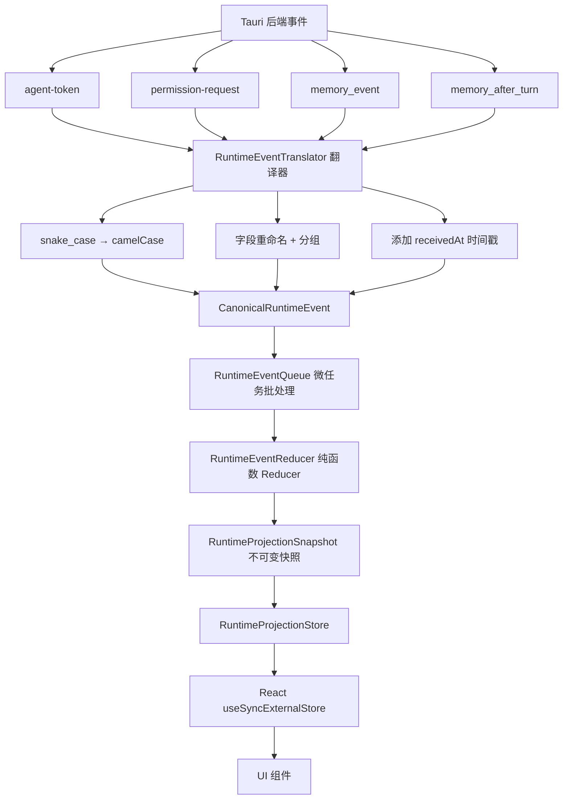
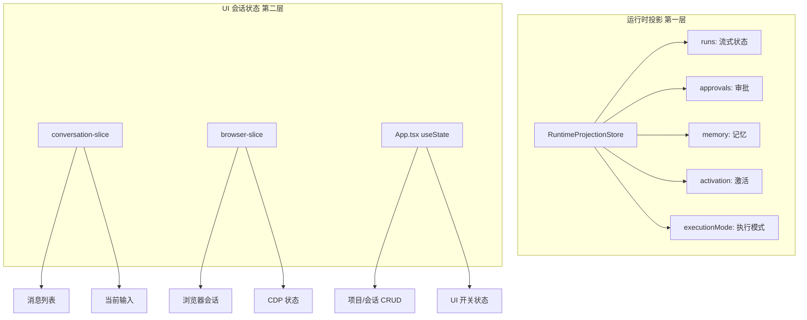

# 运行时投影系统

> If2Ai 独有的运行时投影系统深度解析：后端事件流的唯一真实来源

## 🏗️ 设计理念

运行时投影的核心设计原则：

> **后端事件流是唯一真实来源（Single Source of Truth）**

前端不发明业务真值，只投影后端事件的状态。每一个 UI 状态都可以从事件流中完全重建。

### 4 条硬规则

1. **Reducer 只投影状态**，不发明业务真值（不推断执行模式、不回填激活状态）
2. **Reducer 不触碰** localStorage / IndexedDB / 网络
3. **Reducer 不依赖 React**
4. **Reducer 是纯函数**：相同 `(prev, event)` → 相同 `next`

> 源码参考：`src/runtime-projection/runtime-event-reducer.ts` 文件头注释

## 📍 纯不可变 Reducer

核心函数签名：

```typescript
function reduceRuntimeEvent(
  prev: RuntimeProjectionSnapshot,
  event: CanonicalRuntimeEvent,
): RuntimeProjectionSnapshot
```

**纯函数保证**：
- 输入相同 → 输出必定相同
- 无副作用
- 结构化共享（未变更的节点保持引用相等）

## 🔄 数据管线



### 1. 翻译器（RuntimeEventTranslator）

`src/runtime-projection/runtime-event-translator.ts`（8.6KB）

将后端 snake_case 的 Tauri 事件翻译为前端 camelCase 的 `CanonicalRuntimeEvent`：

```typescript
// 后端 → 前端翻译
translateAgentTokenPayload(payload)     → StreamTextDeltaEvent | StreamThinkingDeltaEvent | ...
translatePermissionRequestPayload(payload) → PermissionRequestEvent
translateMemoryEventPayload(payload)    → MemoryLifecycleEvent
```

**关键约束**：翻译器不做语义改写，只做重命名和分组。

### 2. 事件队列（RuntimeEventQueue）

`src/runtime-projection/runtime-event-queue.ts`（3.7KB）

微任务批处理队列，合并高频事件减少重渲染：

```typescript
class RuntimeEventQueue {
  enqueue(event: CanonicalRuntimeEvent): void
  // 微任务调度，批量分发
}
```

### 3. Reducer（RuntimeEventReducer）

`src/runtime-projection/runtime-event-reducer.ts`（12.4KB，361 行）

纯函数 Reducer，处理 15 种事件类型：

| 事件 | 投影操作 |
|------|----------|
| `stream_text_delta` | 追加文本到 run.text |
| `stream_thinking_start` | 标记思考开始 |
| `stream_thinking_delta` | 追加思考内容 |
| `stream_tool_call_update` | 更新工具调用状态 |
| `stream_complete` | 标记完成 + 记录 Token |
| `stream_error` | 标记失败 |
| `permission_request` | 添加审批条目 |
| `permission_resolved` | 清除审批条目 |
| `memory_event` | 追加到记忆事件环 |
| `memory_write_decision` | 追加写决策 |
| `memory_after_turn` | 更新批量写结果 |
| `activation_snapshot` | 更新激活状态 |
| `execution_mode_decision` | 更新执行模式 |
| `execution_mode_manual_override` | 记录手动覆盖 |

### 4. 快照结构（RuntimeProjectionSnapshot）

```typescript
interface RuntimeProjectionSnapshot {
  runs: Record<string, RunProjection>             // 流式运行状态
  approvals: Record<string, PermissionApprovalProjection>  // 权限审批
  memory: MemoryRollingProjection                  // 记忆滚动投影
  activation: ActivationProjection | null          // 激活状态
  executionMode: ExecutionModeProjection | null    // 执行模式
}
```

### 5. 桥接层（RuntimeProjectionBridge）

`src/runtime-projection/runtime-projection-bridge.ts`（9.1KB，253 行）

唯一将 Tauri 事件翻译为 `CanonicalRuntimeEvent` 的地方：

```typescript
function wireRuntimeProjectionListeners(): () => void
```

**硬约束**：页面组件**绝不能**自己做翻译工作。

### 6. Store（RuntimeProjectionStore）

`src/runtime-projection/runtime-projection-store.ts`（4.1KB）

基于 `useSyncExternalStore` 的响应式 Store：

```typescript
// 订阅机制
subscribe(listener): () => void
getSnapshot(): RuntimeProjectionSnapshot

// React Hook
useRuntimeProjection(): RuntimeProjectionSnapshot
```

## 📝 管理内容

| 投影域 | 内容 | 来源事件 |
|--------|------|----------|
| 流式运行 | 文本、思考、工具调用、状态 | `stream_*` 系列 |
| 权限审批 | 待审批请求、决定结果 | `permission_*` |
| 记忆事件 | 生命周期事件、写决策 | `memory_*` |
| 激活状态 | 许可证、离线宽限 | `activation_snapshot` |
| 执行模式 | 分类器判断、手动覆盖 | `execution_mode_*` |

## 🔗 与 UI 会话状态的关系



**第一层**由后端事件驱动，不可变，纯函数更新。
**第二层**由用户交互驱动，可变，当前仍为 useState/useReducer。

> **演进方向**：M2.5+ 将逐步将 UI 消费者迁移到投影 Store，最终退役 per-stream 监听器。

## 🏗️ 文件清单

| 文件 | 大小 | 职责 |
|------|------|------|
| `types.ts` | 14.9KB | 类型定义：15 种事件 + 5 种投影 + 快照 |
| `runtime-event-reducer.ts` | 12.4KB | 纯函数 Reducer |
| `runtime-event-translator.ts` | 8.6KB | 事件翻译器 |
| `runtime-projection-bridge.ts` | 9.1KB | Tauri 事件桥接 |
| `runtime-projection-store.ts` | 4.1KB | Store + useSyncExternalStore |
| `runtime-event-queue.ts` | 3.7KB | 微任务批处理队列 |
| `use-runtime-projection.ts` | 1.8KB | React Hook |
| `use-execution-mode-preview.ts` | 2.8KB | 执行模式预览 Hook |
| `index.ts` | 0.6KB | 模块导出 |

> 源码参考：`src/runtime-projection/`（9 个文件，总计 ~57KB）

## ⚠️ 与 cc-haha 差距分析

### 优势 ✅

| 维度 | If2Ai 运行时投影 | cc-haha Zustand |
|------|-------------------|-----------------|
| 不可变性 | ✅ 结构化共享，浅比较 | ❌ 可变状态 |
| 纯函数 | ✅ Reducer 无副作用 | ❌ Store 可含副作用 |
| 可回溯 | ✅ 从事件流完全重建 | ❌ 状态快照无历史 |
| 可测试 | ✅ 纯函数极易测试 | ⚠️ 需 mock |
| 审计 | ✅ 事件即审计日志 | ❌ 无审计能力 |

### 劣势 ❌

| 维度 | If2Ai | cc-haha |
|------|-------|---------|
| 投影覆盖 | 仅 5 个域 | Zustand 覆盖所有状态 |
| UI 消费者迁移 | 部分组件仍用旧路径 | 完整 Zustand 生态 |
| 调试工具 | 无 DevTools | ✅ Zustand DevTools |

## 🎯 增强计划

### P0：扩展投影覆盖

将更多 UI 状态纳入运行时投影：
- 会话列表（session CRUD）
- 项目列表（project CRUD）
- 工具调用详情（tool call results）

### P1：构建 DevTools

```
RuntimeProjection DevTools
├── 事件时间线（按 receivedAt 排序）
├── 快照差异查看（prev vs next）
├── 投影域选择器（runs / approvals / memory / ...）
└── 事件回放（从空快照重放 N 个事件）
```

### P2：完整迁移 UI 消费者

- 逐步用 `useRuntimeProjection()` 替换 `listenToStream()` 回调
- 最终退役 `App.tsx` 中的 per-stream 监听器
- 实现完整的单向数据流

## 🔗 相关资源

- [前端实现详解](./02-implementation.md)
- [前端使用指南](./01-usage-guide.md)
- [API 模块](../api/) — 流式事件的来源
- [桌面架构](../desktop/02-architecture.md) — IPC 通信基础
