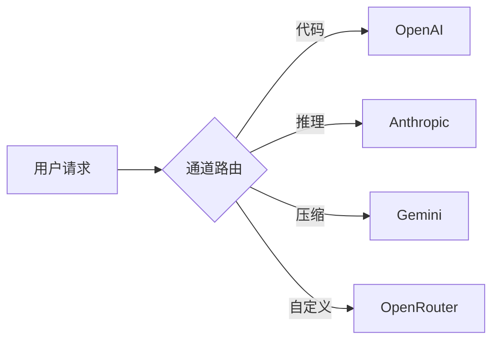
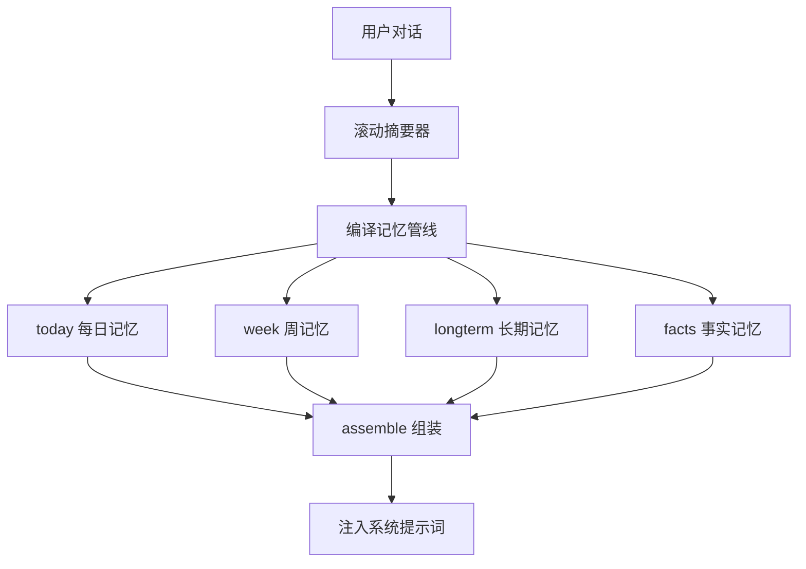

# 常见问题解答

> If2Ai 使用中最常见的问题与解决方案

## 🔄 LLM 提供商

### 如何切换 LLM 提供商？

If2Ai 支持多提供商同时配置，切换方式：

1. **通过 GUI**：设置面板 → 模型设置 → 选择提供商和模型
   - 源码：`src/modules/settings/pages/ModelSettingsPage.tsx`

2. **通过配置文件**：编辑 `~/.if2ai/memory_config.json`，修改 `model_selection.default`

3. **通道路由**：If2Ai 支持按请求类型自动路由到不同提供商
   - 代码对话 → OpenAI
   - 推理任务 → Anthropic
   - 上下文压缩 → Gemini
   - 源码：`src-tauri/src/modules/channel/`



### 如何配置 OpenRouter？

OpenRouter 是统一网关，可访问 100+ 模型：

1. 前往 [openrouter.ai](https://openrouter.ai) 注册并获取 API Key
2. 在 If2Ai 设置面板中添加 OpenRouter 提供商
3. 输入 `sk-or-...` 格式的 API Key
4. 选择需要的模型

## 🧠 记忆系统

### 记忆系统如何工作？

If2Ai 的记忆系统采用多层架构：



1. **滚动摘要** — 每 N 轮对话生成压缩摘要
2. **编译管线** — 5 步（today → week → longterm → facts → assemble）
3. **存储降级** — HybridMemory → VectorMemory → SqliteMemory → InMemory
4. **检索增强** — 相关记忆注入系统提示词，增强上下文

详细说明：[Memory 模块](../memory/01-usage-guide.md)

### 如何查看和管理记忆？

- **记忆管理页面**：设置面板 → 记忆管理
  - 源码：`src/modules/settings/pages/MemorySettingsPage.tsx`
- 支持操作：浏览、搜索、删除、钉选（Pinned）

## 🔧 工具系统

### 如何添加新工具？

If2Ai 的工具系统支持两种扩展方式：

**方式一：内置工具**（需修改 Rust 代码）

1. 在 `src-tauri/src/modules/tools/` 中创建新的工具模块
2. 实现 `Tool` trait
3. 在工具注册表中注册
4. 源码：`src-tauri/src/modules/tools/`

**方式二：技能（Skill）**（无需改代码）

1. 在技能面板中搜索和安装社区技能
2. 或创建自定义 `SKILL.md` 文件
3. 源码：`src-tauri/src/modules/skills/`

详细说明：[Skills 模块](../skills/index.md)

## 🎙️ 语音功能

### 如何使用语音功能？

1. **启用 TTS（文字转语音）**：
   - 设置面板 → 语音设置 → 选择 TTS 配置
   - 代理回复会自动朗读

2. **启用 STT（语音转文字）**：
   - 设置面板 → 语音设置 → 选择 STT 引擎
   - 点击输入框旁的麦克风按钮开始语音输入

3. **声音样本**：
   - 放置 `.wav` / `.mp3` 参考音频到 `~/.if2ai/tts/voices/`
   - TTS 会基于参考音频生成相似音色的语音

源码参考：
- TTS 模块：`src-tauri/src/modules/tts/`
- STT 模块：`src-tauri/src/modules/stt/`
- 语音设置：`src/modules/settings/pages/AgentVoicePicker.tsx`

### 支持哪些语音模型？

| 功能 | 模型 | 说明 |
|------|------|------|
| **TTS 合成** | MOSS-TTS-Nano | ONNX 本地推理，低延迟 |
| **STT 识别** | SenseVoice | ONNX 本地推理，OpenFlow ASR |

## 🌐 浏览器自动化

### 如何启用浏览器自动化？

1. 确保系统已安装 Chrome 或 Chromium（≥ 120）
2. 设置面板 → 浏览器设置 → 启用浏览器自动化
3. 如需指定浏览器路径：设置 `IF2AI_BROWSER_PATH` 环境变量

```bash
# 指定 Chrome 路径
export IF2AI_BROWSER_PATH="/Applications/Google Chrome.app/Contents/MacOS/Google Chrome"
```

浏览器自动化基于 CDP（Chrome DevTools Protocol），通过 `chromiumoxide` Rust crate 实现。

源码参考：
- Browser 模块：`src-tauri/src/modules/browser/`
- 浏览器设置：`src/modules/settings/pages/` (browser 相关)

## 🛠️ 构建问题排查

### cargo build 失败

| 症状 | 原因 | 解决方案 |
|------|------|----------|
| 版本冲突 | Rust 工具链过旧 | `rustup update stable` |
| 依赖下载失败 | 网络问题 | 配置 `CARGO_HTTP_PROXY` 或换源 |
| ONNX Runtime 编译错误 | ort crate 兼容性 | 检查 `src-tauri/Cargo.toml` 中 ort 版本 |
| linking 错误 | 缺少系统库 | `xcode-select --install` |

```bash
# 清理缓存重新编译
cd src-tauri
cargo clean
cargo build
```

### npm install 失败

| 症状 | 原因 | 解决方案 |
|------|------|----------|
| 依赖冲突 | node_modules 缓存 | 删除 `node_modules/` 和 `package-lock.json` 后重装 |
| node-gyp 错误 | Node.js 版本不匹配 | 确保 Node.js ≥ 18 |
| 权限错误 | npm 全局目录权限 | 使用 `nvm` 管理 Node.js |

### Tauri 窗口不显示

1. 检查 `src-tauri/tauri.conf.json` 中 `devUrl` 是否为 `http://localhost:9527`
2. 确认 Vite 开发服务器已启动：`npm run dev`
3. 检查端口是否被占用：`lsof -i :9527`

## ⚡ 性能优化

### 编译速度优化

| 方法 | 效果 | 操作 |
|------|------|------|
| **sccache** | 增量编译缓存 | `cargo install sccache`，设置 `RUSTC_WRAPPER=sccache` |
| **mold 链接器** | 加速链接 | 安装 mold 并配置 `.cargo/config.toml` |
| **减少特性** | 减少编译单元 | 检查 `Cargo.toml` 中的 feature flags |

### 运行时性能优化

| 场景 | 建议 |
|------|------|
| 记忆检索慢 | 确保 LanceDB 索引已构建；检查向量维度配置 |
| TTS 延迟高 | 首次推理需加载 ONNX 模型（~2-3s），后续推理 ~200ms |
| 内存占用高 | 检查 LanceDB 缓存大小；调整 `IF2AI_LOG_LEVEL` 减少 trace 开销 |
| 浏览器自动化慢 | Chrome 冷启动需 3-5s；保持 BrowserSession 复用 |

### 数据目录清理

```bash
# 查看数据目录大小
du -sh ~/.if2ai/*

# 清理旧日志
find ~/.if2ai/log/ -name "*.log" -mtime +30 -delete

# 清理旧会话（谨慎！）
# find ~/.if2ai/sessions/ -name "*.json" -mtime +90 -delete
```

## 📍 核心概念速查表

| 概念 | 说明 |
|------|------|
| **通道路由** | 按请求类型自动选择 LLM 提供商 |
| **编译记忆** | 5 步管线：today → week → longterm → facts → assemble |
| **技能（Skill）** | 通过 `SKILL.md` 定义的可扩展能力单元 |
| **CDP** | Chrome DevTools Protocol，浏览器自动化协议 |
| **TrustLevel** | 技能信任等级：Builtin / Trusted / Community / AgentCreated |
| **降级链** | HybridMemory → VectorMemory → SQLite → InMemory |
| **sccache** | Rust 编译缓存工具，加速增量编译 |

## 🔗 相关资源

- [快速开始指南](./quick-start.md) — 安装与启动
- [环境变量与配置](./env-vars.md) — 详细配置说明
- [Memory 模块](../memory/) — 记忆系统详解
- [Skills 模块](../skills/) — 技能系统详解
- [Browser 模块](../browser/) — 浏览器自动化
- [编码规范](../reference/coding-style.md) — 开发规范
