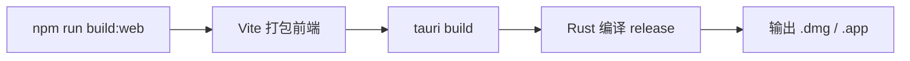

# 快速开始指南

> 从零到 If2Ai 运行的完整步骤 —— 30 分钟上手

## 📋 系统要求

| 依赖 | 最低版本 | 推荐版本 | 检查命令 |
|------|----------|----------|----------|
| **macOS** | 12.0 (Monterey) | 14.0+ (Sonoma) | `sw_vers` |
| **Rust** | 1.75+ | 最新 stable | `rustc --version` |
| **Node.js** | 18+ | 20+ LTS | `node --version` |
| **npm** | 9+ | 10+ | `npm --version` |
| **Xcode CLI** | 最新 | 最新 | `xcode-select --install` |
| **Chrome/Chromium** | 120+ | 最新 | 浏览器自动化所需 |

> 💡 macOS 最低版本由 `src-tauri/tauri.conf.json` 中 `minimumSystemVersion: "11.0"` 决定。实际建议 macOS 12+ 以获得完整功能支持。

## 🚀 克隆与安装

### 步骤 1：克隆仓库

```bash
git clone <repo-url> if2Ai
cd if2Ai
```

### 步骤 2：安装前端依赖

```bash
npm install
```

### 步骤 3：验证 Rust 工具链

```bash
# 检查 Rust 版本
rustc --version   # 应 ≥ 1.75
cargo --version

# 测试后端编译
cd src-tauri
cargo build
cd ..
```

> ⚠️ 首次 `cargo build` 会下载并编译所有 Rust 依赖，可能需要 5-15 分钟。后续增量编译通常在 30 秒以内。

## ⚙️ 首次配置

If2Ai 采用**引导流程**（Onboarding）进行首次配置，无需手动编辑配置文件。

### 启动后引导流程（4 步）


1. **系统检查** — 自动检测 Rust、Node.js、系统资源
2. **提供商配置** — 输入 API Key（OpenAI / Anthropic / OpenRouter）
3. **模型选择** — 选择默认对话模型
4. **完成** — 进入聊天界面

### 可配置的 LLM 提供商

| 提供商 | 所需 Key | 说明 |
|--------|----------|------|
| **OpenAI** | `sk-...` | GPT-4o / GPT-4o-mini |
| **Anthropic** | `sk-ant-...` | Claude Sonnet / Haiku |
| **OpenRouter** | `sk-or-...` | 统一网关，100+ 模型 |
| **Gemini** | — | 上下文压缩用（可选） |

> 💡 API Key 存储在本地 `~/.if2ai/` 目录，不会上传到任何服务器。

## 🏃 启动开发服务器

```bash
# 开发模式（Vite HMR + Rust 后端）
npm run tauri:dev

# 或使用 tauri CLI
npm run tauri dev
```

启动后：
- **Vite 开发服务器**运行在 `http://localhost:9527`（配置于 `vite.config.ts`）
- **Rust 后端**由 Tauri 自动编译并启动
- 应用窗口自动打开，默认尺寸 1280×800

### NPM Scripts 速查

| 命令 | 说明 | 源码参考 |
|------|------|----------|
| `npm run dev` | 仅启动 Vite 前端 | `vite.config.ts` |
| `npm run tauri:dev` | 完整开发模式（前端 + 后端） | `package.json#scripts` |
| `npm run build:web` | 仅构建前端 | `vite.config.ts` |
| `npm run build` | 完整生产构建 | `src-tauri/tauri.conf.json` |
| `npm run release:macos` | macOS 发布打包 | `scripts/release-macos.sh` |
| `npm run test` | 运行测试（Vitest） | — |
| `npm run test:ui` | 测试 UI 面板 | — |

## 📦 构建生产版本

```bash
# 完整生产构建
npm run build
```

构建流程：



1. `beforeBuildCommand`: `npm run build:web` → Vite 打包前端到 `dist/`
2. Tauri 编译 Rust 后端（release 模式）
3. 输出安装包到 `src-tauri/target/release/bundle/`

### macOS 发布

```bash
npm run release:macos
```

此脚本（`scripts/release-macos.sh`）会：
- 同步 `package.json` → `tauri.conf.json` → `Cargo.toml` 版本号
- 执行完整 release 构建
- 打包 `.dmg` 安装镜像

## 🎓 首次运行体验

启动后你将看到引导流程：

1. **系统检查页面** — 显示各项系统要求是否满足
   - 源码：`src/modules/onboarding/steps/SystemCheckStep.tsx`

2. **提供商设置页面** — 选择并配置 LLM 提供商
   - 源码：`src/modules/onboarding/steps/ProviderSetupStep.tsx`

3. **模型选择** — 选择默认对话模型和参数

4. **进入聊天** — 开始与 AI 代理对话
   - 源码：`src/modules/chat/`

### 试试这些功能

| 功能 | 操作 |
|------|------|
| 💬 聊天 | 在输入框输入消息，按回车发送 |
| 🔧 工具调用 | 代理自动判断是否需要调用工具 |
| 🧠 记忆 | 代理自动存储重要信息到长期记忆 |
| 🎙️ 语音 | 在设置中启用 TTS/STT |
| 🌐 浏览器 | 在设置中启用浏览器自动化 |
| 📚 技能 | 在技能面板浏览和安装技能 |

## ⚠️ 常见问题

| 问题 | 解决方案 |
|------|----------|
| `cargo build` 失败 | 检查 Rust 版本 ≥ 1.75；运行 `rustup update` |
| Vite 端口冲突 | 修改 `vite.config.ts` 中的 `server.port` |
| 窗口不显示 | 检查 `src-tauri/tauri.conf.json` 中 `devUrl` 配置 |
| API Key 无效 | 在设置面板重新输入，或检查网络代理 |
| 编译太慢 | 首次正常；确保 `target/` 在 SSD 上 |

## 📍 核心概念速查表

| 概念 | 说明 |
|------|------|
| **Tauri IPC** | 前后端通信桥梁，`#[tauri::command]` 标注 Rust 函数 |
| **Vite HMR** | 前端热模块替换，修改 React 代码即时生效 |
| **Onboarding** | 首次运行引导流程，4 步配置 |
| **Bounded Context** | 后端模块化边界，`src-tauri/src/modules/` 下每个目录 |
| **Pack** | 最小可审查变更单元，5 步流水线管理 |

## 🔗 相关资源

- [环境变量与配置](./env-vars.md) — 详细配置说明
- [常见问题解答](./faq.md) — 更多问题排查
- [项目结构说明](../reference/project-structure.md) — 目录结构详解
- [编码规范](../reference/coding-style.md) — 开发规范
- [QUICKSTART.md](../../../QUICKSTART.md) — 旧版快速开始（Phase 1）
