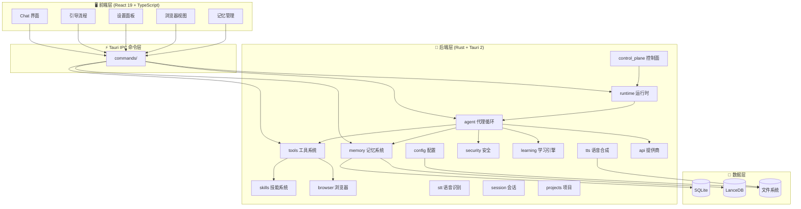

# If2Ai 文档体系

> Tauri 2 + Rust + React 19 驱动的智能体桌面应用 —— 完整设计文档总导航

## ✨ 特性亮点

| 特性 | 说明 |
|------|------|
| 🧠 **记忆系统** | 向量搜索 + SQLite 持久化 + HRR 全息表示 + 编译记忆管线 + 威胁扫描 |
| 🔧 **工具生态** | 6+ 内置工具 + 技能市场（GitHub / ClawHub / skills.sh）+ 60+ 威胁模式安全扫描 |
| 🎙️ **语音交互** | MOSS-TTS-Nano ONNX 原生合成 + SenseVoice ASR + 多声音样本 + 实时流式 |
| 🌐 **浏览器自动化** | Chrome/Chromium CDP 集成（chromiumoxide）+ 技能驱动操控 |
| 📚 **学习引擎** | 学习轨迹追踪 + 策略诊断 + 自适应执行模式路由 |
| 🛡️ **安全体系** | 15 类威胁模式扫描 + 安装策略 + 信任等级 + PII/密钥自动检测 |
| ⚡ **多提供商路由** | OpenAI / Anthropic / OpenRouter / Gemini 统一接入 + 上下文压缩 |
| 🔄 **Pack 流水线** | 5 步结构化开发流程（PACK → BUILD → VERIFY → REVIEW → COMMIT） |

## 🏗️ 技术栈概览

| 层 | 技术 | 说明 |
|----|------|------|
| **桌面框架** | Tauri 2 | Rust 原生后端 + Web 前端，轻量 (~10MB) |
| **后端** | Rust (Edition 2021) | 22 个 bounded-context 模块，tokio 异步运行时 |
| **前端** | React 19 + TypeScript 5 | Vite 5 构建，Tailwind CSS 4，shadcn/ui 组件库 |
| **向量存储** | LanceDB + FastEmbed | ONNX 嵌入 + 向量搜索，纯本地无需外部服务 |
| **持久化** | SQLite (rusqlite) | 会话、记忆、配置持久化 |
| **浏览器** | chromiumoxide | CDP 协议操控 Chrome/Chromium |
| **语音** | ONNX Runtime (ort) | MOSS-TTS-Nano 合成 + SenseVoice 识别 |

## 🏛️ 架构概览

## 📚 模块文档导航

| 模块 | 文档入口 | 说明 |
|------|----------|------|
| 🤖 Agent | [agent/index.md](./agent/index.md) | 代理循环、提供商路由、对话编排 |
| 🧠 Memory | [memory/index.md](./memory/index.md) | 向量搜索、SQLite 持久化、编译记忆管线 |
| 🔧 Tools | [tools/index.md](./tools/index.md) | 工具注册、执行沙箱、6+ 内置工具 |
| 🌐 Browser | [browser/index.md](./browser/index.md) | Chrome CDP 自动化、页面操控 |
| 🎙️ Voice | [voice/index.md](./voice/index.md) | TTS 合成、STT 识别、语音交互 |
| 🛡️ Security | [security/index.md](./security/index.md) | 威胁扫描、安装策略、信任等级 |
| 📚 Skills | [skills/index.md](./skills/index.md) | 技能发现、市场、安全审查 |
| 🚀 Guide | [guide/index.md](./guide/index.md) | 快速开始、环境配置、FAQ |
| 📖 Reference | [reference/index.md](./reference/index.md) | 项目结构、编码规范 |

## 🔄 与 cc-haha 定位对比

| 维度 | If2Ai | cc-haha (Claw Code) |
|------|-------|---------------------|
| **定位** | 桌面 AI 智能体应用 | CLI AI 编程助手 |
| **架构** | Tauri 2 + Rust + React | Rust CLI + 终端 UI |
| **前端** | 完整 GUI（聊天/设置/浏览器） | 终端 TUI / 无 GUI |
| **记忆** | 多层（向量 + SQLite + HRR + 编译） | 单层（SQLite） |
| **工具** | 内置 + 技能市场 + 浏览器自动化 | 内置工具集 |
| **语音** | TTS + STT 原生集成 | 无 |
| **浏览器** | CDP 集成 | 无 |
| **开发流程** | Pack 5 步流水线 | 直接开发 |
| **Lint** | lint_architecture.py（架构级） | cargo clippy（代码级） |
| **配置** | GUI 设置面板 + TOML | .env + TOML |
| **跨平台** | macOS（主要）、Windows/Linux | macOS / Linux / Windows |

## 📍 核心概念速查表

| 概念 | 说明 |
|------|------|
| **Pack** | 最小可审查变更单元，5 步流水线管理 |
| **Bounded Context** | 模块化边界，一个目录一个职责 |
| **God-file** | 超 800 行的大文件，需重构拆分 |
| **Tauri IPC** | 前后端通信桥，`#[tauri::command]` |
| **降级链** | 记忆系统：Hybrid → Vector → SQLite → InMemory |
| **TrustLevel** | 技能信任等级：Builtin / Trusted / Community / AgentCreated |
| **编译记忆** | 5 步管线：today → week → longterm → facts → assemble |
| **HRR** | 全息简化表示（Holographic Reduced Representation），实验性向量编码 |

## 🔗 相关资源

- [AGENTS.md](../../AGENTS.md) — 项目导航地图
- [CLAUDE.md](../../CLAUDE.md) — Pack 流水线规则
- [ARCHITECTURE.md](../../ARCHITECTURE.md) — 系统架构
- [docs/packs/CHARTER.md](../packs/CHARTER.md) — Pack 流水线章程
- [docs/packs/REGISTRY.md](../packs/REGISTRY.md) — Pack 一览表
- [docs/references/coding-style-and-lint-contract.md](../references/coding-style-and-lint-contract.md) — 编码规范
- [docs/design-docs/](../design-docs/) — 参考设计文档
