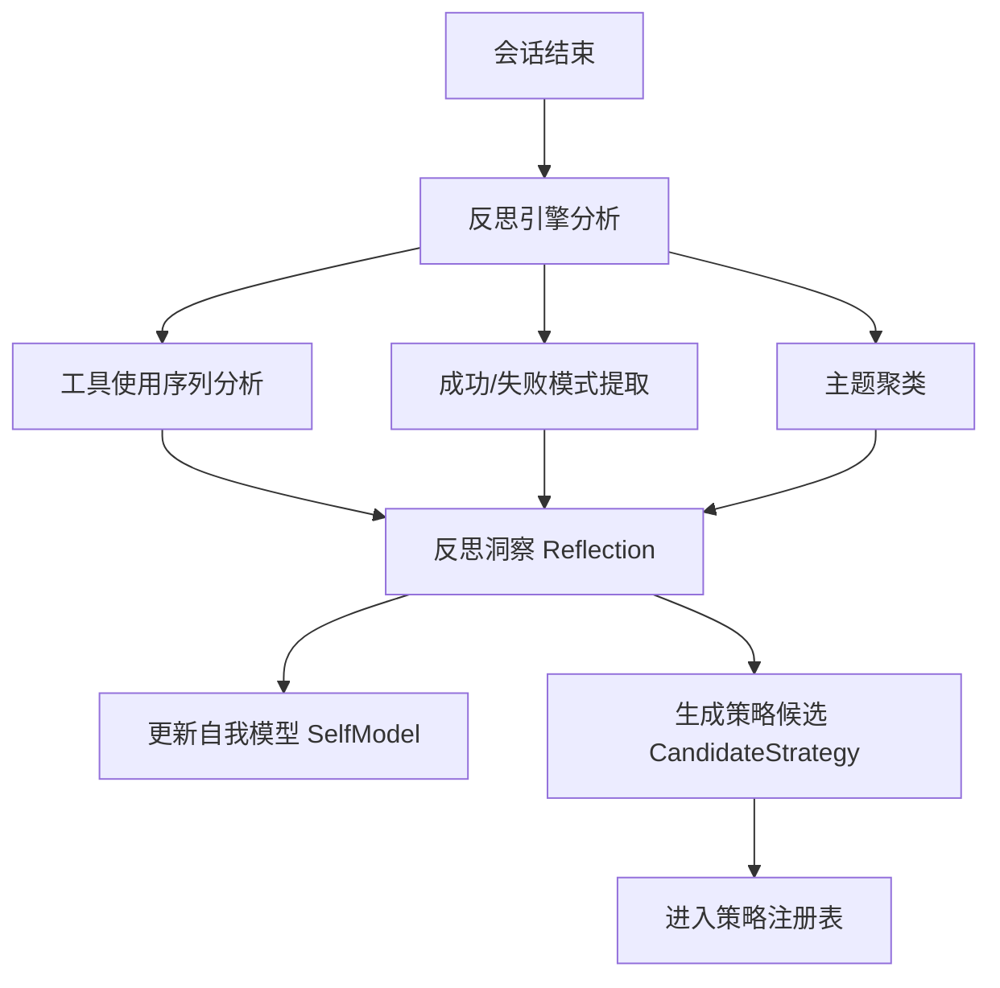
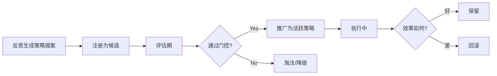

# 学习系统使用指南

> 面向用户：理解 If2Ai 如何学习、反思并持续改进

## 🧠 自我模型概念

If2Ai 的 **SelfModel** 是 AI 代理对自身能力的认知图谱——它知道自己擅长什么、不擅长什么，以及从经验中学到了什么。

### 自我模型包含什么？

| 组成 | 说明 | 示例 |
|------|------|------|
| 能力（Capabilities） | 代理能做什么 | "擅长代码重构"、"能浏览网页" |
| 局限（Limitations） | 代理做不好的事 | "长上下文容易遗忘"、"复杂推理偶尔出错" |
| 已学模式（LearnedPatterns） | 经验中提取的规律 | "工具 X 后通常跟工具 Y" |
| 性能指标（PerformanceMetrics） | 量化表现 | 成功率、平均响应时间 |

### 自我模型如何更新？

自我模型不是手动维护的——它由**反思引擎**在每次会话结束后自动更新。

> 源码参考：`src-tauri/src/modules/learning/self_model.rs`

## 🔍 反思引擎

### AI 如何分析自己的表现？

反思引擎（ReflectionEngine）在会话边界自动运行，执行以下分析：



### 反思洞察（Reflection）

每条反思包含：

| 字段 | 类型 | 说明 |
|------|------|------|
| pattern | String | 观察到的模式 |
| insight | String | 从模式推导的洞察 |
| confidence | f32 | 置信度 0.0-1.0 |
| source_session | String | 来源会话 ID |
| timestamp | DateTime | 生成时间 |

### 如何触发反思？

```typescript
// 前端通过 IPC 命令触发
await invoke('learning_reflect_session_and_register', {
  sessionId: 'session-123',
})
```

也可在 Harness 测试中自动触发。

> 源码参考：`src-tauri/src/modules/learning/reflection.rs`

## 📋 策略管理

策略（Strategy）是学习系统从反思中提炼的可执行改进方案。

### 策略生命周期



### 5 阶段详解

| 阶段 | 说明 | 命令 |
|------|------|------|
| 1. 提案 | 反思引擎或用户手动创建 | `learning_register_candidate_from_reflection` |
| 2. 评估 | 在测试套件上评估效果 | `learning_evaluate_candidate` |
| 3. 门控 | 检查是否满足推广条件 | `learning_apply_promotion_gate` |
| 4. 推广 | 激活为正式策略 | `learning_activate_promoted_candidate` |
| 5. 回滚 | 效果不佳时撤回 | `learning_rollback_active_strategy` |

### 策略查看命令

| 命令 | 说明 |
|------|------|
| `learning_list_candidates` | 列出所有候选策略 |
| `learning_get_candidate` | 获取单个候选详情 |
| `learning_get_active_strategies` | 查看当前活跃策略 |
| `learning_resolve_active_overlay` | 解析活跃叠加层 |

## 📊 轨迹记录

### ShareGPT JSONL 格式

TrajectoryManager 将每次会话记录为 ShareGPT 格式的 JSONL 文件，用于离线分析和未来 RL 训练。

**格式示例**：

```json
{
  "id": "traj-20260421-abc",
  "conversations": [
    { "from": "human", "value": "帮我重构这个函数" },
    { "from": "gpt", "value": "好的，我来分析这段代码..." }
  ],
  "model_id": "claude-sonnet-4-20250514",
  "system": "You are If2Ai...",
  "temperature": 0.7,
  "turn_metadata": {
    "session_id": "sess-123",
    "timestamp": "2026-04-21T10:00:00Z",
    "token_count": 1500,
    "tools_used": ["read_file", "write_file"]
  }
}
```

### 隐私控制

轨迹记录内置隐私保护（`TrajectoryPrivacy`）：
- 自动过滤敏感信息
- 支持 `export_trajectories` 命令导出
- 数据存储在本地 `~/.if2ai/trajectories/`

> 源码参考：`src-tauri/src/modules/learning/trajectory.rs`

## 🔗 相关资源

- [实现深度解析](./02-implementation.md)
- [API 模块](../api/) — 学习系统使用的 LLM 调用
- [桌面架构](../desktop/02-architecture.md)
