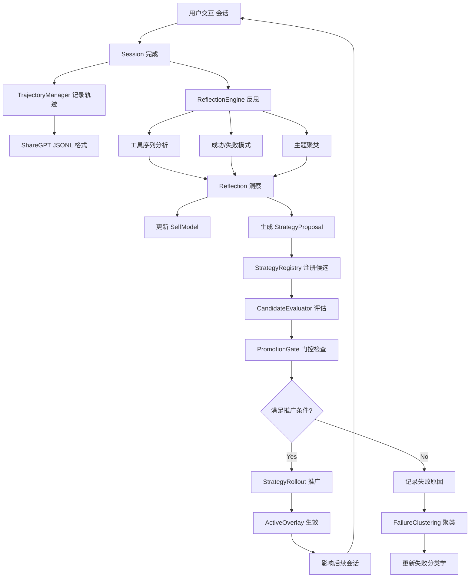
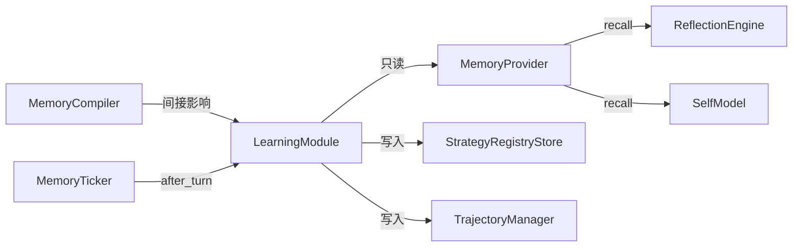

# 学习系统实现

> 面向开发者：LearningModule 核心架构、数据流与集成机制深度解析

## 🏗️ LearningModule 核心架构

LearningModule 是学习系统的顶层容器，持有三个核心组件：

```rust
// src-tauri/src/modules/learning/mod.rs
pub struct LearningModule {
    pub self_model: SelfModel,
    pub trust_tracker: TrustTracker,
    pub reflection_engine: StandardReflectionEngine,
}
```

### 模块文件结构

```
src-tauri/src/modules/learning/
├── mod.rs                      (5.0KB)  模块入口 + LearningModule 容器
├── self_model.rs               (11.1KB) 自我模型：能力/局限/模式
├── reflection.rs               (13.6KB) 反思引擎 trait + 标准实现
├── reflection_generator.rs     (9.1KB)  反思内容生成
├── reflection_note.rs          (11.2KB) 反思笔记 + 策略提案
├── trajectory.rs               (19.0KB) ShareGPT JSONL 轨迹管理
├── trajectory_score.rs         (13.8KB) 轨迹评分 + 对比
├── strategy_registry.rs        (35.7KB) 策略注册表数据模型
├── strategy_registry_service.rs(35.9KB) 策略注册表服务逻辑
├── strategy_registry_store.rs  (14.0KB) 策略注册表持久化
├── strategy_rollout.rs         (36.6KB) 策略部署/回滚服务
├── promotion_gate.rs           (30.2KB) 推广门控决策引擎
├── candidate_evaluator.rs      (37.5KB) 候选策略评估器
├── active_overlay.rs           (8.6KB)  活跃策略叠加层解析
├── failure_clustering.rs       (8.0KB)  失败聚类分析
├── failure_taxonomy.rs         (5.2KB)  失败分类学
└── trust_tracker.rs            (5.2KB)  信任追踪器
```

**总计：~5,000 行 Rust 代码**，是 If2Ai 最大的独有模块。

## 🔄 学习循环流程



## 📝 ReflectionEngine 反思引擎实现

### trait 定义

```rust
// reflection.rs
#[async_trait]
pub trait ReflectionEngine: Send + Sync {
    async fn analyze_session(&self, session: &Session) -> LearningResult<Vec<Reflection>>;
    async fn update_self_model(&self, reflections: Vec<Reflection>) -> LearningResult<()>;
    async fn get_self_model(&self) -> LearningResult<SelfModel>;
}
```

### StandardReflectionEngine 实现

```rust
pub struct StandardReflectionEngine {
    self_model: RwLock<SelfModel>,
    memory: SharedMemoryProvider,  // 只读访问，不修改记忆
}
```

**关键设计决策**：
- 使用 `RwLock<SelfModel>` 实现并发安全的自我模型更新
- 持有 `SharedMemoryProvider` 的只读引用——学习系统读取记忆但不直接修改
- 异步 trait（`async_trait`）支持跨 await 点持有

### 反思生成器

`ReflectionGenerator` 从原始反思中生成结构化的 `ReflectionNote`：

```rust
// reflection_note.rs
pub struct ReflectionNote {
    pub issue_type: ReflectionIssueType,  // 问题分类
    pub evidence: Vec<ReflectionEvidenceRef>,  // 证据引用
    pub proposals: Vec<StrategyProposal>,  // 策略提案
}
```

## 📊 TrajectoryManager 轨迹管理

### 数据模型

```rust
// trajectory.rs
pub struct Trajectory {
    pub id: String,
    pub conversations: Vec<ConversationEntry>,  // ShareGPT 格式
    pub model_id: String,
    pub system: Option<String>,
    pub temperature: f32,
    pub turn_metadata: TurnMetadata,
}
```

### 核心功能

| 功能 | 方法 | 说明 |
|------|------|------|
| 会话转轨迹 | `Trajectory::from_session()` | 将 Session 转为 ShareGPT 格式 |
| 追加记录 | `TrajectoryManager::append_turn()` | 追加单轮对话 |
| 导出轨迹 | `export_trajectories` IPC 命令 | 导出所有轨迹 |
| 压缩轨迹 | `TrajectoryCompressor` | 长轨迹压缩存储 |
| 隐私过滤 | `TrajectoryPrivacy` | 自动脱敏 |

### 轨迹评分

`TrajectoryScore` 提供多维度轨迹评分：

```rust
// trajectory_score.rs
pub enum TrajectoryAxis {
    TaskCompletion,    // 任务完成度
    ToolEfficiency,    // 工具使用效率
    ResponseQuality,   // 响应质量
    SafetyCompliance,  // 安全合规
}
```

## 📋 策略注册表

### 数据模型层次

```rust
// strategy_registry.rs
pub struct CandidateStrategy {
    pub identity: StrategyIdentity,      // 唯一标识
    pub definition: StrategyDefinition,  // 策略定义
    pub source: StrategySource,          // 来源（反思/手动）
    pub rollout_state: RolloutState,     // 部署状态
    pub compare_ref: Option<CompareRef>, // 对比基准
}
```

### 策略来源

```rust
pub enum StrategySource {
    FromReflection { reflection_id: String, note_index: usize },
    Manual { author: String, reason: String },
}
```

### 策略生命周期状态

```rust
pub enum RolloutState {
    Candidate,              // 候选中
    Evaluating { progress: EvaluationProgress },  // 评估中
    PromotionEligible,      // 满足推广条件
    Promoted { audit: ActivationAudit },  // 已推广
    Superseded { by: String },  // 被替代
    Retired,                // 已退役
}
```

## 🚀 PromotionGate 推广门控

推广门控是策略上线的守门人，确保只有真正有效的策略才能影响系统：

```rust
// promotion_gate.rs
pub struct PromotionGateService { ... }

pub enum PromotionDecision {
    Promote(PromotionGateOutcome),
    Defer(String),   // 暂缓，附原因
    Reject(String),  // 拒绝，附原因
}
```

### 门控检查项

| 检查项 | 说明 |
|--------|------|
| 评估完成度 | 候选策略必须完成所有评估步骤 |
| 性能基线 | 必须超过对比基准的最低提升阈值 |
| 信任分数 | TrustTracker 评分需满足最低要求 |
| 失败聚类 | 不存在与已知高严重性失败聚类的关联 |

## 🔗 与 Memory 模块的集成



**关键约束**：学习系统**只读**记忆数据，**不直接修改**记忆。这确保了两个模块的解耦。

## ⚠️ 与 cc-haha 差距分析

### 优势 ✅

| 维度 | If2Ai | cc-haha |
|------|-------|---------|
| 自我模型 | ✅ SelfModel + Capabilities + Limitations | ❌ 无 |
| 反思引擎 | ✅ ReflectionEngine + ReflectionNote | ❌ 无 |
| 策略生命周期 | ✅ 提案→评估→门控→推广→回滚 | ❌ 无 |
| 轨迹记录 | ✅ ShareGPT JSONL + 评分 | ❌ 无 |
| 失败分析 | ✅ FailureClustering + Taxonomy | ❌ 无 |
| 信任追踪 | ✅ TrustTracker | ❌ 无 |

**cc-haha 完全没有学习系统，这是 If2Ai 的核心差异化优势。**

### 待完善 ⚠️

| 维度 | 当前状态 | 目标 |
|------|----------|------|
| 策略 A/B 测试 | 无 | 并行运行新旧策略对比 |
| 跨会话追踪 | 基础 | 完整的性能演变时间线 |
| 记忆编译集成 | 间接 | 学习结果直接影响编译管线 |
| 评估自动化 | 手动触发 | 自动在会话边界触发 |

## 🎯 增强计划

### P0：与记忆编译管线深度集成

```
反思洞察 → 记忆编译策略调整 → 编译输出变化 → 后续会话效果
```

让学习结果直接影响记忆编译的行为参数。

### P1：策略 A/B 测试框架

```rust
struct ABTestFrame {
    control: StrategyIdentity,     // 对照组（当前策略）
    treatment: StrategyIdentity,   // 实验组（新策略）
    traffic_split: f32,            // 流量分配比例
    duration: Duration,            // 测试时长
    metrics: Vec<TrajectoryAxis>,  // 评估维度
}
```

### P2：跨会话性能追踪

- 每次会话自动记录策略执行效果
- 生成长期性能演变趋势图
- 检测性能退化并自动触发回滚

## 🔗 相关资源

- [使用指南](./01-usage-guide.md)
- [API 模块](../api/) — 学习系统使用的 LLM 提供商
- [桌面架构](../desktop/02-architecture.md) — AppState 中 LearningModule 的位置
