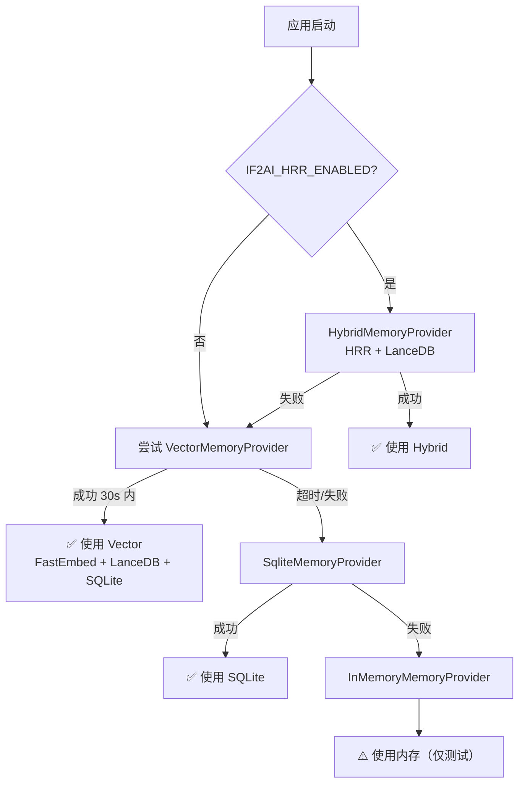
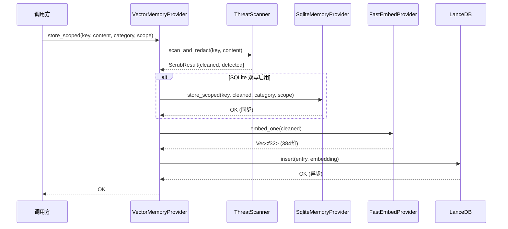
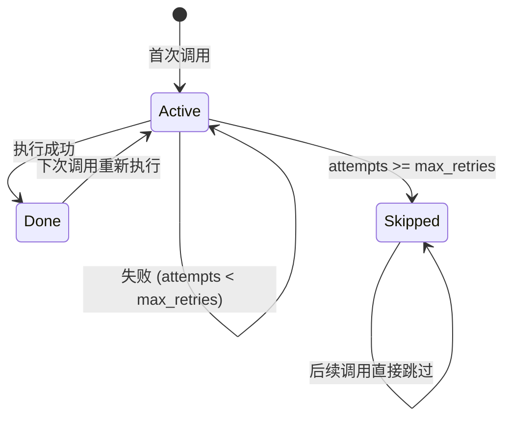
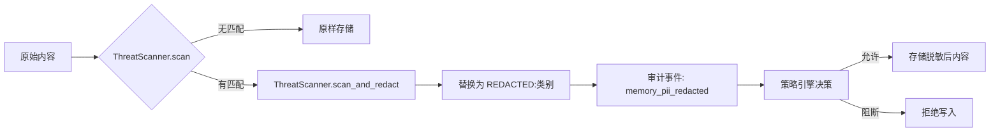
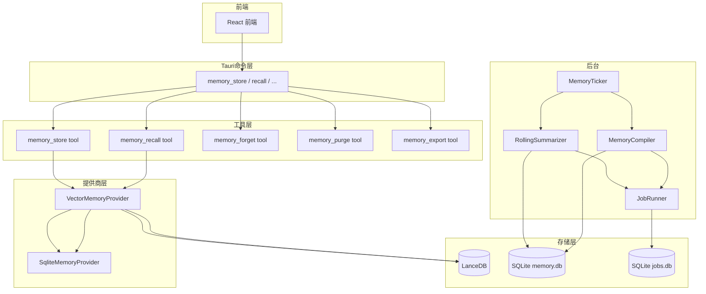
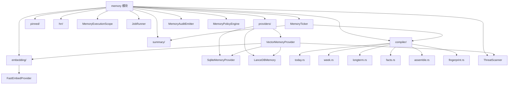

# 记忆模块实现原理

> 面向开发者的记忆系统架构——四层降级链、向量嵌入、SQLite 双写与后台作业

## 🏗️ 四层提供商降级链

If2Ai 记忆系统在启动时按以下顺序尝试初始化提供商，任一层失败自动降级到下一层：



初始化逻辑位于 `src-tauri/src/main.rs`：

```rust
// 1. HRR 实验特性
if hrr_enabled {
    match create_hybrid_provider().await { ... }
}
// 2. 向量提供商（30 秒超时）
let vector_result = tokio::time::timeout(
    Duration::from_secs(30),
    VectorMemoryProvider::new(config)
).await;
// 3. SQLite 回退
// 4. InMemory 兜底
```

## 📍 向量嵌入：FastEmbed + LanceDB

### FastEmbed 嵌入引擎

- **模型**：多语言 ONNX 模型（本地离线运行）
- **维度**：384 维 float32 向量
- **缓存**：模型文件本地缓存，首次下载后不再请求网络
- **初始化**：`FastEmbedProvider::new()` 同步加载，约 1-3 秒

> 源码参考：`src-tauri/src/modules/memory/embedding/fastembed.rs`

### LanceDB 向量存储

- **Schema**：Arrow 固定大小 float32 嵌入列
- **索引**：IVF-PQ 量化索引（数据量达到阈值后自动创建）
- **搜索**：ANN 向量搜索 + FTS 全文搜索（回退）
- **融合**：两种搜索结果通过 RRF（Reciprocal Rank Fusion）合并排序

> 源码参考：`src-tauri/src/modules/memory/providers/lancedb.rs`

## 🔄 SQLite 双写机制

VectorMemoryProvider 在启用 `sqlite_path` 配置后，每次写入同时写入 SQLite 和 LanceDB：



**双写的作用：**
- **持久性**：SQLite 作为权威存储，确保数据不丢失
- **作用域过滤**：SQLite 支持 session_id/project_id 过滤，LanceDB 无此列
- **重要性衰减**：SQLite 支持 Weibull 衰减模型，LanceDB 不支持
- **回退搜索**：向量搜索失败时，SQLite 全文搜索作为回退

> 源码参考：`src-tauri/src/modules/memory/providers/vector_provider.rs` — `store_scoped()`

## 🔄 后台作业：JobRunner

所有后台记忆任务（滚动摘要、编译、事实提取等）通过 JobRunner 统一调度：

### 三大保证

1. **有界重试**：同一 `(kind, target)` 失败 `max_retries`（默认 3）次后标记为 `Skipped`，避免无限重试浪费 LLM 预算
2. **并发上限**：`tokio::sync::Semaphore` 限制同时运行的任务数（默认 3），防止 LLM 提供商被突发请求压垮
3. **持久化状态**：失败/跳过状态持久化到 `jobs.db`（独立于 `memory.db`），崩溃后不丢失计数



> 源码参考：`src-tauri/src/modules/memory/job_runner.rs`

## 🛡️ ThreatScanner 深度解析

### 威胁类别

| 类别 | 检测目标 | PiiKind 映射 |
|------|----------|-------------|
| `api_key` | OpenAI / Anthropic / AWS / GitHub 等 API 密钥 | `ApiKey` |
| `jwt` | JSON Web Token | `ApiKey` |
| `private_key` | PEM 编码私钥 | `PrivateKey` |
| `password` | 内联密码赋值 | `InlineSecret` |
| `credit_card` | 信用卡号 | `CreditCard` |
| `id_card_cn` | 中国身份证号 | `IdCard` |
| `ssn_us` | 美国社保号 | `Ssn` |

### 扫描与脱敏流程



> 源码参考：`src-tauri/src/modules/memory/security.rs` — `scan()` / `scan_and_redact()`

## 📝 完整数据流图



## 🔗 模块间依赖关系



## ⚠️ 与 cc-haha 差距分析

### If2Ai 优势

- **向量搜索架构**：LanceDB ANN 向量搜索 + FTS 全文搜索 + RRF 融合，比 cc-haha 的 Fuse.js 文本搜索在语义匹配上更精准
- **分层降级设计**：4 层提供商降级链确保系统在各种环境下都能工作
- **SQLite 双写**：向量搜索 + 关系查询两全其美
- **ThreatScanner**：15 个威胁类别、60+ 正则模式，覆盖 6 种 PII 类型
- **JobRunner**：有界重试 + 并发控制 + 持久化状态，比 cc-haha 的简单重试更健壮

### If2Ai 劣势

- **缺少 AutoDream**：cc-haha 有周期性自动整合机制，自动发现并合并相关记忆
- **缺少团队记忆同步**：cc-haha 有 Pull/Push API，支持跨设备记忆共享
- **JobRunner 并发配置**：3 并发硬编码，不如 cc-haha 的动态调节

## 🎯 增强计划

1. **AutoDream 等价机制**：在 `MemoryTicker::do_daily()` 中添加记忆整合步骤，使用 LLM 自动发现并合并相关/重复记忆
2. **团队记忆同步**：添加 `memory_pull` / `memory_push` Tauri 命令，基于 HTTP API 实现跨设备同步
3. **动态并发调节**：JobRunner 并发上限根据 LLM 提供商响应时间动态调整
4. **混合搜索权重**：RRF 融合权重可配置，允许用户偏好向量搜索或文本搜索
