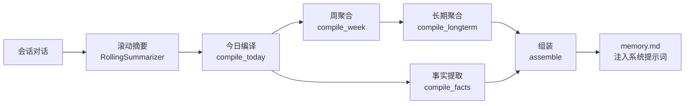
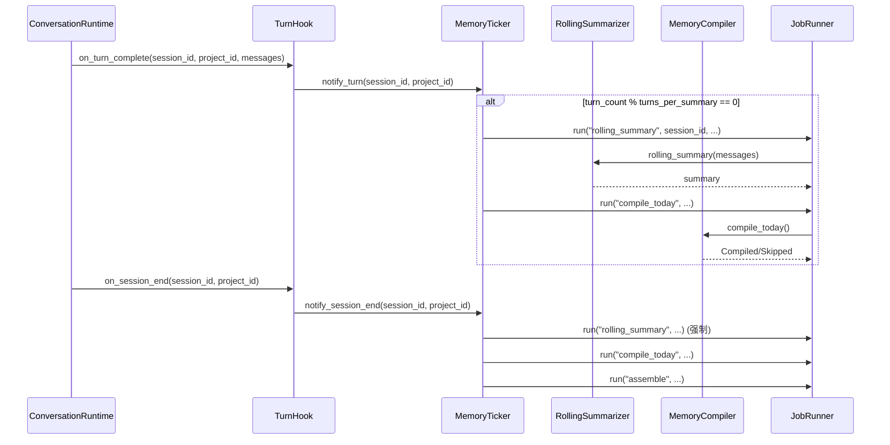
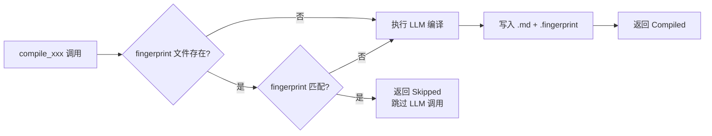

# 编译记忆管线

> If2Ai 独有的记忆编译系统——从滚动摘要到长期聚合的自动化管线

## 📍 概述

编译记忆（Compiled Memory）是 If2Ai 独创的记忆整理管线，将散落的对话摘要逐步提炼为结构化的长期记忆。该管线由 `MemoryCompiler` 编排，由 `MemoryTicker` 驱动调度。

核心价值：**让 AI 的记忆像人类一样——从短期对话中提炼长期知识。**

## 🏗️ 管线架构

编译记忆管线包含五个阶段，每个阶段产出一份 `.md` 文件：



### 产物文件

| 文件 | 路径 | 说明 |
|------|------|------|
| `today.md` | `<scope_root>/today.md` | 当日编译摘要 |
| `week.md` | `<scope_root>/week.md` | 本周聚合摘要 |
| `longterm.md` | `<scope_root>/longterm.md` | 长期聚合摘要 |
| `facts.md` | `<scope_root>/facts.md` | 提取的重要事实 |
| `memory.md` | `<scope_root>/memory.md` | 最终组装产物 |

所有路径由 `CompilePaths::from_scope_root()` 统一管理。

> 源码参考：`src-tauri/src/modules/memory/compiler/mod.rs` — `CompilePaths`

## 🔄 MemoryCompiler 和 MemoryTicker 的协作

### MemoryCompiler

`MemoryCompiler` 是编译管线的核心编排器，持有四个协作对象：

| 协作对象 | 类型 | 说明 |
|----------|------|------|
| `summary_store` | `Arc<dyn SessionSummaryStore>` | 滚动摘要持久化存储 |
| `llm` | `Arc<dyn UtilityLlm>` | LLM 接口（用于摘要/提取） |
| `job_runner` | `Arc<JobRunner>` | 后台作业调度 |
| `config` | `CompilerConfig` | 编译配置 |

五个编译方法：

```
compile_today()    → 今日摘要 → today.md
compile_week()     → 周聚合   → week.md
compile_longterm() → 长期聚合 → longterm.md
compile_facts()    → 事实提取 → facts.md
assemble()         → 组装     → memory.md
```

每个方法返回 `CompileResult::Compiled`（LLM 已执行）或 `CompileResult::Skipped`（缓存命中/无输入）。

### MemoryTicker

`MemoryTicker` 是轮次级调度器，通过 `TurnHook` trait 与 `ConversationRuntime` 集成：

| 触发时机 | 动作 |
|----------|------|
| 每 N 轮（默认 6） | 触发 `RollingSummarizer::rolling_summary()` + `MemoryCompiler::compile_today()` |
| 会话结束 | 强制最终滚动摘要 → `compile_today()` → `assemble()` |
| 逻辑日切换 | 完整每日管线：`compile_today` → `compile_week` → `compile_longterm` → `compile_facts` → `assemble` |
| 启动恢复 | 扫描 `(session, mtime)` 对，补偿上次崩溃未完成的摘要 |



> 源码参考：`src-tauri/src/modules/memory/ticker.rs` / `compiler/mod.rs`

## 📝 指纹缓存机制

每个编译产物都有对应的 `.fingerprint` 文件（MD5 校验），避免重复调用 LLM：



> 源码参考：`src-tauri/src/modules/memory/compiler/fingerprint.rs`

## 🔄 与 cc-haha AutoDream 的对比

| 维度 | If2Ai 编译记忆 | cc-haha AutoDream |
|------|---------------|-------------------|
| **触发方式** | 轮次计数 + 逻辑日切换 + 会话结束 | 定时器周期触发 |
| **管线结构** | 5 步显式管线 (today→week→longterm→facts→assemble) | 自动整合 + Dream 合成 |
| **缓存机制** | MD5 fingerprint 文件级缓存 | 版本号比对 |
| **LLM 依赖** | 每步可选调用 UtilityLlm | 全程 LLM 驱动 |
| **输出格式** | 结构化 Markdown 文件 | 记忆条目合并 |
| **作用域** | 三级 (Session/Project/Global) | 项目级 |
| **作业管理** | JobRunner 有界重试 | 简单重试 |
| **整合深度** | 逐级浓缩（对话→摘要→周→长期） | 直接从原始记忆 Dream 合成 |
| **事实提取** | 独立 `compile_facts` 步骤 | 无等价机制 |
| **组装输出** | `assemble` → `memory.md` 注入提示词 | 直接更新记忆存储 |

### If2Ai 优势

- **显式管线**：每步可独立调试、跳过、重试
- **事实提取**：`compile_facts` 从摘要中抽取结构化事实
- **缓存友好**：fingerprint 机制避免重复消耗 LLM token
- **JobRunner 集成**：失败自动重试 + 并发控制

### If2Ai 劣势

- **缺乏自动发现**：AutoDream 能自动发现相关记忆并整合，If2Ai 需要显式管线步骤
- **整合粒度**：cc-haha 的 Dream 合成可以从原始记忆直接创造新洞察，If2Ai 依赖逐级浓缩
- **周期性不足**：MemoryTicker 的日常循环依赖逻辑日切换检测，不如 AutoDream 的定时器可靠

## ⚠️ 与 cc-haha 差距分析

| 差距 | 严重程度 | 说明 |
|------|----------|------|
| 无 AutoDream 等价机制 | 中 | 缺少自动发现和整合相关记忆的能力 |
| 日常循环可靠性 | 低 | 依赖逻辑日切换检测，长时间空闲可能错过编译 |
| 团队记忆同步 | 高 | 无 Pull/Push API，无法跨设备共享编译记忆 |
| 记忆新鲜度管理 | 中 | 仅依赖 Weibull 衰减，缺少显式的过期/归档策略 |

## 🎯 增强计划

1. **AutoDream 等价整合步骤**：在 `MemoryTicker::do_daily()` 末尾添加 `compile_dream` 步骤，使用 LLM 从现有编译记忆中发现跨主题关联和新的综合洞察
2. **定时器驱动编译**：添加 `tokio::time::interval` 定时器作为 `daily_check_interval_secs` 的补充，确保即使无 turn 也能触发编译
3. **团队记忆同步**：添加 `memory_sync_pull` / `memory_sync_push` 命令，支持编译产物的跨设备同步
4. **记忆归档策略**：超过 N 天的长期记忆自动归档到 `archive/` 目录，减少活跃记忆量
5. **Dream 质量 AI 评估**：对 `compile_dream` 产出进行质量打分，低分产出不写入 `memory.md`
