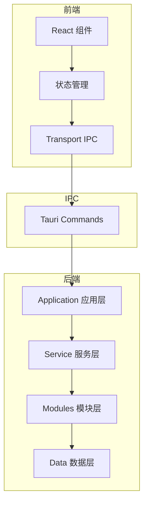

# 编码规范与 Lint 合约

> If2Ai 的代码风格、架构约束与质量门禁 —— 所有贡献者必须遵守

## 🦀 Rust 编码规范

### 格式化与 lint

| 工具 | 命令 | 说明 |
|------|------|------|
| **cargo fmt** | `cargo fmt --all` | 自动格式化，必须通过 |
| **cargo clippy** | `cargo clippy --workspace --all-targets -- -D warnings` | lint 检查，零警告 |
| **cargo test** | `cargo test --workspace` | 测试套件，必须通过 |

> ⚠️ 以上三条命令在每次 Pack 提交前都必须通过，否则 REVIEW_FAIL。

### 核心规则

| 规则 | 说明 | 源码参考 |
|------|------|----------|
| 禁止 `unwrap()` | 非测试代码不得使用 `unwrap()` | `coding-style-and-lint-contract.md` |
| 禁止 `expect()` | 非测试代码不得使用 `expect()` | 同上 |
| 禁止 `todo!()` | 非测试代码不得使用 `todo!()` | 同上 |
| `pub fn` 必须有 `///` doc | 所有公开函数必须有文档注释 | 同上 |
| 异步用 tokio | 使用 `tokio`，不用 `std::thread` | `Cargo.toml` (`tokio = "1"`) |
| 跨模块用 `crate::modules::*` | 不直接 `crate::xxx` | `modules/mod.rs` |
| `pub(crate)` 默认 | 仅在真正需要时才暴露 `pub` | `coding-style-and-lint-contract.md` |

### 文件大小限制

| 类型 | 目标上限 | 硬性上限 | 检查工具 |
|------|----------|----------|----------|
| 后端 `.rs` 模块文件 | 500 行 | 800 行 | `lint_architecture.py` |
| 前端 `.tsx` 组件 | 300 行 | 500 行 | `lint_architecture.py` |
| 前端 `.ts` hooks/工具 | 200 行 | 400 行 | `lint_architecture.py` |

> 超 800 行的文件自动进入 god-file watchlist，需创建 GFR Pack 进行拆分。
> 已知的 god-file 在 `lint_architecture.py` 的 `SIZE_EXEMPT_PATHS` 中临时豁免。

### 错误处理规范

```rust
// ✅ 正确：使用 Result + thiserror
#[derive(Debug, thiserror::Error)]
pub enum MemoryError {
    #[error("storage not available: {0}")]
    StorageUnavailable(String),
    #[error("vector search failed: {0}")]
    VectorSearchFailed(String),
}

// ❌ 错误：使用 unwrap()
let value = storage.get("key").unwrap(); // REVIEW_FAIL

// ✅ 正确：使用 ? 操作符
let value = storage.get("key")?;
```

### 异步规范

```rust
// ✅ 正确：使用 tokio
#[tokio::main]
async fn main() -> Result<()> {
    let result = tokio::spawn(async_move()).await??;
    Ok(())
}

// ❌ 错误：使用 std::thread
std::thread::spawn(|| { /* ... */ }); // 不推荐
```

## 📝 TypeScript 编码规范

### 命名规范

| 类型 | 规范 | 示例 |
|------|------|------|
| React 组件 | PascalCase | `ChatMessage.tsx`、`AgentOrb.tsx` |
| 函数/hooks | camelCase | `useOnboarding()`、`handleSubmit()` |
| 常量 | UPPER_SNAKE_CASE | `MAX_TOKENS`、`DEFAULT_MODEL` |
| 类型/接口 | PascalCase | `Message`、`SessionConfig` |
| 文件名 | kebab-case 或 PascalCase | `chat-ui.tsx`、`AgentOrb.tsx` |

### 组件规范

```typescript
// ✅ 正确：函数式组件 + 类型定义
interface ChatMessageProps {
  content: string;
  role: 'user' | 'assistant';
}

export function ChatMessage({ content, role }: ChatMessageProps) {
  return (
    <div className={cn('message', role)}>
      {content}
    </div>
  );
}
```

### 样式规范

- 使用 **Tailwind CSS** 工具类
- 使用 **shadcn/ui** 基础组件（`src/components/ui/`）
- 使用 `cn()`（`clsx` + `tailwind-merge`）合并类名
- 全局样式在 `src/styles/`

## 🏛️ 架构约束

### 模块化原则

| 原则 | 说明 |
|------|------|
| **一个文件一个有界职责** | 不在文件中混合不相关的逻辑 |
| **超 800 行入 god-file watchlist** | 自动检测，必须创建 GFR Pack |
| **依赖只能向下流动** | 上层可依赖下层，反之禁止 |
| **禁止无边界目录** | `utils/`、`helpers/`、`common/`、`misc/` 被禁止 |
| **跨模块用 `crate::modules::*`** | 不直接 `crate::xxx` |

### 分层架构



### 依赖方向

| 层 | 可依赖 | 不可依赖 |
|----|--------|----------|
| React 组件 | hooks、transport、ui | 后端模块 |
| Transport | Tauri API | 业务逻辑 |
| Commands | Service 层 | 直接操作数据 |
| Application | Service + Modules | 直接操作数据 |
| Modules | 数据层 | 其他 Modules（通过 Application） |

## 🔧 Lint 工具

### lint_architecture.py

路径：`scripts/lint_architecture.py`

三项检查：

1. **Bounded-context 成员检查** — 每个目录必须在 CHARTER §1 或 REGISTRY 中声明
2. **文件大小限制** — 后端 ≤500/800 行，前端 ≤300/500 行
3. **禁止目录名** — `utils/`、`helpers/`、`common/`、`misc/`

```bash
# 运行架构 lint
python3 scripts/lint_architecture.py

# 输出 JSON 格式
python3 scripts/lint_architecture.py --json-out violations.json

# 警告视为错误
python3 scripts/lint_architecture.py --warnings-as-errors
```

### 违规输出格式

每条违规包含：
- `check` — 检查类型
- `severity` — 严重程度（error / warning）
- `file` — 文件路径
- `evidence` — 违规证据
- `fix_prompt` — 修复指令（agent 可读）

## ⚠️ 差距分析：与 cc-haha 编码规范对比

| 维度 | cc-haha | If2Ai | 评估 |
|------|---------|-------|------|
| **Rust lint** | `cargo clippy` | `cargo clippy` + `lint_architecture.py` | ✅ If2Ai 更严格（架构级） |
| **TypeScript lint** | Biome（替代 ESLint+Prettier） | 无 | ⚠️ 缺少 ESLint/Prettier/Biome |
| **Pre-commit hooks** | husky + lint-staged | 无 | ⚠️ 缺少 git hooks |
| **TypeScript strict** | 启用 strict 模式 | 未启用 | ⚠️ 类型安全不足 |
| **Pack 流水线** | 无 | 5 步流水线 | ✅ If2Ai 更规范 |
| **God-file 追踪** | 无 | 自动检测 + GFR Pack | ✅ If2Ai 更系统 |
| **代码审查** | 手动 | `code-reviewer` subagent | ✅ If2Ai 更自动化 |
| **文档强制** | 无 | `pub fn` 必须有 `///` doc | ✅ If2Ai 更严格 |

### 增强建议

1. **配置 Biome** — 替代 ESLint + Prettier，统一 JS/TS/JSON 格式化
   ```bash
   npm install --save-dev @biomejs/biome
   npx biome init
   ```

2. **添加 pre-commit hooks** — 使用 husky + lint-staged
   ```bash
   npm install --save-dev husky lint-staged
   npx husky init
   ```

3. **启用 TypeScript strict** — 在 `tsconfig.json` 中
   ```json
   {
     "compilerOptions": {
       "strict": true,
       "noUncheckedIndexedAccess": true
     }
   }
   ```

4. **CI 集成** — 在 GitHub Actions 中运行全部 lint

## 📍 核心概念速查表

| 概念 | 说明 |
|------|------|
| **cargo fmt** | Rust 自动格式化，必须通过 |
| **cargo clippy -D warnings** | Rust lint，零警告 |
| **lint_architecture.py** | 架构级 lint，检查模块边界和文件大小 |
| **God-file** | 超 800 行的文件，需创建 GFR Pack 拆分 |
| **Bounded Context** | 模块化边界，一个目录一个职责 |
| **Pack 流水线** | 5 步：PACK → BUILD → VERIFY → REVIEW → COMMIT |
| **SIZE_EXEMPT_PATHS** | 已知 god-file 临时豁免列表 |
| **FORBIDDEN_DIR_NAMES** | 禁止的目录名：utils / helpers / common / misc |
| **TrustLevel** | 技能信任等级：Builtin / Trusted / Community / AgentCreated |
| **pub(crate)** | 默认可见性，仅必要时暴露 pub |

## 🔗 相关资源

- [项目结构说明](./project-structure.md) — 目录结构详解
- [编码规范原文](../../references/coding-style-and-lint-contract.md) — Rust 编码规范
- [Pack 章程](../../packs/CHARTER.md) — 开发流程规则
- [Pack 注册表](../../packs/REGISTRY.md) — God-file watchlist
- [lint_architecture.py](../../../scripts/lint_architecture.py) — 架构 lint 源码
- [AGENTS.md](../../../AGENTS.md) — 项目导航地图
