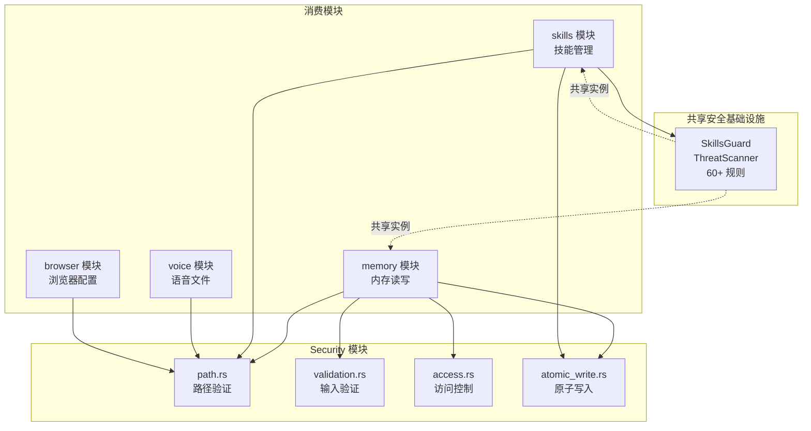
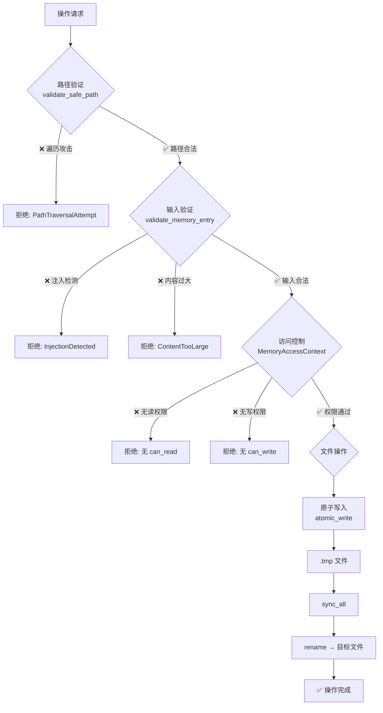

# 🏗️ Security 实现文档

> 开发者视角 —— 权限框架架构、路径验证、原子写入、ThreatScanner 共享实例与安全审计日志。

## 📍 架构总览



## 🔄 权限决策流程



## 🏗️ 权限框架架构

### MemoryAccessContext

`access.rs` 宥现基于分类的访问控制：

```rust
// src-tauri/src/modules/security/access.rs
pub struct MemoryAccessContext {
    pub session_id: Option<String>,
    pub project_id: Option<String>,
    pub read_categories: Vec<MemoryCategory>,
    pub write_categories: Vec<MemoryCategory>,
}
```

#### 会话上下文

```rust
pub fn for_session(session_id: &str) -> Self {
    Self {
        session_id: Some(session_id.to_string()),
        project_id: None,
        read_categories: vec![Conversation, Daily],
        write_categories: vec![Conversation],
    }
}
```

#### 项目上下文

```rust
pub fn for_project(project_id: &str) -> Self {
    Self {
        session_id: None,
        project_id: Some(project_id.to_string()),
        read_categories: vec![Core, Daily, Conversation, Custom("project")],
        write_categories: vec![Core, Daily, Conversation, Custom("project")],
    }
}
```

#### 权限检查

```rust
pub fn can_read(&self, category: &MemoryCategory) -> bool {
    self.read_categories.iter().any(|c| c == category)
}

pub fn can_write(&self, category: &MemoryCategory) -> bool {
    self.write_categories.iter().any(|c| c == category)
}
```

### 权限矩阵

| 上下文 | Core | Daily | Conversation | Custom |
|--------|------|-------|--------------|--------|
| Session 读 | ❌ | ✅ | ✅ | ❌ |
| Session 写 | ❌ | ❌ | ✅ | ❌ |
| Project 读 | ✅ | ✅ | ✅ | ✅ |
| Project 写 | ✅ | ✅ | ✅ | ✅ |

## 🏗️ 路径验证与原子写入

### 路径验证算法

`path.rs` 宥现两阶段路径验证：

**阶段 1：路径存在时**
```
1. canonicalize(base) → base_canonical
2. canonicalize(base + requested) → full_canonical
3. 检查 full_canonical.starts_with(&base_canonical)
```

**阶段 2：路径不存在时**
```
1. 从 full_path 向上找最近存在的祖先
2. canonicalize(ancestor) → 确认在 base 内
3. 遍历剩余组件：
   - Normal → join
   - ParentDir → pop + 检查是否仍在 base 内
   - 其他 → join
4. 最终检查结果路径是否在 base 内
```

源码参考：[`src-tauri/src/modules/security/path.rs`](../../../src-tauri/src/modules/security/path.rs)

### 原子写入实现

`atomic_write.rs` 确保崩溃安全：

```rust
// src-tauri/src/modules/security/atomic_write.rs
pub async fn atomic_write(path, contents) -> Result<(), WriteError> {
    let temp_path = path.with_extension("tmp");
    let mut file = File::create(&temp_path).await?;   // 1. 写入临时文件
    file.write_all(contents.as_ref()).await?;
    file.sync_all().await?;                            // 2. 同步到磁盘
    fs::rename(&temp_path, path).await?;               // 3. 原子重命名
    Ok(())
}
```

### JSON 原子写入

```rust
pub async fn atomic_json_write(path, data: &T) -> Result<(), WriteError> {
    let contents = serde_json::to_string_pretty(data)?;
    atomic_write(path, contents.as_bytes()).await
}
```

### 保证特性

| 特性 | 保证 |
|------|------|
| 原子性 | 读者要么看到旧内容，要么看到新内容，绝不会看到部分写入 |
| 持久性 | `sync_all` 确保数据写入磁盘后才 rename |
| 一致性 | 进程崩溃后 `.tmp` 文件残留，目标文件保持旧版本 |

## 🏗️ ThreatScanner 共享实例

### 跨模块共享架构

ThreatScanner（`SkillsGuard`）在 skills 模块中实现，但被多个模块共享：

```
skills/guard/
├── mod.rs              # SkillsGuard 主逻辑
├── threat_patterns.rs  # 60+ 威胁模式
├── policy.rs           # InstallPolicy + TrustLevel
├── invisible_unicode.rs# 不可见 Unicode 检测
└── structural_limits.rs# 结构性限制
```

### 共享使用方式

| 模块 | 使用方式 | 扫描对象 |
|------|----------|----------|
| skills | 直接实例化 `SkillsGuard` | 外部技能文件 |
| memory | 通过 `SkillContext.guard` | 技能相关内存操作 |

### ThreatPattern 核心类型

```rust
// src-tauri/src/modules/skills/guard/threat_patterns.rs
pub struct ThreatPattern {
    pub regex: Regex,
    pub pattern_id: &'static str,    // 如 "env_exfil_curl"
    pub severity: Severity,          // Critical/High/Medium/Low
    pub category: ThreatCategory,    // 15 类之一
    pub description: &'static str,
}
```

## 🔍 PII 检测规则

### 15 类威胁模式

`threat_patterns.rs` 定义 60+ 正则模式，覆盖 15 类威胁：

| 类别 | 模式数 | 典型检测内容 |
|------|--------|-------------|
| Exfiltration | 8+ | `curl $ENV`, 外部数据上传 |
| Injection | 8+ | prompt injection, 命令注入 |
| Destructive | 5+ | `rm -rf`, 格式化命令 |
| Persistence | 5+ | crontab, launchd, 注册表 |
| Network | 4+ | 反向 shell, 端口扫描 |
| Obfuscation | 4+ | base64 编码执行, 十六进制 |
| Mining | 3+ | 加密货币挖矿代码 |
| SupplyChain | 3+ | 依赖篡改 |
| PrivilegeEscalation | 4+ | sudo 滥用, setuid |
| CredentialExposure | 5+ | 硬编码 API key, token |
| AgentConfigPersistence | 3+ | 修改 AI 系统提示 |
| ContextExfiltration | 3+ | 窃取对话历史 |
| Jailbreak | 3+ | 绕过安全限制 |
| InvisibleUnicode | 2+ | 零宽字符, 同形字 |
| StructuralLimits | 3+ | 超大文件, 嵌套过深 |

### 扫描流程

```rust
// src-tauri/src/modules/skills/guard/mod.rs
impl SkillsGuard {
    pub fn new() -> Self { /* 加载所有 ThreatPattern */ }

    pub fn scan(&self, skill_dir: &Path, trust_level: &str) -> ScanResult {
        // 1. 遍历技能目录所有文件
        // 2. 逐行匹配 THREAT_PATTERNS
        // 3. 扫描不可见 Unicode
        // 4. 检查结构性限制
        // 5. 汇总 Findings → ScanResult
    }

    pub fn should_allow_install(&self, result: &ScanResult) -> (bool, String) {
        // 根据 TrustLevel + Verdict 决定是否允许
    }
}
```

### Finding 结构

```rust
pub struct Finding {
    pub pattern_id: String,     // "env_exfil_curl"
    pub severity: String,       // "critical" / "high" / "medium" / "low"
    pub category: String,       // "exfiltration"
    pub file: String,           // 相对路径
    pub line: u32,              // 行号
    pub match_text: String,     // 匹配文本（截断 120 字符）
    pub description: String,    // 人类可读描述
}
```

## 🏗️ 安全审计日志

## 📝 核心概念速查表

| 组件 | 文件 | 职责 |
|------|------|------|
| validate_safe_path | `security/path.rs` | 路径遍历防护 |
| validate_memory_entry | `security/validation.rs` | 注入检测 |
| MemoryAccessContext | `security/access.rs` | 分类访问控制 |
| atomic_write | `security/atomic_write.rs` | 崩溃安全写入 |
| SkillsGuard | `skills/guard/mod.rs` | 威胁扫描引擎 |
| ThreatPattern | `skills/guard/threat_patterns.rs` | 60+ 规则定义 |
| InstallPolicy | `skills/guard/policy.rs` | 安装策略 |
| HubPaths | `skills/hub/state.rs` | 审计日志管理 |

## ⚠️ 与 cc-haha 差距分析

### ✅ 优势

| 方面 | If2Ai | cc-haha |
|------|-------|---------|
| 路径验证 | 双阶段验证（存在/不存在） | 基础验证 |
| 原子写入 | Rust `sync_all` + `rename`，POSIX 保证 | Python 写入，无原子保证 |
| 类型安全 | Rust 编译时类型检查 | Python 运行时 |
| 威胁扫描 | 15 类 60+ 规则 | 较少规则 |
| 不可见 Unicode | 专门检测模块 | 无 |
| 结构性限制 | 文件数/嵌套深度/大小 | 无 |
| 信任等级 | 四级（Builtin/Trusted/Community/AgentCreated） | 两级 |

### ❌ 劣势

| 方面 | cc-haha 有 | If2Ai 缺 |
|------|-----------|----------|
| Keychain 集成 | macOS Keychain 安全存储凭证 | 无操作系统级凭证管理 |
| SecureStorage | 加密存储 API key / token | 明文配置文件 |
| 符号链接逃逸 | 专门检测符号链接指向 | 仅检查 canonicalize 前缀 |
| 运行时权限模式 | DangerFullAccess / RequireApproval / Deny | 仅静态分类权限 |
| 沙箱隔离 | 进程级沙箱（容器/chroot） | 无进程隔离 |
| 安全审计 UI | 可视化审计日志查看器 | 仅文本日志 |

### 📊 对比矩阵

| 特性 | If2Ai | cc-haha | 差距 |
|------|-------|---------|------|
| 静态安全扫描 | ⭐⭐⭐⭐⭐ | ⭐⭐⭐ | If2Ai 更强 |
| 原子写入 | ⭐⭐⭐⭐⭐ | ⭐⭐⭐ | If2Ai Rust 保证 |
| 凭证管理 | ⭐⭐ | ⭐⭐⭐⭐ | cc-haha 有 Keychain |
| 运行时权限 | ⭐⭐ | ⭐⭐⭐⭐ | cc-haha 多级模式 |
| 符号链接防护 | ⭐⭐⭐ | ⭐⭐⭐⭐ | cc-haha 更严格 |
| 沙箱隔离 | ⭐⭐ | ⭐⭐⭐⭐ | cc-haha 进程级 |

## 🎯 增强计划

### 1. 集成 macOS Keychain

```
目标：使用操作系统级安全存储管理凭证

Phase 1: API Key 存入 Keychain
  - security-framework crate 访问 macOS Keychain
  - API key / token 不再明文存于配置文件
Phase 2: 跨平台抽象
  - macOS: Keychain Services
  - Linux: libsecret / keyutils
  - Windows: Credential Manager
Phase 3: 凭证轮换
  - 自动检测过期凭证
  - 提示用户更新 + 安全删除旧凭证
```

### 2. 符号链接逃逸检测

```
目标：增强路径验证以防御符号链接攻击

- 验证路径的每个组件是否为符号链接
- 检查符号链接目标是否在允许范围外
- 禁止在安全目录内创建指向外部的符号链接
```

### 3. 多级权限模式

```
目标：实现运行时可切换的权限模式

enum PermissionMode {
    RequireApproval,    // 所有操作需用户批准
    Normal,             // 正常权限检查
    DangerFullAccess,   // 全部允许（仅限调试）
    Deny,               // 全部拒绝
}

切换方式：设置界面 / CLI 参数 / 技能声明
```

### 4. 进程级沙箱

```
目标：为外部技能执行提供进程隔离

- macOS: sandbox-exec / Seatbelt
- Linux: namespaces / seccomp
- 限制文件系统和网络访问
```

## 🔗 相关资源

- [Security 使用指南](./01-usage-guide.md) — 用户操作手册
- [Skills 实现文档](../skills/02-implementation.md) — ThreatScanner 详解
- [路径验证源码](../../../src-tauri/src/modules/security/path.rs)
- [原子写入源码](../../../src-tauri/src/modules/security/atomic_write.rs)
- [ThreatPatterns 源码](../../../src-tauri/src/modules/skills/guard/threat_patterns.rs)
