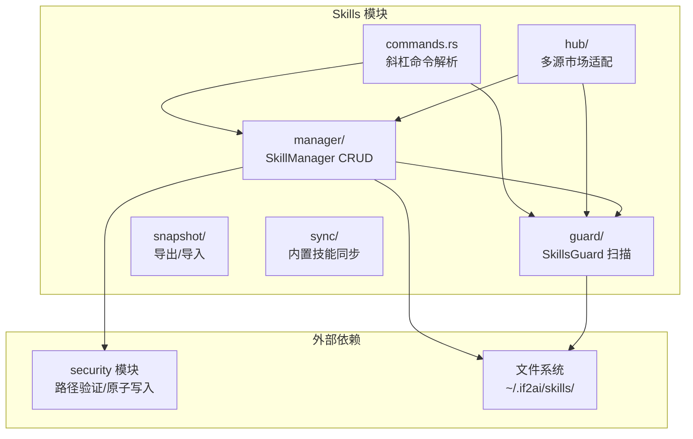
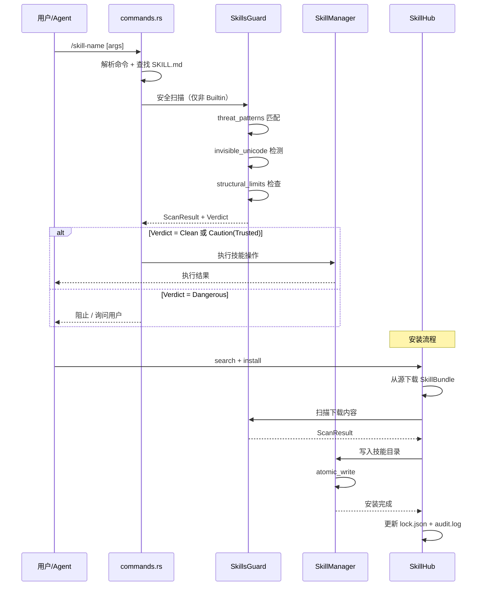
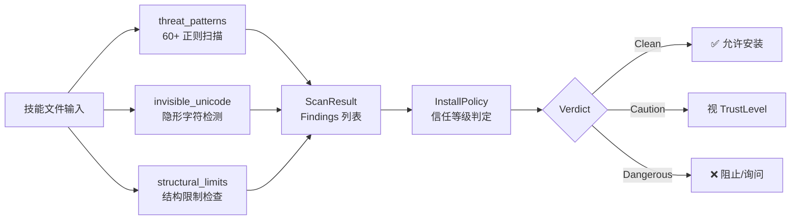

# 🏗️ Skills 实现文档

> 开发者视角 —— SkillManager 架构、ThreatScanner 集成、技能加载与执行沙箱设计。

## 📍 架构总览



## 🔄 技能执行流程



## 🏗️ SkillManager 架构

### 核心数据结构

```rust
// src-tauri/src/modules/skills/manager/mod.rs
pub struct SkillContext {
    pub skills_dir: PathBuf,    // ~/.if2ai/skills/
    pub guard: SkillsGuard,     // 安全扫描实例
}

pub enum SkillError {
    Io(std::io::Error),
    Validation(String),
    SecurityBlocked(String),
    NotFound(String),
    AlreadyExists(String),
    OperationFailed(String),
}
```

### CRUD 操作（actions.rs）

`actions.rs` 实现了完整的技能生命周期管理：

| 操作 | 说明 | 安全检查 |
|------|------|----------|
| `create` | 创建技能目录 + SKILL.md | 名称验证 + 内容扫描 |
| `edit` | 修改 SKILL.md 内容 | 修改后重新扫描 |
| `patch` | 增量更新 SKILL.md | 差异扫描 |
| `delete` | 删除技能目录 | 无 |
| `write_file` | 写入辅助文件 | 路径验证 + 大小限制 |
| `remove_file` | 删除辅助文件 | 路径验证 |

### 原子写入（atomic_write.rs）

技能文件写入使用原子操作保证数据完整性：

```rust
// src-tauri/src/modules/skills/manager/atomic_write.rs
pub struct AtomicWriteOptions {
    pub backup: bool,           // 是否创建备份
    pub validate_on_write: bool, // 写入后验证
}

// 流程：.tmp → sync_all → rename
pub async fn atomic_write(path, contents, options) -> AtomicWriteResult
```

### 验证器（validator.rs）

| 规则 | 约束 |
|------|------|
| 技能名称 | `^[a-z0-9][a-z0-9._-]*$`，最长 64 字符 |
| 技能描述 | 最长 1024 字符 |
| SKILL.md 内容 | 最长 100,000 字符 |
| 辅助文件 | 单文件最大 1MB |
| 子目录白名单 | 仅允许特定子目录 |

源码参考：[`src-tauri/src/modules/skills/manager/validator.rs`](../../../src-tauri/src/modules/skills/manager/validator.rs)

## 🛡️ ThreatScanner 集成

### ThreatPattern 数据结构

```rust
// src-tauri/src/modules/skills/guard/threat_patterns.rs
pub struct ThreatPattern {
    pub regex: Regex,           // 编译后的正则
    pub pattern_id: &'static str, // 唯一标识（如 "env_exfil_curl"）
    pub severity: Severity,     // Critical / High / Medium / Low
    pub category: ThreatCategory, // 威胁分类
    pub description: &'static str, // 人类可读描述
}
```

### Severity 严重等级

| 等级 | 数值 | 说明 |
|------|------|------|
| `Critical` | 0 | 数据外泄、系统破坏 |
| `High` | 1 | 提权、持久化 |
| `Medium` | 2 | 网络活动、混淆 |
| `Low` | 3 | 轻微异常 |

### 安装策略（InstallPolicy）

```rust
// src-tauri/src/modules/skills/guard/policy.rs
pub enum TrustLevel {
    Builtin,       // 不扫描，始终信任
    Trusted,       // Caution 级允许
    Community,     // 任何发现 = 阻止
    AgentCreated,  // Dangerous = 询问
}

pub enum Verdict {
    Clean,     // 无发现
    Caution,   // 中低风险
    Dangerous, // 高危发现
}
```

策略矩阵：

| 信任等级 | Clean | Caution | Dangerous |
|----------|-------|---------|-----------|
| Builtin | ✅ 允许 | ✅ 允许 | ✅ 允许 |
| Trusted | ✅ 允许 | ✅ 允许 | ❌ 阻止 |
| Community | ✅ 允许 | ❌ 阻止 | ❌ 阻止 |
| AgentCreated | ✅ 允许 | ⚠️ 询问 | ⚠️ 询问 |

### 不可见 Unicode 检测

`invisible_unicode.rs` 扫描每行代码中的：

- 零宽字符（U+200B / U+200C / U+200D / U+FEFF）
- 同形字攻击（Cyrillic 替换 Latin）
- 控制字符注入

### 结构性限制检查

`structural_limits.rs` 检测：

- 文件数量超限
- 目录嵌套过深
- 单文件过大
- 符号链接循环

## ⚙️ 技能加载与条件激活机制

### 技能发现流程

```
应用启动 → 扫描 ~/.if2ai/skills/
          ├─ 跳过 .git / .github / .hub 目录
          ├─ 每个子目录视为一个技能
          ├─ 读取 SKILL.md 解析元数据
          └─ 注册为 /skill-name 斜杠命令
```

### 当前激活机制

当前通过 `requires_toolsets` 字段实现基本条件激活：

```rust
// src-tauri/src/modules/skills/commands.rs
pub struct SkillCommandInfo {
    pub requires_toolsets: Vec<String>,  // 必须可用的工具集
    pub fallback_toolsets: Vec<String>,  // 备选工具集
    // ...
}
```

> ⚠️ 当前不支持按文件类型 / 项目类型自动激活，见差距分析。

### Hub 多源加载

`SkillSource` trait 定义统一的技能源接口：

```rust
// src-tauri/src/modules/skills/hub/source.rs
#[async_trait]
pub trait SkillSource: Send + Sync {
    async fn search(&self, query: &str) -> HubResult<Vec<SkillMeta>>;
    async fn download(&self, identifier: &str) -> HubResult<SkillBundle>;
    fn source_name(&self) -> &str;
}
```

已实现适配器：

| 适配器 | 文件 | 说明 |
|--------|------|------|
| `GitHubSource` | `hub/github.rs` | GitHub API 获取技能仓库 |
| `ClawHubSource` | `hub/clawhub.rs` | If2Ai 官方注册中心 |
| `SkillsShSource` | `hub/skills_sh.rs` | skills.sh 社区平台 |

## 🔒 技能执行沙箱

### 当前沙箱策略

1. **文件系统隔离**：技能只能操作 `skills_dir` 内的文件
2. **路径验证**：`SkillValidator` 确保无路径逃逸
3. **内容限制**：`SKILL.md` 最大 100K，辅助文件最大 1MB
4. **安全扫描**：所有非 Builtin 技能执行前必须通过扫描
5. **审计日志**：所有安装操作记录到 `audit.log`

### 安全扫描管线



## 📝 核心概念速查表

| 组件 | 文件 | 职责 |
|------|------|------|
| SkillsGuard | `guard/mod.rs` | 安全扫描主入口 |
| ThreatPattern | `guard/threat_patterns.rs` | 60+ 威胁模式定义 |
| InstallPolicy | `guard/policy.rs` | 安装策略 + 信任等级 |
| SkillContext | `manager/mod.rs` | 技能操作上下文 |
| SkillValidator | `manager/validator.rs` | 输入验证规则 |
| SkillSource | `hub/source.rs` | 多源适配器 trait |
| HubPaths | `hub/state.rs` | Hub 状态目录管理 |
| SkillCommandInfo | `commands.rs` | 斜杠命令元数据 |

## ⚠️ 与 cc-haha 差距分析

### ✅ 优势

| 方面 | If2Ai | cc-haha |
|------|-------|---------|
| 安全扫描 | 15 类 60+ 模式 + 不可见 Unicode + 结构限制 | 基础安全检查 |
| 信任模型 | 四级（Builtin/Trusted/Community/AgentCreated） | 两级（允许/拒绝） |
| 隔离机制 | quarantine 隔离 + audit.log 审计 | 无隔离 |
| 多源市场 | GitHub + ClawHub + skills.sh 三源 | 单源 |

### ❌ 劣势

| 方面 | cc-haha 有 | If2Ai 缺 |
|------|-----------|----------|
| 条件激活 | 按文件类型 / 项目类型 / 上下文自动激活技能 | 仅有 `requires_toolsets` 基本条件 |
| 技能市场 API | 完整 REST API + 评分 + 评论 | 仅有搜索和下载 |
| 版本管理 | 语义版本 + 自动更新 + 兼容性检查 | 无版本概念 |
| 技能依赖 | 技能间依赖声明 + 自动解析 | 无依赖系统 |

### 📊 对比矩阵

| 特性 | If2Ai | cc-haha | 差距 |
|------|-------|---------|------|
| 安全扫描深度 | ⭐⭐⭐⭐⭐ | ⭐⭐⭐ | If2Ai 更强 |
| 条件激活 | ⭐⭐ | ⭐⭐⭐⭐ | cc-haha 更强 |
| 市场生态 | ⭐⭐ | ⭐⭐⭐⭐ | cc-haha 更强 |
| 版本管理 | ⭐ | ⭐⭐⭐⭐ | cc-haha 更强 |
| 信任模型 | ⭐⭐⭐⭐ | ⭐⭐ | If2Ai 更强 |

## 🎯 增强计划

### 1. 条件激活引擎

```
目标：实现按文件类型 / 项目类型 / 上下文自动激活技能

Phase 1: 文件类型匹配
  - SKILL.md 增加 activation.file_patterns 字段
  - 示例：*.py → 激活 python-lint 技能

Phase 2: 项目类型推断
  - 检测项目根目录特征文件（package.json / Cargo.toml / pyproject.toml）
  - 自动激活对应技能

Phase 3: 上下文激活
  - 基于对话内容语义匹配
  - 基于当前工作目录上下文
```

### 2. 技能市场 API

```
目标：提供完整的技能市场 REST API

- 技能发布 / 更新 / 下架
- 评分与评论系统
- 下载量统计
- 分类与标签体系
- 搜索排序算法优化
```

### 3. 语义版本管理

```
目标：引入 semver 版本管理

- SKILL.md 增加 version 字段
- 依赖声明：requires: [{name: "base", version: "^1.0.0"}]
- 自动更新检查
- 兼容性矩阵
- 回滚支持
```

## 🔗 相关资源

- [Skills 使用指南](./01-usage-guide.md) — 用户操作手册
- [Security 实现文档](../security/02-implementation.md) — 安全模块架构
- [SkillsGuard 源码](../../../src-tauri/src/modules/skills/guard/mod.rs)
- [ThreatPatterns 源码](../../../src-tauri/src/modules/skills/guard/threat_patterns.rs)
