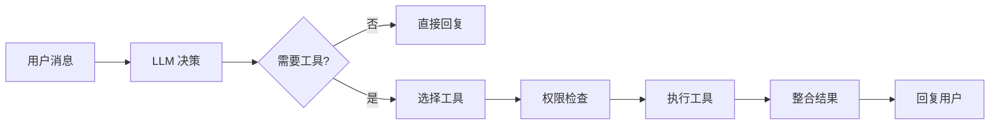

# 工具模块使用指南

> 面向用户的工具操作手册——45+ 工具按类别详解、权限等级与使用示例

## 📍 工具调用方式

If2Ai 的工具由 Agent 自主调用，用户通过对话间接使用。Agent 根据任务需求自动选择合适的工具：



## 📂 文件 I/O 工具

### read_file — 读取文件

读取指定路径的文件内容，支持行范围读取。

```
参数:
  - path (string, 必需): 文件绝对路径
  - start_line (number, 可选): 起始行号
  - end_line (number, 可选): 结束行号
```

**示例**：Agent 读取项目配置
> 用户："看看 package.json 的依赖"  
> Agent 调用 `read_file(path="/project/package.json")`

### file_write — 写入文件

写入内容到指定文件，自动创建不存在的目录。

```
参数:
  - path (string, 必需): 文件绝对路径
  - content (string, 必需): 写入内容
  - create_dirs (boolean, 可选): 是否创建目录（默认 true）
```

### file_edit — 编辑文件

对文件进行精确的搜索替换操作。

```
参数:
  - path (string, 必需): 文件绝对路径
  - old_text (string, 必需): 要替换的原始文本
  - new_text (string, 必需): 替换后的文本
```

### glob_search — 文件搜索

使用 Glob 模式搜索文件路径。

```
参数:
  - pattern (string, 必需): Glob 模式（如 "**/*.rs"）
  - path (string, 可选): 搜索根目录
```

### content_search — 内容搜索

在文件中搜索指定文本内容。

```
参数:
  - query (string, 必需): 搜索内容
  - path (string, 可选): 搜索目录
  - file_pattern (string, 可选): 文件过滤模式
```

## 💻 终端工具

### bash — 执行 Shell 命令

在系统 Shell 中执行命令，支持超时控制。

```
参数:
  - command (string, 必需): 要执行的命令
  - timeout (number, 可选): 超时秒数
  - workdir (string, 可选): 工作目录
```

**示例**：Agent 运行测试
> 用户："跑一下测试"  
> Agent 调用 `bash(command="cargo test")`

### REPL / PowerShell

交互式命令行环境，支持多轮命令执行。

## 🌐 网络工具

### web_fetch — 抓取网页

抓取指定 URL 的网页内容。

```
参数:
  - url (string, 必需): 目标 URL
  - query (string, 可选): 搜索关键词
```

### web_search — Web 搜索

使用搜索引擎搜索信息，支持多种搜索引擎。

```
参数:
  - query (string, 必需): 搜索查询
  - engine (string, 可选): 搜索引擎
  - limit (number, 可选): 结果数量
```

### web_research — 深度研究

对指定主题进行深度网络研究，自动多轮搜索和整合。

```
参数:
  - topic (string, 必需): 研究主题
  - depth (number, 可选): 研究深度
```

### http_request — HTTP 请求

发送自定义 HTTP 请求。

```
参数:
  - url (string, 必需): 请求 URL
  - method (string, 可选): HTTP 方法（默认 GET）
  - headers (object, 可选): 请求头
  - body (string, 可选): 请求体
```

## 🧠 记忆工具

### memory_store — 存储记忆

将信息持久化到长期记忆，自动向量嵌入和 PII 扫描。

```
参数:
  - key (string, 必需): 记忆键名
  - content (string, 必需): 记忆内容
  - category (string, 可选): 分类标签
```

### memory_recall — 召回记忆

通过语义搜索召回相关记忆。

```
参数:
  - query (string, 必需): 搜索查询
  - category (string, 可选): 按分类过滤
  - limit (number, 可选): 返回条数上限
```

### memory_forget / memory_purge / memory_export

删除、批量清除、导出记忆，详见 [记忆模块使用指南](../memory/01-usage-guide.md)。

## ⚡ 技能工具

### skill — 执行技能

调用已注册的技能（类似 Slash 命令）。

```
参数:
  - name (string, 必需): 技能名称
  - args (string, 可选): 技能参数
```

### skill_find / skill_search — 查找技能

搜索和发现可用技能。

### skill_manage — 管理技能

启用/禁用/安装/卸载技能。

### skill_view — 查看技能详情

查看技能的完整定义和文档。

## ⏰ 调度工具

### cron_add — 添加定时任务

```
参数:
  - schedule (string, 必需): Cron 表达式
  - command (string, 必需): 要执行的命令
  - description (string, 可选): 任务描述
```

### cron_list / cron_remove / cron_run / cron_runs

列出、删除、手动运行定时任务，查看运行历史。

## 🛡️ 权限等级说明

| 等级 | 说明 | 行为 |
|------|------|------|
| **高风险** | 需要 Session 级显式上下文 | 必须通过 `dispatch_with_context()` 调度 |
| **标准** | 可使用共享上下文 | 允许通过 `dispatch()` 调度 |

高风险工具列表由 `requires_explicit_context()` 定义，包括：`read_file`、`file_write`、`file_edit`、`bash`、`REPL`、`PowerShell`、`memory_store`、`memory_forget`、`memory_purge`、`cron_add`、`cron_remove`、`cron_run`、`agent` 等。

> 除非设置 `IF2AI_ALLOW_SHARED_CONTEXT_DISPATCH=1`，高风险工具在共享上下文下会被拒绝执行。

## ⚠️ 与 cc-haha 差距分析

### If2Ai 优势

| 特性 | If2Ai | cc-haha |
|------|-------|---------|
| **类型安全** | Rust trait + 编译时检查 | TypeScript 运行时 |
| **工具-记忆集成** | memory_* 工具与 VectorMemory 深度集成 | 独立记忆系统 |
| **工具-技能集成** | skill_* 工具与 SkillsControlPlane 联动 | 独立技能系统 |
| **多模态输出** | ToolOutput 支持 Text + Image | 纯文本输出 |
| **上下文隔离** | 高风险工具强制 Session 级上下文 | 无显式隔离 |

### If2Ai 劣势

| 特性 | If2Ai | cc-haha |
|------|-------|---------|
| **工具数量** | 45 个 | 57 个 |
| **LSP 集成** | 无 LSPTool | 有 LSPTool |
| **规划模式** | 无 EnterPlanModeTool | 有 EnterPlanModeTool |
| **团队协作** | 无 TeamCreateTool | 有 TeamCreateTool |
| **监控** | 无 MonitorTool | 有 MonitorTool |
| **通知** | 无 PushNotificationTool | 有 PushNotificationTool |
| **简报** | 无 BriefTool | 有 BriefTool |

## 🎯 增强计划

1. **补充 12+ 缺失工具**：按优先级实现 LSPTool、EnterPlanModeTool、TeamCreateTool、MonitorTool、PushNotificationTool、BriefTool 等
2. **Tool Hooks 中间件**：在 `dispatch_with_context()` 前后添加可插拔的中间件钩子，支持日志/限流/缓存等横切关注点
3. **工具描述自动压缩**：当注册工具过多时，自动压缩低频工具的描述以节省 token
4. **工具使用分析**：记录工具调用频率和耗时，自动优化工具选择策略
