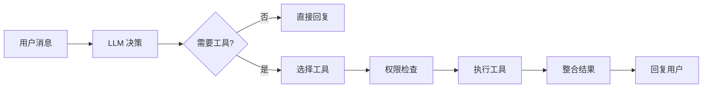

# 工具模块使用指南

> 面向用户的工具操作手册——45+ 工具按类别详解、权限等级与使用示例

## 📍 工具调用方式

If2Ai 的工具由 Agent 自主调用，用户通过对话间接使用。Agent 根据任务需求自动选择合适的工具：



## 📂 文件 I/O 工具

### read_file — 读取文件

读取指定路径的文件内容，支持按字节偏移读取。

```
参数:
  - path (string, 必需): 文件绝对路径
  - offset (number, 可选): 起始字节偏移（默认 0）
  - limit (number, 可选): 最大读取字节数（默认 1MB）
```

> 工具层按字节偏移截断，前端行号切片通过 `runtime/file_ops.rs` 封装。

**示例**：Agent 读取项目配置
> 用户："看看 package.json 的依赖"
> Agent 调用 `read_file(path="/project/package.json")`

### file_write — 写入文件

写入内容到指定文件，自动创建不存在的父目录。

```
参数:
  - path (string, 必需): 文件绝对路径
  - content (string, 必需): 写入内容
  - append (boolean, 可选): 是否以追加模式写入（默认 false）
```

> 工具会自动创建缺失的父目录。

### file_edit — （暂未实现）基于 diff 的文件编辑

当前状态：工具已在注册表中预留，处于 `disabled: true` 状态，调用返回错误。

预期参数:
  - path (string, 必需): 文件绝对路径
  - patch (string, 必需): 统一 diff 格式的补丁内容

> 注意：目前该工具尚不可用，后续实现完成前请使用 `file_write`。

### glob_search — 文件搜索

使用 Glob 模式搜索文件路径。

```
参数:
  - pattern (string, 必需): Glob 模式（如 "**/*.rs"）
  - path (string, 可选): 搜索根目录
```

### content_search — 内容搜索

在文件中搜索指定文本内容。

```
参数:
  - query (string, 必需): 搜索内容
  - path (string, 可选): 搜索目录
  - file_pattern (string, 可选): 文件过滤模式
```

## 💻 终端工具

### bash — 执行 Shell 命令

在系统 Shell 中执行命令，支持超时控制。

```
参数:
  - command (string, 必需): 要执行的命令
  - timeout (number, 可选): 超时秒数（默认 30，最大 300）
```

> 工作目录由 `ToolContext.workdir` 决定。

**示例**：Agent 运行测试
> 用户："跑一下测试"  
> Agent 调用 `bash(command="cargo test")`

### REPL / PowerShell

交互式命令行环境，支持多轮命令执行。

## 🌐 网络工具

### web_fetch — 抓取网页

抓取指定 URL 的网页内容。

```
参数:
  - url (string, 必需): 目标 URL
  - query (string, 可选): 搜索关键词
```

### web_search — Web 搜索

使用搜索引擎搜索信息，支持多种搜索引擎。

```
参数:
  - query (string, 必需): 搜索查询
  - engine (string, 可选): 搜索引擎
  - limit (number, 可选): 结果数量
```

### web_research — 深度研究

对指定主题进行深度网络研究，自动多轮搜索和整合。

```
参数:
  - topic (string, 必需): 研究主题
  - depth (number, 可选): 研究深度
```

### http_request — HTTP 请求

发送自定义 HTTP 请求。

```
参数:
  - url (string, 必需): 请求 URL
  - method (string, 可选): HTTP 方法（默认 GET）
  - headers (object, 可选): 请求头
  - body (string, 可选): 请求体
```

## 🧠 记忆工具

### memory_store — 存储记忆

将信息持久化到长期记忆，自动向量嵌入和 PII 扫描。

```
参数:
  - key (string, 必需): 记忆键名
  - content (string, 必需): 记忆内容
  - category (string, 可选): 分类标签
```

### memory_recall — 召回记忆

通过语义搜索召回相关记忆。

```
参数:
  - query (string, 必需): 搜索查询
  - category (string, 可选): 按分类过滤
  - limit (number, 可选): 返回条数上限
```

### memory_forget / memory_purge / memory_export

删除、批量清除、导出记忆，详见 [记忆模块使用指南](../memory/01-usage-guide.md)。

## ⚡ 技能工具

### skill — 执行技能

调用已注册的技能（类似 Slash 命令）。

```
参数:
  - name (string, 必需): 技能名称
  - args (string, 可选): 技能参数
```

### skill_find / skill_search — 查找技能

搜索和发现可用技能。

### skill_manage — 管理技能

启用/禁用/安装/卸载技能。

### skill_view — 查看技能详情

查看技能的完整定义和文档。

## ⏰ 调度工具

### cron_add — 添加定时任务

```
参数:
  - schedule (string, 必需): Cron 表达式
  - command (string, 必需): 要执行的命令
  - description (string, 可选): 任务描述
```

### cron_list / cron_remove / cron_run / cron_runs

列出、删除、手动运行定时任务，查看运行历史。

## 🛡️ 权限等级说明

| 等级 | 说明 | 行为 |
|------|------|------|
| **高风险** | 需要 Session 级显式上下文 | 必须通过 `dispatch_with_context()` 调度 |
| **标准** | 可使用共享上下文 | 允许通过 `dispatch()` 调度 |

高风险工具列表由 `requires_explicit_context()` 定义，包括：`read_file`、`file_write`、`file_edit`、`bash`、`REPL`、`PowerShell`、`memory_store`、`memory_forget`、`memory_purge`、`cron_add`、`cron_remove`、`cron_run`、`agent` 等。

> 除非设置 `IF2AI_ALLOW_SHARED_CONTEXT_DISPATCH=1`，高风险工具在共享上下文下会被拒绝执行。

## ⚠️ 与 cc-haha 差距分析

### If2Ai 优势

| 特性 | If2Ai | cc-haha |
|------|-------|---------|
| **类型安全** | Rust trait + 编译时检查 | TypeScript 运行时 |
| **工具-记忆集成** | memory_* 工具与 VectorMemory 深度集成 | 独立记忆系统 |
| **工具-技能集成** | skill_* 工具与 SkillsControlPlane 联动 | 独立技能系统 |
| **多模态输出** | ToolOutput 支持 Text + Image | 纯文本输出 |
| **上下文隔离** | 高风险工具强制 Session 级上下文 | 无显式隔离 |

### If2Ai 劣势

| 特性 | If2Ai | cc-haha |
|------|-------|---------|
| **工具数量** | 45 个 | 57 个 |
| **LSP 集成** | 无 LSPTool | 有 LSPTool |
| **规划模式** | 无 EnterPlanModeTool | 有 EnterPlanModeTool |
| **团队协作** | 无 TeamCreateTool | 有 TeamCreateTool |
| **监控** | 无 MonitorTool | 有 MonitorTool |
| **通知** | 无 PushNotificationTool | 有 PushNotificationTool |
| **简报** | 无 BriefTool | 有 BriefTool |

## 🔍 cc-haha vs If2Ai 深度对比

> 以下对比基于双方精确源码，引用完整路径和行号。cc-haha 源码路径前缀：`/Users/ryanliu/Documents/IfAI/cc-haha-main/`；If2Ai 源码路径前缀：`src-tauri/src/modules/tools/`。

### 1. 工具定义对比

**cc-haha `buildTool()` 工厂**（`/Users/ryanliu/Documents/IfAI/cc-haha-main/src/Tool.ts` L757-792）

```typescript
// Tool.ts L757-792
const TOOL_DEFAULTS = {
  isEnabled: () => true,
  isConcurrencySafe: (_input?: unknown) => false,
  isReadOnly: (_input?: unknown) => false,
  isDestructive: (_input?: unknown) => false,
  checkPermissions: (input, _ctx) =>
    Promise.resolve({ behavior: 'allow', updatedInput: input }),
  toAutoClassifierInput: (_input?) => '',
  userFacingName: (_input?) => '',
}

export function buildTool<D extends AnyToolDef>(def: D): BuiltTool<D> {
  return { ...TOOL_DEFAULTS, userFacingName: () => def.name, ...def } as BuiltTool<D>
}
```

cc-haha 通过 `buildTool()` 工厂函数填充安全默认值（fail-closed 策略：并发不安全、非只读、非破坏性），工具开发者只需覆盖需要的方法。`ToolDef` 类型使默认方法可选，`BuiltTool<D>` 类型确保返回完整工具。

**If2Ai `ToolEntry` 直接构造**（`src-tauri/src/modules/tools/registry.rs` L201-237）

```rust
// registry.rs L201-237
pub struct ToolEntry {
    pub name: String,
    pub toolset: String,
    pub description: String,
    pub input_schema: Value,
    pub max_result_size: Option<usize>,    // 已废弃
    pub max_text_bytes: Option<usize>,     // Phase 7C.2
    pub max_image_bytes: Option<usize>,    // Phase 7C.2
    pub timeout_secs: Option<u32>,
    pub disabled: bool,
    pub handler: ToolHandler,
    pub multimodal_handler: Option<ToolHandlerMultimodal>,
}
```

If2Ai 直接构造 `ToolEntry`，所有字段必须显式填写。没有工厂函数或默认值填充，但 Rust 编译器保证所有字段都已初始化。

| 对比维度 | cc-haha `buildTool()` | If2Ai `ToolEntry` |
|---------|----------------------|-------------------|
| 安全默认值 | ✅ 自动填充（fail-closed） | ⚠️ 编译时强制初始化，无语义默认 |
| 别名支持 | ✅ `aliases` 字段 | ❌ 无 |
| 搜索提示 | ✅ `searchHint` 字段 | ❌ 无 |
| 安全分类 | ✅ 三个维度（并发/只读/破坏性） | ⚠️ 仅高风险列表 |
| 多模态 | ❌ 纯文本 | ✅ `multimodal_handler` 优先 |
| 类型安全 | ⚠️ TypeScript 运行时 | ✅ Rust 编译时 |

### 2. 工具调用生命周期对比

**cc-haha 5 步生命周期**：

```
validateInput() → checkPermissions() → call() → mapResult() → persist()
     ↓                 ↓                  ↓          ↓            ↓
  业务验证          权限检查          执行工具     结果映射     大结果持久化
  (Tool.ts L489)   (Tool.ts L500)   (Tool.ts L379)  (Tool.ts L557) (toolResultStorage.ts L205)
```

1. **validateInput()**（Tool.ts L489-492）：异步业务验证，返回 `ValidationResult`
2. **checkPermissions()**（Tool.ts L500-503）：工具特定权限检查，返回 `PermissionResult`
3. **call()**（Tool.ts L379-385）：核心执行，接收 `onProgress` 回调
4. **mapToolResultToToolResultBlockParam()**（Tool.ts L557-560）：将结果映射为 API 格式
5. **persist**（toolResultStorage.ts L205-226）：超过阈值的结果持久化到磁盘

**If2Ai 3 步生命周期**：

```
validate() → dispatch_with_context() → enforce_size_caps()
     ↓                ↓                        ↓
  Schema 验证      执行工具+超时           大小限制检查
  (registry.rs L559) (registry.rs L506)   (registry.rs L316)
```

1. **validate()**（registry.rs L559-583）：仅检查 required 参数是否存在
2. **dispatch_with_context()**（registry.rs L506-540）：查找工具→检查启用→选择处理器→执行→超时保护
3. **enforce_size_caps()**（registry.rs L316-351）：按模态（text/image）检查输出大小

| 对比维度 | cc-haha 5 步 | If2Ai 3 步 |
|---------|-------------|------------|
| 业务验证 | ✅ validateInput() | ❌ 仅 Schema |
| 权限检查 | ✅ 逐工具 checkPermissions() | ⚠️ 仅高风险列表 |
| 进度回调 | ✅ onProgress | ❌ 无 |
| 结果映射 | ✅ 自定义映射 | ✅ 自动（Text/Image） |
| 持久化 | ✅ 大结果自动持久化 | ❌ 直接拒绝 |

### 3. BashTool 深度对比

**cc-haha BashTool**（`/Users/ryanliu/Documents/IfAI/cc-haha-main/src/tools/BashTool/BashTool.tsx`，1144 行）

关键特性：
- **命令语义分类**（L59-78）：`BASH_SEARCH_COMMANDS`、`BASH_READ_COMMANDS`、`BASH_LIST_COMMANDS`、`BASH_SILENT_COMMANDS`——根据命令类型折叠 UI 显示
- **后台执行**（L57）：`ASSISTANT_BLOCKING_BUDGET_MS = 15_000`，超过 15 秒自动后台化
- **进度回调**（L663-677）：实时输出字节数、行数、耗时
  ```typescript
  // BashTool.tsx L663-677
  onProgress({
    toolUseID: `bash-progress-${progressCounter++}`,
    data: {
      type: 'bash_progress',
      output: progress.output,
      fullOutput: progress.fullOutput,
      elapsedTimeSeconds: progress.elapsedTimeSeconds,
      totalLines: progress.totalLines,
      totalBytes: progress.totalBytes,
      taskId: progress.taskId,
      timeoutMs: progress.timeoutMs
    }
  });
  ```
- **AST 命令解析**（L17）：`parseForSecurity()` 使用 bash AST 解析检测危险命令
- **沙箱执行**（L33）：`SandboxManager` 支持容器化执行
- **只读验证**（L46）：`checkReadOnlyConstraints()` 检查只读约束
- **语义命令解释**（L44）：`interpretCommandResult()` 语义化命令结果

**If2Ai bash**（`src-tauri/src/modules/tools/builtin/bash.rs`，235 行）

关键特性：
- **危险命令黑名单**（L17-24）：`DANGEROUS_COMMANDS` 静态列表
  ```rust
  // bash.rs L17-24
  const DANGEROUS_COMMANDS: &[&str] = &[
      "rm -rf /", "rm -rf /*", "sudo su", "mkfs", "dd if=", ":(){:|:&};:",
  ];
  ```
- **工作目录限制**：从 ToolContext 提取 workdir
- **tokio::process::Command**：异步执行
- **超时保护**：通过 registry 的 `timeout_secs` 实现

| 对比维度 | cc-haha BashTool (1144 行) | If2Ai bash (235 行) |
|---------|--------------------------|-------------------|
| 命令分类 | ✅ 语义分类（search/read/list/silent） | ❌ 无 |
| 后台执行 | ✅ 自动后台化 (15s) | ❌ 无 |
| 进度回调 | ✅ 实时进度 | ❌ 无 |
| 安全检查 | ✅ AST 解析 + 沙箱 | ⚠️ 仅黑名单 |
| 只读约束 | ✅ 独立验证 | ❌ 无 |
| 沙箱执行 | ✅ SandboxManager | ❌ 无 |
| 语义解释 | ✅ interpretCommandResult | ❌ 无 |
| 异步 I/O | ⚠️ Node.js 事件循环 | ✅ tokio async |

### 4. FileReadTool 深度对比

**cc-haha FileReadTool**（`/Users/ryanliu/Documents/IfAI/cc-haha-main/src/tools/FileReadTool/FileReadTool.ts`，1184 行）

关键特性：
- **多格式支持**：文本文件 + 图像（自动压缩/缩放） + PDF（分页提取） + Notebook（`.ipynb` 解析）
  - 图像：`compressImageBufferWithTokenLimit()` (L44-50)
  - PDF：`extractPDFPages()`/`readPDF()` (L61)
  - Notebook：`readNotebook()`/`mapNotebookCellsToToolResult()` (L57-58)
- **设备文件保护**（L98-115）：`BLOCKED_DEVICE_PATHS` 阻止读取 `/dev/zero`、`/dev/random` 等无限输出设备
  ```typescript
  // FileReadTool.ts L98-115
  const BLOCKED_DEVICE_PATHS = new Set([
    '/dev/zero', '/dev/random', '/dev/urandom', '/dev/full',
    '/dev/stdin', '/dev/tty', '/dev/console',
    '/dev/fd/0', '/dev/fd/1', '/dev/fd/2',
  ])
  ```
- **Token 估算**（L20-22）：`countTokensWithAPI()`/`roughTokenCountEstimationForFileType()`
- **行号添加**（L34）：`addLineNumbers()` 格式化输出
- **技能目录发现**（L25-27）：`discoverSkillDirsForPaths()`/`addSkillDirectories()`
- **记忆文件检测**（L53）：`isAutoMemFile()` 检测 CLAUDE.md 等记忆文件

**If2Ai file_read**（`src-tauri/src/modules/tools/builtin/file_read.rs`，248 行）

关键特性：
- **工作目录边界**（L47-51）：`BoundaryResolver` 强制路径在 workdir 内
  ```rust
  // file_read.rs L47-51
  let resolved_path = BoundaryResolver::resolve_user_path(&workdir, &requested_path);
  let canonical_path = BoundaryResolver::canonicalize_existing(&resolved_path)?;
  BoundaryResolver::assert_within_workdir(&canonical_workdir, &canonical_path)?;
  ```
- **敏感路径黑名单**（L54-62）：`/etc/passwd`、`/etc/shadow`、`/.ssh/`、`/.aws/`
- **大小限制**：1MB 默认限制（`MAX_FILE_SIZE`）
- **偏移读取**：支持 offset + limit 参数

| 对比维度 | cc-haha FileReadTool (1184 行) | If2Ai file_read (248 行) |
|---------|------------------------------|------------------------|
| 文本文件 | ✅ 行号 + token 估算 | ✅ 基础读取 + 偏移 |
| 图像支持 | ✅ 自动压缩/缩放 | ❌ 无 |
| PDF 支持 | ✅ 分页提取 | ❌ 无 |
| Notebook 支持 | ✅ .ipynb 解析 | ❌ 仅有独立 notebook_edit |
| 设备文件保护 | ✅ BLOCKED_DEVICE_PATHS | ❌ 无 |
| 路径安全 | ⚠️ 权限系统 | ✅ BoundaryResolver + 黑名单 |
| 敏感路径保护 | ⚠️ 权限系统 | ✅ 显式黑名单 |
| 技能/记忆集成 | ✅ 自动发现 | ❌ 无 |
| 编码处理 | ✅ 多编码支持 | ⚠️ 仅 UTF-8 |

## 🎯 增强计划

1. **补充 12+ 缺失工具**：按优先级实现 LSPTool、EnterPlanModeTool、TeamCreateTool、MonitorTool、PushNotificationTool、BriefTool 等
2. **Tool Hooks 中间件**：在 `dispatch_with_context()` 前后添加可插拔的中间件钩子，支持日志/限流/缓存等横切关注点
3. **工具描述自动压缩**：当注册工具过多时，自动压缩低频工具的描述以节省 token
4. **工具使用分析**：记录工具调用频率和耗时，自动优化工具选择策略
