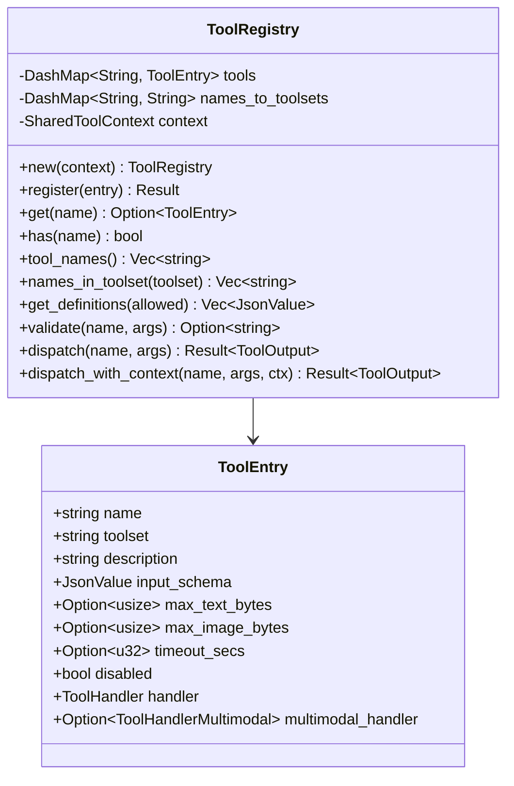
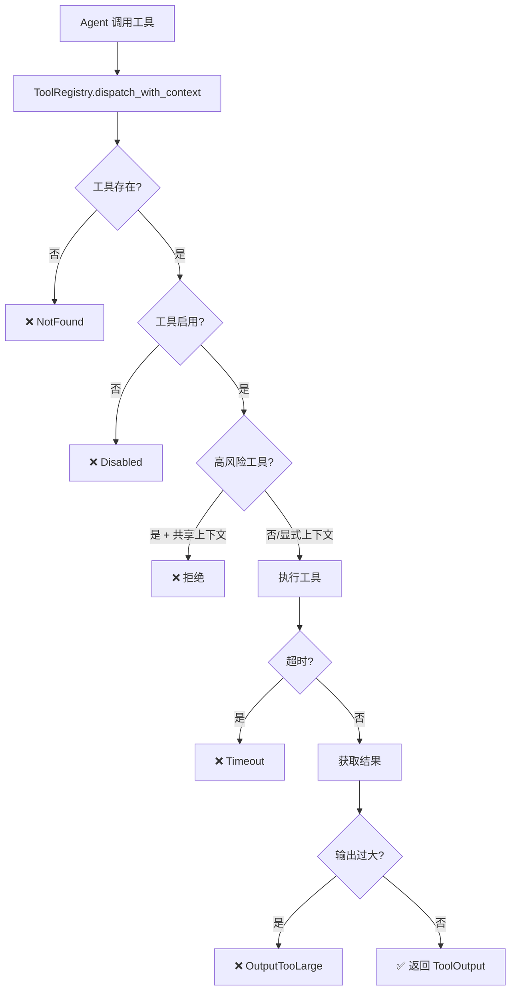
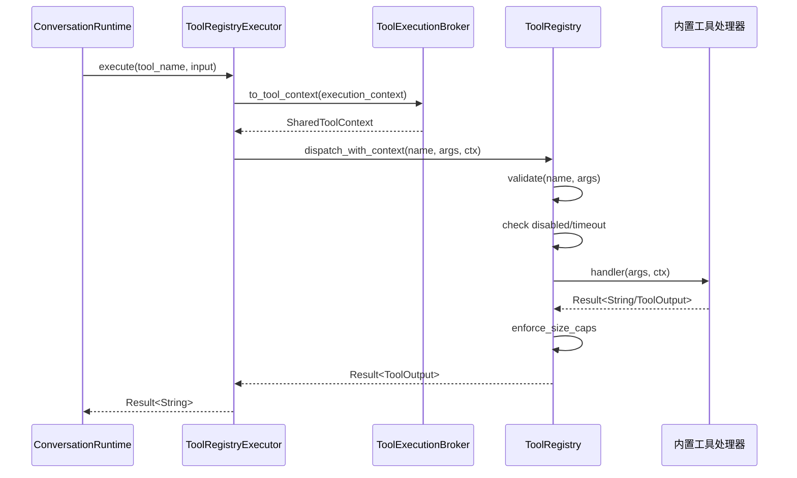
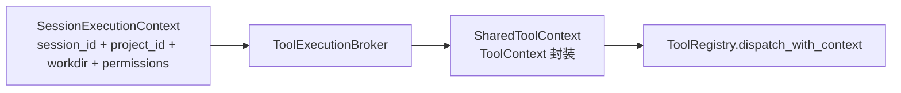

# 工具模块实现原理

> 面向开发者的工具系统架构——注册中心、执行框架、扩展指南

## 🏗️ ToolRegistry 注册中心

`ToolRegistry` 是工具系统的核心，基于 `DashMap` 实现高性能并发访问：



### ToolEntry 字段详解

| 字段 | 类型 | 说明 |
|------|------|------|
| `name` | `String` | 工具唯一标识（如 "bash"） |
| `toolset` | `String` | 所属工具集（如 "terminal"） |
| `description` | `String` | 工具描述，发送给 LLM |
| `input_schema` | `Value` | JSON Schema 输入验证 |
| `max_text_bytes` | `Option<usize>` | 文本输出大小上限 |
| `max_image_bytes` | `Option<usize>` | 图片输出大小上限 |
| `timeout_secs` | `Option<u32>` | 执行超时（默认 300 秒） |
| `disabled` | `bool` | 是否禁用 |
| `handler` | `ToolHandler` | 标准文本处理器 |
| `multimodal_handler` | `Option<ToolHandlerMultimodal>` | 多模态处理器（优先于 handler） |

> 源码参考：`src-tauri/src/modules/tools/registry.rs`

## 🔄 工具执行框架

### 执行流程



### dispatch_with_context 实现

```rust
pub async fn dispatch_with_context(
    &self,
    name: &str,
    args: Value,
    context: SharedToolContext,
) -> Result<ToolOutput, ToolError> {
    // 1. 查找工具
    let entry = self.get(name).ok_or(ToolError::NotFound(...))?;
    
    // 2. 检查启用状态
    if entry.disabled { return Err(ToolError::Disabled(...)); }
    
    // 3. 选择处理器（多模态优先）
    let timeout_duration = entry.timeout_secs.unwrap_or(300);
    
    let exec = if let Some(mm) = entry.multimodal_handler {
        timeout(timeout_duration, mm(args, context)).await
    } else {
        timeout(timeout_duration, legacy(args, context))
            .await
            .map(|inner| inner.map(ToolOutput::text))
    };
    
    // 4. 处理结果 + 大小检查
    match exec {
        Ok(Ok(output)) => {
            enforce_size_caps(name, &entry, &output)?;
            Ok(output)
        }
        Ok(Err(e)) => Err(e),
        Err(_) => Err(ToolError::Timeout(...)),
    }
}
```

> 源码参考：`src-tauri/src/modules/tools/registry.rs` — `dispatch_with_context()`

### 输入验证

`validate()` 方法对工具参数进行基础 Schema 验证：

```rust
pub fn validate(&self, name: &str, args: &Value) -> Option<String> {
    let entry = self.get(name)?;
    // 检查 required 参数是否存在
    if let Some(obj) = args.as_object() {
        if let Some(schema_obj) = entry.input_schema
            .get("properties").and_then(|p| p.as_object()) {
            for (key, schema) in schema_obj {
                if schema.get("required").and_then(|r| r.as_bool()).unwrap_or(false)
                    && !obj.contains_key(key) {
                    return Some(format!("missing required parameter: {key}"));
                }
            }
        }
    }
    None
}
```

## 📐 Tool trait 定义

If2Ai 的工具通过 `ToolHandler` 闭包注册，而非传统的 trait 对象：

```rust
/// 标准工具处理器（返回纯文本）
pub type ToolHandler = Arc<
    dyn Fn(Value, SharedToolContext) -> Pin<Box<dyn Future<Output = Result<String, ToolError>> + Send>>
    + Send + Sync
>;

/// 多模态工具处理器（返回 ToolOutput）
pub type ToolHandlerMultimodal = Arc<
    dyn Fn(Value, SharedToolContext) -> Pin<Box<dyn Future<Output = Result<ToolOutput, ToolError>> + Send>>
    + Send + Sync
>;
```

选择闭包而非 trait 的原因：
- **灵活性**：每个工具可以有完全不同的签名和状态
- **零成本**：无需 vtable 分发，闭包直接内联
- **兼容性**：30+ 内置工具无需修改即可迁移到 `ToolOutput`

## 🔧 工具扩展指南

### 添加新工具的步骤

1. **创建工具文件**：在 `src-tauri/src/modules/tools/builtin/` 下创建 `my_tool.rs`

2. **实现工具注册函数**：

```rust
// src-tauri/src/modules/tools/builtin/my_tool.rs
use serde_json::Value;
use crate::modules::tools::context::SharedToolContext;
use crate::modules::tools::registry::{ToolEntry, ToolError};

pub fn register(registry: &ToolRegistry) -> Result<(), ToolError> {
    registry.register(ToolEntry {
        name: "my_tool".to_string(),
        toolset: "utility".to_string(),
        description: "My custom tool description".to_string(),
        input_schema: serde_json::json!({
            "type": "object",
            "properties": {
                "input": { "type": "string", "description": "Input parameter" }
            },
            "required": ["input"]
        }),
        max_text_bytes: None,
        max_image_bytes: None,
        timeout_secs: Some(60),
        disabled: false,
        handler: Arc::new(|args: Value, ctx: SharedToolContext| {
            Box::pin(async move {
                let input = args["input"].as_str().unwrap_or("");
                Ok(format!("Processed: {input}"))
            })
        }),
        multimodal_handler: None,
    })
}
```

3. **注册到模块**：在 `builtin/mod.rs` 中添加 `mod my_tool;` 并在 `register_all()` 中调用

4. **添加到工具集**：在 `toolset.rs` 的 `TOOLSETS` 常量中添加工具名

### 工具执行流程图



## 📊 ToolOutput 多模态输出

`ToolOutput` 支持文本和图片混合输出：

```rust
pub struct ToolOutput {
    pub parts: Vec<ToolResultPart>,
}

pub enum ToolResultPart {
    Text { text: String },
    Image { data: String, mime_type: String },
}
```

- **向后兼容**：`to_legacy_string()` 将所有部分合并为纯文本
- **图片占位**：`[image: mime_type, N bytes]` 在文本模式中表示图片
- **优先级**：`multimodal_handler` 优先于 `handler`

> 源码参考：`src-tauri/src/modules/tools/output.rs`

## 🔄 ToolExecutionBroker

`ToolExecutionBroker` 是控制平面组件，负责将 `SessionExecutionContext` 转换为 `SharedToolContext`：



关键职责：
- 隔离不同会话的工作目录和权限
- 高风险工具强制使用会话级上下文
- 防止跨会话上下文泄漏

> 源码参考：`src-tauri/src/modules/control_plane/tool_execution_broker.rs`

## ⚠️ 与 cc-haha 差距分析

### If2Ai 优势

- **Rust trait 抽象更安全**：编译时保证工具签名一致性，避免运行时错误
- **与记忆/技能深度集成**：memory_* 和 skill_* 工具直接调用对应子系统
- **多模态输出**：ToolOutput 支持图片，cc-haha 仅文本
- **上下文隔离**：高风险工具强制 Session 级上下文

### If2Ai 劣势

- **工具数量少**：45 vs cc-haha 的 57 个
- **缺少 LSPTool**：无语言服务器协议集成，代码理解能力弱
- **缺少 EnterPlanModeTool**：无规划模式
- **缺少 TeamCreateTool**：无团队协作工具
- **缺少 MonitorTool**：无监控工具
- **缺少 PushNotificationTool**：无推送通知
- **缺少 BriefTool**：无简报生成

## 🎯 增强计划

1. **补充 12+ 缺失工具**：
   - **P0**：LSPTool（代码智能）、EnterPlanModeTool（规划模式）
   - **P1**：MonitorTool（执行监控）、BriefTool（会话简报）
   - **P2**：TeamCreateTool（团队协作）、PushNotificationTool（通知推送）
   - **P3**：DiffTool（差异比较）、DiagramTool（图表生成）、DeployTool（部署）

2. **Tool Hooks 中间件机制**：
   ```rust
   trait ToolHook: Send + Sync {
       async fn before_dispatch(&self, name: &str, args: &Value) -> Option<Value>;
       async fn after_dispatch(&self, name: &str, result: &ToolOutput);
   }
   ```
   支持日志、限流、缓存、审计等横切关注点的可插拔扩展

3. **工具自动发现**：扫描 `builtin/` 目录，自动注册工具，减少手动 `mod.rs` 维护
4. **工具性能监控**：记录每次调用的耗时/成功率/错误类型，支持工具健康度仪表盘
