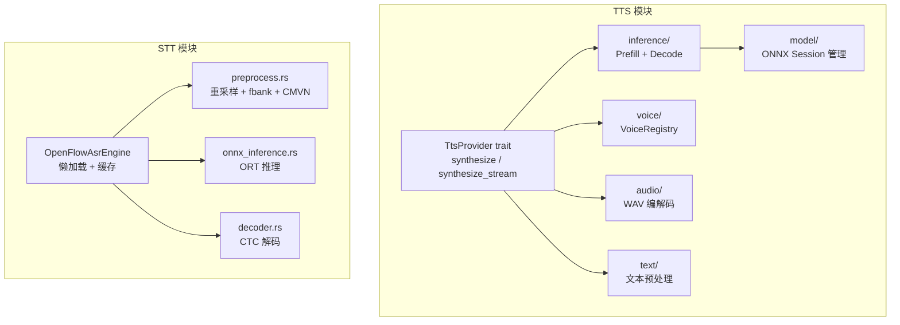
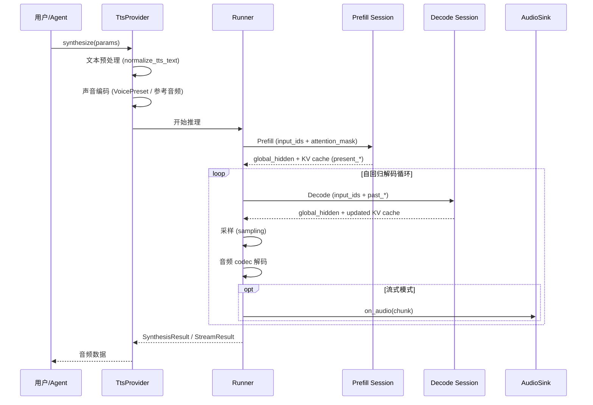
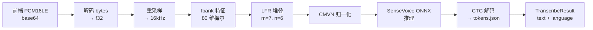

# 🏗️ Voice 实现文档

> 开发者视角 —— TTS ONNX 推理管线、STT 音频处理、模型加载与流式架构设计。

## 📍 架构总览



## 🔄 TTS 处理流程



## 🏗️ TTS ONNX 推理管线

### 两阶段推理

TTS 使用 Prefill + Decode 两阶段自回归架构：

| 阶段 | ONNX 文件 | 输入 | 输出 |
|------|-----------|------|------|
| **Prefill** | `prefill.onnx` | `input_ids [1, seq_len, 1]` + `attention_mask [1, seq_len]` | `global_hidden` + KV cache (`present_key_*`, `present_value_*`) |
| **Decode** | `decode_step.onnx` | `input_ids [1, 1, 1]` + `past_valid_lengths` + KV cache (`past_key_*`, `past_value_*`) | `global_hidden` + 更新的 KV cache |

源码参考：[`src-tauri/src/modules/tts/model/global.rs`](../../../src-tauri/src/modules/tts/model/global.rs)

### KV Cache 流转

```
Prefill 输出:  present_key_0, present_value_0, present_key_1, ...
    ↓ 重命名 (present_* → past_*)
Decode 输入:   past_key_0, past_value_0, past_key_1, ...
    ↓ 推理
Decode 输出:   present_key_0, present_value_0, ...
    ↓ 重命名
下一轮 Decode: past_key_0, past_value_0, ...
```

```rust
// src-tauri/src/modules/tts/model/global.rs
pub fn present_to_past(name: &str) -> String {
    name.replacen("present_", "past_", 1)
}
```

### Session 配置

```rust
// src-tauri/src/modules/tts/model/global.rs
pub const DEFAULT_THREAD_COUNT: usize = 4;

// Session 构建：
// - CPUExecutionProvider
// - GraphOptimizationLevel::Max
// - 线程数 = DEFAULT_THREAD_COUNT
```

### 采样策略

`inference/sampling.rs` 宥现多种采样方法：

| 策略 | 说明 |
|------|------|
| 贪心 | 取概率最大的 token |
| Top-k | 从概率最高的 k 个 token 中采样 |
| Top-p（nucleus） | 从累积概率 ≤ p 的最小集合中采样 |
| 温度 | 调整分布锐度 |

源码参考：[`src-tauri/src/modules/tts/inference/sampling.rs`](../../../src-tauri/src/modules/tts/inference/sampling.rs)

### 流式合成控制

`inference/streaming.rs` 实现流式合成：

- 每生成一个音频帧，立即推送到 `AudioSink`
- `stream_budget.rs` 控制提前生成量（lead seconds）
- 首音延迟 = 从开始合成到第一个 audio chunk 的墙钟秒数
- 实时因子 = emitted_audio_seconds / elapsed_seconds

## 🏗️ STT 处理流程



### 音频预处理管线

`stt/openflow/preprocess.rs` 宥现完整的 Kaldi 风格预处理：

| 步骤 | 参数 | 说明 |
|------|------|------|
| 重采样 | 目标 16kHz | 自动从任意采样率转换 |
| Dither | 默认关闭 | 环境变量 `OPEN_FLOW_DITHER=1` 可开启 |
| fbank | 80 维梅尔滤波器 | Hamming 窗，25ms 帧长，10ms 帧移 |
| LFR | m=7, n=6 | 低帧率堆叠，560 维输入 |
| CMVN | am.mvn 文件 | Kaldi 归一化（shift + scale） |

```rust
// src-tauri/src/modules/stt/openflow/preprocess.rs
pub const TARGET_SAMPLE_RATE: u32 = 16000;
pub const N_MELS: usize = 80;
pub const FRAME_LENGTH_MS: f32 = 25.0;
pub const FRAME_SHIFT_MS: f32 = 10.0;
pub const LFR_M: usize = 7;
pub const LFR_N: usize = 6;
```

### ONNX 推理

`stt/openflow/onnx_inference.rs` 封装 ORT 推理：

- 单 session 懒加载（首次 transcribe 时初始化）
- `tokio::sync::Mutex` 保护（ORT `Session::run` 需要 `&mut self`）
- 支持 `model.onnx` 和 `model_quant.onnx`

### CTC 解码

`stt/openflow/decoder.rs` 宥现 CTC 解码：

- 从 `tokens.json` 加载词表
- 合并重复 token
- 移除 blank token
- 自动检测语言标记

## 🎵 音频格式处理

### WAV 编解码

`audio/wav.rs` 提供 WAV 文件读写：

- 输出格式：48kHz, 立体声, 16-bit PCM
- 支持读取任意采样率/声道 WAV

### 参考音频处理

`audio/reference.rs` 处理参考音频（声音克隆用）：

- 支持 WAV / MP3 输入
- 自动重采样到模型所需格式
- 归一化音量

### 流式解码器

`audio/streaming_decoder.rs` 将 ONNX 输出的 codec 帧解码为 PCM：

- 逐帧解码，无需等待全部生成完成
- 输出 PCM chunk 供 `AudioSink` 消费

## 📦 模型加载与缓存策略

### TTS 模型管理

```rust
// src-tauri/src/modules/tts/model/local.rs
// 模型路径解析：
// ~/.if2ai/models/tts/MOSS-TTS-Nano-100M-ONNX/
//   ├── prefill.onnx
//   ├── decode_step.onnx
//   └── browser_poc_manifest.json
//
// ~/.if2ai/models/tts/MOSS-Audio-Tokenizer-Nano-ONNX/
//   └── (tokenizer weights)
```

### STT 懒加载

```rust
// src-tauri/src/modules/stt/openflow/engine.rs
pub struct OpenFlowAsrEngine {
    model_dir: PathBuf,
    inner: Mutex<Option<LoadedSession>>,  // 懒加载
}

// 首次 transcribe 时：
// 1. 创建 AudioPreprocessor
// 2. 加载 ONNX Session
// 3. 加载 CTC 词表
// 4. 缓存到 inner，后续复用
```

### 声音注册表

`voice/registry.rs` 管理 3 类语音来源：

```rust
// src-tauri/src/modules/tts/voice/registry.rs
pub enum VoiceKind {
    Builtin,       // Manifest 内置 18 voice（prebaked codes）
    Bundled,       // 应用打包自定义 voice
    UserUploaded,  // 用户上传 voice
}

pub struct VoiceAsset {
    pub id: String,
    pub display_name: String,
    pub kind: VoiceKind,
    pub audio_path: Option<PathBuf>,
    pub language: Option<String>,
}
```

### 声音编解码器

`model/codec.rs` 宥现音频 codec：

- **Builtin 声音**：使用 manifest 中预编码的 `prompt_audio_codes`，零编码开销
- **Bundled/User 声音**：现场编码（`codec.encode`），约 150ms / 首次

## 📝 核心概念速查表

| 组件 | 文件 | 职责 |
|------|------|------|
| TtsProvider | `tts/mod.rs` | TTS 服务顶层 trait |
| OnnxSession | `tts/model/global.rs` | Prefill/Decode ONNX Session |
| Sampling | `tts/inference/sampling.rs` | 采样策略 |
| AudioPreprocessor | `stt/openflow/preprocess.rs` | STT 音频预处理 |
| OpenFlowAsrEngine | `stt/openflow/engine.rs` | STT 懒加载引擎 |
| CTCDecoder | `stt/openflow/decoder.rs` | CTC 文本解码 |
| VoiceRegistry | `tts/voice/registry.rs` | 语音资产管理 |
| AudioCodec | `tts/model/codec.rs` | 声音编解码 |

## ⚠️ 与 cc-haha 差距分析

### ✅ 优势

| 方面 | If2Ai | cc-haha |
|------|-------|---------|
| TTS | MOSS-TTS-Nano ONNX，18 内置声音 + 声音克隆 + 流式 | ❌ 完全没有 |
| STT | SenseVoice ONNX，自动语言检测 | ❌ 完全没有 |
| 语音交互 | TTS + STT 双向语音 | ❌ 完全没有 |
| 声音克隆 | 参考音频即克隆 | ❌ 无此功能 |
| 流式合成 | 边生成边播放，TTFA < 200ms | ❌ 无此功能 |

**语音系统是 If2Ai 的核心差异化功能，cc-haha 完全没有对应模块。**

### ❌ 劣势

| 方面 | 现状 | 改进方向 |
|------|------|----------|
| 语言支持 | 中/英/日 | 扩展更多语言 |
| 实时对话 | TTS/STT 独立运行 | 全双工实时语音对话 |
| 模型加载 | 首次使用懒加载 | 预加载 + 后台预热 |
| 语音情感 | 无情感控制 | 情感标签 + 语气调节 |

## 🎯 增强计划

### 1. 扩展语言支持

```
目标：支持更多语言的 TTS/STT

Phase 1: 韩语/法语/德语 STT（SenseVoice 原生支持）
Phase 2: 多语言 TTS 声音预设扩展
Phase 3: 自动语言路由（根据输入自动选择最优模型）
```

### 2. 实时语音对话（全双工）

```
目标：实现 TTS + STT 全双工实时对话

架构：
  STT 流 → VAD 检测 → 语义理解 → 响应生成 → TTS 流
  ↑_____________________________________________↓

关键挑战：
  - 回声消除（AEC）
  - 打断处理（barge-in）
  - 延迟优化（端到端 < 500ms）
```

### 3. 模型加载优化

```
目标：缩短首次使用等待时间

- 应用启动时后台预加载 ONNX Session
- Warmup 合成（短文本预热模型）
- 模型量化（INT8 减小体积）
- 增量模型下载
```

### 4. 语音情感控制

```
目标：为 TTS 输出添加情感维度

- 情感标签：开心/悲伤/愤怒/平静
- 语气强度参数
- 与 Agent 情绪系统集成
```

## 🔗 相关资源

- [Voice 使用指南](./01-usage-guide.md) — 用户操作手册
- [TtsProvider trait 源码](../../../src-tauri/src/modules/tts/mod.rs)
- [OpenFlowAsrEngine 源码](../../../src-tauri/src/modules/stt/openflow/engine.rs)
- [音频预处理器源码](../../../src-tauri/src/modules/stt/openflow/preprocess.rs)
