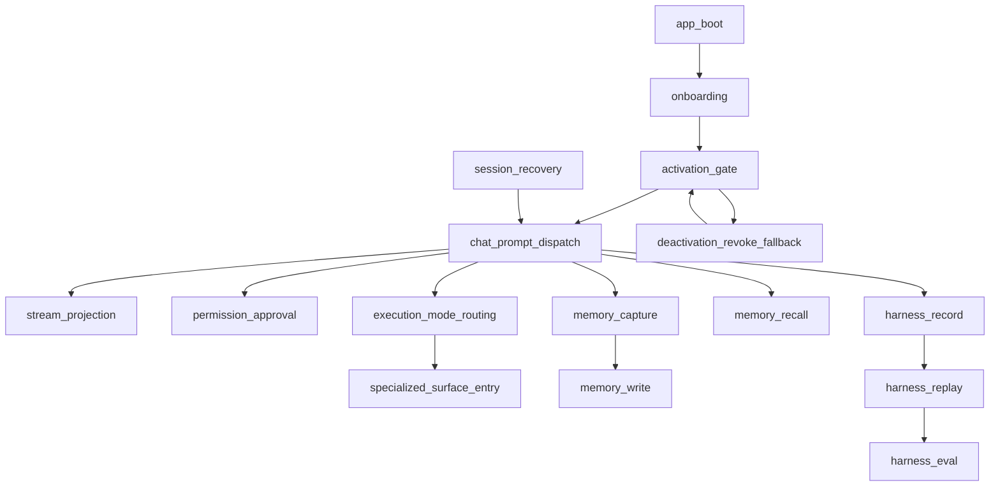

# If2Ai Workflow Truth Registry

> If2Ai 整改计划 Phase M0.2 产出。固定当前 codebase 主 workflow 的真相状态、入口、真相归属层与下一阶段责任 phase。
>
> 最后更新: 2026-04-20
> 上位设计: [canonical-domain-model-and-workflow-truth-design.md](./canonical-domain-model-and-workflow-truth-design.md)
> 配套：[if2ai-canonical-domain-model.md](./if2ai-canonical-domain-model.md)

## 1. 文档目的

本文件解决 If2Ai 当前最致命的真相漂移：**“能力是否存在”被误读为“workflow 是否成立”**。

任何后续 phase 在引用某条 workflow 之前，必须先在本文件查到它当前的状态：

1. `canonical` —— 已成立、已收口、可被引用为真相。
2. `partial` —— 关键路径存在但尚未收口（多源真相 / 半实现 / 关键缺口）。
3. `not_established` —— 当前 codebase 未建立该 workflow，仅设计存在或完全缺失。

不允许使用模糊描述（“基本可用”、“接近完成”、“已大量实现”）替代上述三态判定。

## 2. 真相口径规则

1. backend_entry 与 frontend_entry 必须指向真实存在的文件；不存在则写 `none`。
2. source_of_truth 列说明该 workflow 当前的“说话算数的那一层”；若多层互相覆写则必须标记 `partial`。
3. blockers 必须指出阻止升级到 `canonical` 的具体技术原因，不得写“需要重构”这类无证据描述。
4. next_phase_owner 必须落到正式 phase（`M0`~`M5`），不得写 `TBD`。
5. 当一条 workflow 横跨“事件流 + 持久化 + UI 投影”三层时，只要其中任一层缺正式 contract，状态就只能是 `partial`，不得为 `canonical`。

## 3. Workflow Truth Registry

### 3.1 `app boot`

| field            | value                                                                                                                                                                                                                                                       |
| ---------------- | ----------------------------------------------------------------------------------------------------------------------------------------------------------------------------------------------------------------------------------------------------------- |
| workflow_name    | `app_boot`                                                                                                                                                                                                                                                  |
| status           | `partial`                                                                                                                                                                                                                                                   |
| backend_entry    | [src-tauri/src/main.rs](../../src-tauri/src/main.rs) `main()` + `tauri::Builder::default().setup(...)`                                                                                                                                                      |
| frontend_entry   | [src/App.tsx](../../src/App.tsx)（splash + onboarding check + main shell 三态切换）                                                                                                                                                                         |
| source_of_truth  | 前端 `App.tsx` 的 `showSplash / showOnboarding` 局部 state；后端无 boot phase 状态机                                                                                                                                                                        |
| blockers         | 1) 启动顺序由 `App.tsx` 内嵌的 `useEffect` + 3s `onboarding_get_state` 超时决定，无 contract；2) 后端各子系统（memory provider / job runner / harness / tts）在 `main.rs` 顺序构造，没有 boot phase 事件；3) 失败回退路径分散在每个子系统内部，未统一汇报。 |
| next_phase_owner | `M2`（前端 boot shell + projection）；contract 入口 `M0.4`                                                                                                                                                                                                  |

### 3.2 `onboarding`

| field            | value                                                                                                                                                                                                                                                                                 |
| ---------------- | ------------------------------------------------------------------------------------------------------------------------------------------------------------------------------------------------------------------------------------------------------------------------------------- |
| workflow_name    | `onboarding`                                                                                                                                                                                                                                                                          |
| status           | `partial`                                                                                                                                                                                                                                                                             |
| backend_entry    | [src-tauri/src/modules/onboarding/flow.rs](../../src-tauri/src/modules/onboarding/flow.rs) + commands [src-tauri/src/commands/onboarding.rs](../../src-tauri/src/commands/onboarding.rs)（`onboarding_get_state / next_step / prev_step / complete / security_confirm`）              |
| frontend_entry   | [src/modules/onboarding/OnboardingApp.tsx](../../src/modules/onboarding/OnboardingApp.tsx)（在 `App.tsx` 中按 `showOnboarding` 渲染）                                                                                                                                                 |
| source_of_truth  | backend `OnboardingFlow` + `load_state / save_state`；前端持有副本                                                                                                                                                                                                                    |
| blockers         | 1) 与 `activation_license` 状态机粘连：`activation_complete` 直接写 onboarding state（[commands/activation.rs:117](../../src-tauri/src/commands/activation.rs)）；2) `cross:onboarding-reset` 跨窗口事件无 contract，靠字符串约定；3) 步骤定义散落在 backend `flow.rs` 与前端组件中。 |
| next_phase_owner | `M0.4` 拆开 onboarding 与 activation 语义；`M2` 收口前端组件                                                                                                                                                                                                                          |

### 3.3 `activation gate`

| field            | value                                                                                                                                                                                                                                                                                                                                                                                                                                                        |
| ---------------- | ------------------------------------------------------------------------------------------------------------------------------------------------------------------------------------------------------------------------------------------------------------------------------------------------------------------------------------------------------------------------------------------------------------------------------------------------------------ |
| workflow_name    | `activation_gate`                                                                                                                                                                                                                                                                                                                                                                                                                                            |
| status           | `partial`                                                                                                                                                                                                                                                                                                                                                                                                                                                    |
| backend_entry    | [src-tauri/src/commands/activation.rs](../../src-tauri/src/commands/activation.rs)（4 commands：`activation_validate / activation_start / activation_test_message / activation_complete`）                                                                                                                                                                                                                                                                   |
| frontend_entry   | onboarding 流程内一段 “启动仪式” 屏（在 `OnboardingApp` 中），无独立 gate overlay                                                                                                                                                                                                                                                                                                                                                                            |
| source_of_truth  | 当前实现是“首启动检查清单 + 一次性问候 + 标记 onboarding 完成”，**不是硬门禁**；真正的 license 状态机不存在                                                                                                                                                                                                                                                                                                                                                  |
| blockers         | 1) 无 `ActivationStatus` 状态机（缺失 `requesting_activation / pending_approval / refreshed / revoked / expired / deactivated`）；2) 无 license refresh / revoke check 后台路径；3) 无 gate overlay 在主 shell 内重新拦截（一旦进入 main shell，license 失效不会回流到 gate）；4) `activation_validate` 仅校验 4 个本地配置项，无远端验证。设计目标见 [activation-gate-and-license-lifecycle-design.md](./activation-gate-and-license-lifecycle-design.md)。 |
| next_phase_owner | `M0.4` contract + `M1` `activation_service` + `M2` boot shell gate                                                                                                                                                                                                                                                                                                                                                                                           |

### 3.4 `chat prompt dispatch`

| field            | value                                                                                                                                                                                                                             |
| ---------------- | --------------------------------------------------------------------------------------------------------------------------------------------------------------------------------------------------------------------------------- |
| workflow_name    | `chat_prompt_dispatch`                                                                                                                                                                                                            |
| status           | `partial`                                                                                                                                                                                                                         |
| backend_entry    | [src-tauri/src/commands/agent.rs](../../src-tauri/src/commands/agent.rs)（约 4061 行）：`run_agent_turn` / `start_agent_stream`                                                                                                   |
| frontend_entry   | [src/components/ui/chat-ui.tsx](../../src/components/ui/chat-ui.tsx)（约 4736 行） + [src/lib/tauri.ts](../../src/lib/tauri.ts) `runAgentTurn / startAgentStream`                                                                 |
| source_of_truth  | backend `commands/agent.rs` 内联编排（系统 prompt 拼装、tool 选择、memory 注入、stream emit），无 service 边界；前端持有大量编排副本                                                                                              |
| blockers         | 1) `commands/agent.rs` 同时承担 provider 选择 / prompt 组装 / memory 注入 / stream 事件发射 / permission 等待，没有 `Run` 实体或 service；2) 无 `RuntimeEventEnvelope`；3) 没有 `execution_mode` 路由介入（请求一律走相同编排）。 |
| next_phase_owner | `M0.3` contract envelope + `M1` provider/prompt/memory/stream service 抽离 + `M0.5` execution_mode 介入点                                                                                                                         |

### 3.5 `stream projection`

| field            | value                                                                                                                                                                                                                                                                    |
| ---------------- | ------------------------------------------------------------------------------------------------------------------------------------------------------------------------------------------------------------------------------------------------------------------------ |
| workflow_name    | `stream_projection`                                                                                                                                                                                                                                                      |
| status           | `partial`                                                                                                                                                                                                                                                                |
| backend_entry    | [src-tauri/src/commands/agent.rs](../../src-tauri/src/commands/agent.rs) 内联 `app.emit(...)` 多种事件名                                                                                                                                                                 |
| frontend_entry   | [src/lib/tauri.ts](../../src/lib/tauri.ts) `listenToStream` / `listenToPermissionRequests` / `listenMemoryEvent` + [src/App.tsx](../../src/App.tsx) 与 [src/components/ui/chat-ui.tsx](../../src/components/ui/chat-ui.tsx) 大量 reducer 风格 useState 处理 stream chunk |
| source_of_truth  | 多源：backend 直接发事件；前端在 `chat-ui.tsx` / `App.tsx` 各自重组 message timeline；没有 translator/reducer/store 层                                                                                                                                                   |
| blockers         | 1) 没有 canonical `RuntimeEventEnvelope`；2) `tauri.ts` 既是 transport 又是事件分发，自己也持有大量类型；3) `chat-ui.tsx` 仍在直接消费裸事件并合成业务结构；4) memory_event / browser-status / permission_prompt 事件名无统一注册表。                                    |
| next_phase_owner | `M0.3` contract + `M1` stream emitter service + `M2` translator/reducer/stores                                                                                                                                                                                           |

### 3.6 `permission approval`

| field            | value                                                                                                                                                                                                                                                          |
| ---------------- | -------------------------------------------------------------------------------------------------------------------------------------------------------------------------------------------------------------------------------------------------------------- |
| workflow_name    | `permission_approval`                                                                                                                                                                                                                                          |
| status           | `partial`                                                                                                                                                                                                                                                      |
| backend_entry    | [src-tauri/src/commands/agent.rs](../../src-tauri/src/commands/agent.rs) `respond_permission` + [src-tauri/src/commands/mod.rs](../../src-tauri/src/commands/mod.rs) `AppState.permission_senders / permission_overrides`（按 `session_id` 路由 oneshot 决策） |
| frontend_entry   | [src/lib/tauri.ts](../../src/lib/tauri.ts) `listenToPermissionRequests` + `respondPermission`，UI 在 `chat-ui.tsx` 中触发对话框                                                                                                                                |
| source_of_truth  | backend `permission_senders` map（每 session 一个 sender）；前端基于 session_id 单向触发决策                                                                                                                                                                   |
| blockers         | 1) 决策记录未沉淀（不会被 harness / memory 采集）；2) “记住此会话”逻辑通过 `permission_overrides` 临时 HashMap 实现，重启后丢失；3) 无 contract 描述 “permission prompt → decision → log” 三段；4) UI 与后端通过 ad-hoc event 名沟通。                         |
| next_phase_owner | `M1`（service 化）+ `M4`（permission decision 进入 governance trace）                                                                                                                                                                                          |

### 3.7 `session recovery`

| field            | value                                                                                                                                                                              |
| ---------------- | ---------------------------------------------------------------------------------------------------------------------------------------------------------------------------------- |
| workflow_name    | `session_recovery`                                                                                                                                                                 |
| status           | `partial`                                                                                                                                                                          |
| backend_entry    | [src-tauri/src/modules/session/manager.rs](../../src-tauri/src/modules/session/manager.rs) + commands [src-tauri/src/commands/session.rs](../../src-tauri/src/commands/session.rs) |
| frontend_entry   | [src/App.tsx](../../src/App.tsx) 启动后 `listSessions / listProjects` 拉取；[src/components/ui/chat-ui.tsx](../../src/components/ui/chat-ui.tsx) 切换 session                      |
| source_of_truth  | backend 持久化目录（`~/.if2ai/sessions/`），但 “上次活跃 session” 的恢复逻辑分散在 `App.tsx`                                                                                       |
| blockers         | 1) 上次活跃 session id 由前端 localStorage 决定，缺权威源；2) 脏数据场景下解析失败可能导致启动 panic（蓝图 §3.1.3）；3) 没有 session corruption recovery contract。                |
| next_phase_owner | `M1` `session_service` 收口 + `M2` boot shell 统一恢复路径                                                                                                                         |

### 3.8 `memory capture`

| field            | value                                                                                                                                                                                                                                                    |
| ---------------- | -------------------------------------------------------------------------------------------------------------------------------------------------------------------------------------------------------------------------------------------------------- |
| workflow_name    | `memory_capture`                                                                                                                                                                                                                                         |
| status           | `partial`                                                                                                                                                                                                                                                |
| backend_entry    | [src-tauri/src/commands/agent.rs](../../src-tauri/src/commands/agent.rs) 内联调用 + [src-tauri/src/modules/memory/](../../src-tauri/src/modules/memory/)（providers + `RollingSummarizer` + `MemoryCompiler` + `MemoryTicker` 在 `main.rs` 装配）        |
| frontend_entry   | [src/lib/tauri.ts](../../src/lib/tauri.ts) `listenMemoryEvent`（`memory_event` 通道）                                                                                                                                                                    |
| source_of_truth  | backend `modules::memory::audit::register_app_handle` 发射 audit 事件；但 “是否要写” 的决策逻辑散落在 provider / summarizer / compiler 内                                                                                                                |
| blockers         | 1) 没有 `MemoryCoordinator` / `WritePolicy`，capture 决策逻辑散布；2) `UtilityLlm` 当前是 `MockUtilityLlm::empty()`（[main.rs:494](../../src-tauri/src/main.rs)），真正的 utility-LLM 接线尚未完成；3) capture event 与 run 上下文未在 envelope 内对齐。 |
| next_phase_owner | `M3` `MemoryCoordinator` + `WritePolicy`                                                                                                                                                                                                                 |

### 3.9 `memory recall`

| field            | value                                                                                                                                                                                                                                                                                                                                                                                        |
| ---------------- | -------------------------------------------------------------------------------------------------------------------------------------------------------------------------------------------------------------------------------------------------------------------------------------------------------------------------------------------------------------------------------------------- |
| workflow_name    | `memory_recall`                                                                                                                                                                                                                                                                                                                                                                              |
| status           | `partial`                                                                                                                                                                                                                                                                                                                                                                                    |
| backend_entry    | [src-tauri/src/commands/memory.rs](../../src-tauri/src/commands/memory.rs) `memory_recall` + [src-tauri/src/modules/memory/retrieval/ActiveRetrievalManager](../../src-tauri/src/modules/memory/retrieval/) + [src-tauri/src/modules/memory/intent.rs](../../src-tauri/src/modules/memory/intent.rs)（rule-based intent classifier，仅服务于 memory recall，不是请求 execution mode 分类器） |
| frontend_entry   | [src/lib/tauri.ts](../../src/lib/tauri.ts)（recall command 调用） + 显示在 chat-ui memory chip                                                                                                                                                                                                                                                                                               |
| source_of_truth  | backend `ActiveRetrievalManager` + provider；recall 顺序与去重策略由各 provider 自行决定                                                                                                                                                                                                                                                                                                     |
| blockers         | 1) 无 `RecallAssembler` / 无显式 recall budget；2) 多 provider 召回结果合并策略硬编码；3) 召回结果与 prompt 注入之间缺 contract；4) 前端无法解释 “这条 chip 为何被召回”。                                                                                                                                                                                                                    |
| next_phase_owner | `M3` `RecallAssembler` + `QualityGate`                                                                                                                                                                                                                                                                                                                                                       |

### 3.10 `memory write`

| field            | value                                                                                                                                                                                                                                                   |
| ---------------- | ------------------------------------------------------------------------------------------------------------------------------------------------------------------------------------------------------------------------------------------------------- |
| workflow_name    | `memory_write`                                                                                                                                                                                                                                          |
| status           | `partial`                                                                                                                                                                                                                                               |
| backend_entry    | provider write paths（`SqliteMemoryProvider` / `VectorMemoryProvider` / `HybridMemoryProvider`）+ `SessionSummaryStore` + `PinnedStore`；统一过 [src-tauri/src/modules/memory/security/threat_scanner.rs](../../src-tauri/src/modules/memory/security/) |
| frontend_entry   | [src/lib/tauri.ts](../../src/lib/tauri.ts) `pinned_add / memory_promote / memory_demote / memory_compile_now` 等                                                                                                                                        |
| source_of_truth  | backend providers + scanner；audit 通过 `audit::register_app_handle` 投出 `memory_event`                                                                                                                                                                |
| blockers         | 1) 无 `WritePolicy`：是否写、写到哪个 scope、是否升级 / 降级，由 caller 各自决定；2) `JobRunner` retry 策略与每条 write decision 之间没有 trace 关联；3) `compile_*` 实际尚未接入真实 utility-LLM（见 §3.8 blocker 2）。                                |
| next_phase_owner | `M3` `WritePolicy` + `MemoryCoordinator`                                                                                                                                                                                                                |

### 3.11 `harness record`

| field            | value                                                                                                                                                                                                                                                                                         |
| ---------------- | --------------------------------------------------------------------------------------------------------------------------------------------------------------------------------------------------------------------------------------------------------------------------------------------- |
| workflow_name    | `harness_record`                                                                                                                                                                                                                                                                              |
| status           | `partial`                                                                                                                                                                                                                                                                                     |
| backend_entry    | [src-tauri/src/modules/harness/](../../src-tauri/src/modules/harness/) + commands [src-tauri/src/commands/harness.rs](../../src-tauri/src/commands/harness.rs)（`get_harness_status / start_harness_recording / stop_harness_recording / get_session_telemetry / get_all_session_telemetry`） |
| frontend_entry   | 调试 / 开发者面板（不在主路径）                                                                                                                                                                                                                                                               |
| source_of_truth  | backend HarnessState；启用与否由 `IF2AI_HARNESS_ENABLED=1` 环境变量决定（[main.rs:713](../../src-tauri/src/main.rs)），默认关闭                                                                                                                                                               |
| blockers         | 1) opt-in，与生产路径事实上脱钩；2) 仅记录 telemetry，没有 `HarnessRunReport` / grader / blocker；3) trace 的事件 schema 与 `RuntimeEventEnvelope` 未对齐。                                                                                                                                   |
| next_phase_owner | `M4` `HarnessRunReport` + grader + 进入治理链路                                                                                                                                                                                                                                               |

### 3.12 `harness replay`

| field            | value                                                                                  |
| ---------------- | -------------------------------------------------------------------------------------- |
| workflow_name    | `harness_replay`                                                                       |
| status           | `not_established`                                                                      |
| backend_entry    | none                                                                                   |
| frontend_entry   | none                                                                                   |
| source_of_truth  | 不存在                                                                                 |
| blockers         | 1) 无 replay runner；2) 无 record schema 稳定性保证；3) 无 baseline / candidate 概念。 |
| next_phase_owner | `M4`                                                                                   |

### 3.13 `harness eval`

| field            | value                                                                                       |
| ---------------- | ------------------------------------------------------------------------------------------- |
| workflow_name    | `harness_eval`                                                                              |
| status           | `not_established`                                                                           |
| backend_entry    | none                                                                                        |
| frontend_entry   | none                                                                                        |
| source_of_truth  | 不存在；设计在 [harness-v2-governance-design.md](./harness-v2-governance-design.md)         |
| blockers         | 1) 无 grader；2) 无 baseline-candidate compare；3) 无 gate rule；4) 无 eval corpus 注册表。 |
| next_phase_owner | `M4` 全部 + `M5` promotion gate                                                             |

### 3.14 `execution mode routing`

| field            | value                                                                                                                                                                                                                                                                                                  |
| ---------------- | ------------------------------------------------------------------------------------------------------------------------------------------------------------------------------------------------------------------------------------------------------------------------------------------------------ |
| workflow_name    | `execution_mode_routing`                                                                                                                                                                                                                                                                               |
| status           | `not_established`                                                                                                                                                                                                                                                                                      |
| backend_entry    | none（注意：[modules/memory/intent.rs](../../src-tauri/src/modules/memory/intent.rs) 是 memory 用途的 rule-based intent classifier，**不是请求执行模式分类器**）                                                                                                                                       |
| frontend_entry   | none                                                                                                                                                                                                                                                                                                   |
| source_of_truth  | 不存在；当前所有请求一律走 `commands/agent.rs` 同一编排，无分流                                                                                                                                                                                                                                        |
| blockers         | 1) 无 `ExecutionMode` / `ExecutionModeDecision` 类型；2) 无 classifier service；3) 无 `RouteHint / RiskLevel / ComplexityLevel / reason_codes`；4) 前端无解释性投影。设计在 [request-intelligence-and-execution-mode-routing-design.md](./request-intelligence-and-execution-mode-routing-design.md)。 |
| next_phase_owner | `M0.5` contract + `M1` `request_intelligence_service` + `M2` 解释性投影                                                                                                                                                                                                                                |

### 3.15 `specialized surface entry`

| field            | value                                                                                                                                                       |
| ---------------- | ----------------------------------------------------------------------------------------------------------------------------------------------------------- |
| workflow_name    | `specialized_surface_entry`                                                                                                                                 |
| status           | `partial`                                                                                                                                                   |
| backend_entry    | 各专业能力面板的支撑 commands（browser、TTS、STT、skills hub、memory browser、harness panel）                                                               |
| frontend_entry   | [src/App.tsx](../../src/App.tsx) 的多 panel 切换 + 专业面板组件                                                                                             |
| source_of_truth  | 前端导航状态 + 各 panel 自行管理；没有 “何时该跳转到 specialized surface” 的 runtime 决策                                                                   |
| blockers         | 1) 进入 specialized surface 由用户手动选择，runtime 不参与决策；2) 没有 `execution_mode = specialized_surface` 的反向触发链路；3) 各 panel 之间状态不互通。 |
| next_phase_owner | `M0.5` 把 `specialized_surface` 写进 `ExecutionMode` 后，`M2` 引入正式投影                                                                                  |

### 3.16 `deactivation / revoke fallback`

| field            | value                                                                                                                                                                            |
| ---------------- | -------------------------------------------------------------------------------------------------------------------------------------------------------------------------------- |
| workflow_name    | `deactivation_revoke_fallback`                                                                                                                                                   |
| status           | `not_established`                                                                                                                                                                |
| backend_entry    | none                                                                                                                                                                             |
| frontend_entry   | none                                                                                                                                                                             |
| source_of_truth  | 不存在；`commands/activation.rs` 仅提供 `activation_complete`，无 `deactivate / revoke` 命令；主 shell 不会因 license 失效回流到 gate                                            |
| blockers         | 1) 无 `ActivationStatus::Revoked / Expired / Deactivated` 实际处理；2) 无 license refresh 后台 job；3) 无 gate overlay 在主 shell 内重新拦截；4) 无 “失效 → 数据保留策略” 决策。 |
| next_phase_owner | `M0.4` contract + `M1` activation_service + `M2` boot shell gate                                                                                                                 |

## 4. 状态汇总

| status            | count | workflows                                                                                                                                                                                                     |
| ----------------- | ----- | ------------------------------------------------------------------------------------------------------------------------------------------------------------------------------------------------------------- |
| `canonical`       | 0     | —                                                                                                                                                                                                             |
| `partial`         | 12    | app_boot, onboarding, activation_gate, chat_prompt_dispatch, stream_projection, permission_approval, session_recovery, memory_capture, memory_recall, memory_write, harness_record, specialized_surface_entry |
| `not_established` | 4     | harness_replay, harness_eval, execution_mode_routing, deactivation_revoke_fallback                                                                                                                            |

> 提示：当前 0 条 `canonical` 是有意为之。M0 阶段不通过文档把任何 workflow 升级到 canonical；canonical 升级须等待对应 phase（M1~M5）完成相应 contract / service / projection 后，由人工 checkpoint 在本表回写。

## 5. Cross-Workflow 依赖

依赖红线：

1. `chat_prompt_dispatch` 是所有 runtime workflow 的中枢；它在 `partial` 期间，所有依赖它的 workflow 至多只能 `partial`。
2. `execution_mode_routing` 与 `specialized_surface_entry` 必须一起升级；前者不立，后者无法成立。
3. `deactivation_revoke_fallback` 必须在 `activation_gate` 升级到 `canonical` 之前完成，否则激活体系仍是单向门。

## 6. 维护规则

1. 任何 workflow 状态变更必须 PR 本文件，并在 PR 描述里附上证据（具体 contract / service / projection 已落地）。
2. 不允许在不更新本表的前提下，在其他文档中宣称某 workflow 为 `canonical`。
3. 当 `canonical` 数 ≥ 1 时，README 端到端执行映射须同步更新引用。
4. 当 `not_established` 数随 phase 推进下降时，对应 phase YAML 必须能回指出哪一个 slice 完成了升级。

## 7. 关联文档

- 配套：[if2ai-canonical-domain-model.md](./if2ai-canonical-domain-model.md)
- 上位：[canonical-domain-model-and-workflow-truth-design.md](./canonical-domain-model-and-workflow-truth-design.md)
- contracts 设计：[runtime-contracts-and-event-projection-design.md](./runtime-contracts-and-event-projection-design.md)、[activation-gate-and-license-lifecycle-design.md](./activation-gate-and-license-lifecycle-design.md)、[request-intelligence-and-execution-mode-routing-design.md](./request-intelligence-and-execution-mode-routing-design.md)
- 治理设计：[harness-v2-governance-design.md](./harness-v2-governance-design.md)、[memory-self-evolution-design.md](./memory-self-evolution-design.md)
- 横向对照：[uclaw-if2ai-architecture-migration-report.md](./uclaw-if2ai-architecture-migration-report.md)
- 执行计划：[phase-m0-canonical-contracts-and-truth.yaml](../exec-plans/active/phase-m0-canonical-contracts-and-truth.yaml)、[phase-m0-executor-runbook.md](../exec-plans/active/phase-m0-executor-runbook.md)、[phase-m0-truth-documents-file-level-plan.md](../exec-plans/active/phase-m0-truth-documents-file-level-plan.md)
